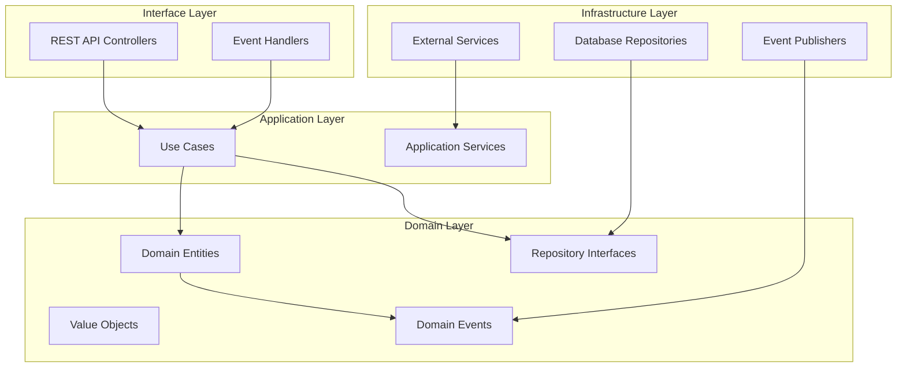
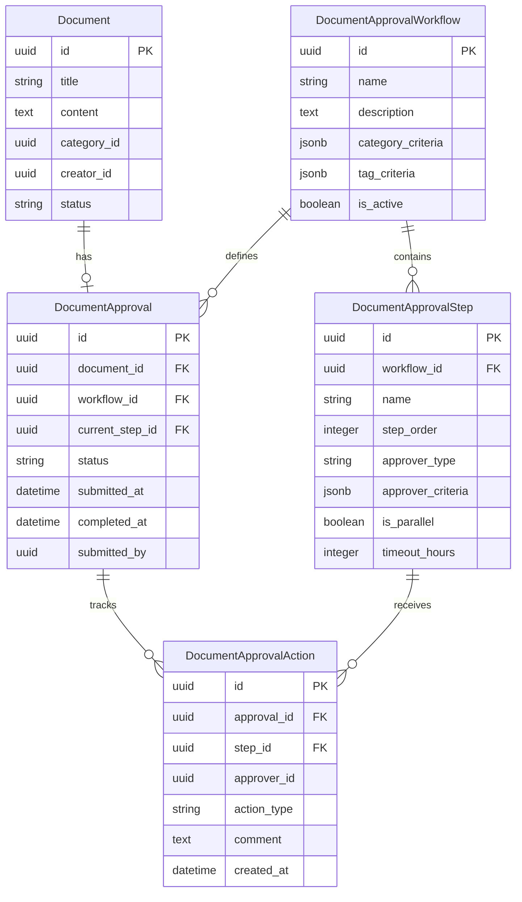

# 設計文檔

## 概述

本文檔概述了在現有知識管理系統中實施文檔審批工作流系統的設計。該設計遵循乾淨架構原則和事件驅動模式，與當前系統架構無縫整合，同時提供強大的審批功能。

文檔審批工作流系統將擴展現有的 Document 實體，並引入新的領域實體來管理審批流程、工作流配置和稽核軌跡。系統將利用現有的事件驅動基礎設施，並與已建立的架構模式保持一致。

## 架構

### 高層架構

文檔審批工作流系統遵循已建立的乾淨架構模式，具有四個不同的層次：



### 與現有系統的整合

審批工作流系統與現有組件整合：

- **Document 實體**：擴展審批相關方法和狀態
- **事件系統**：利用現有事件發布者基礎設施
- **用戶管理**：與現有用戶服務整合進行審批者解析
- **通知系統**：使用現有通知基礎設施
- **資料庫層**：擴展當前 SQLAlchemy 模型和儲存庫

## 組件和介面

### 領域層組件

#### 核心實體

**DocumentApprovalWorkflow**

```python
@dataclass
class DocumentApprovalWorkflow:
    id: uuid.UUID
    name: str
    description: str
    steps: List[DocumentApprovalStep]
    is_active: bool
    created_at: datetime
    updated_at: datetime

    def add_step(self, step: DocumentApprovalStep) -> None
    def remove_step(self, step_id: uuid.UUID) -> None
    def get_applicable_documents(self, document: Document) -> bool
    def get_first_step(self) -> Optional[DocumentApprovalStep]
```

**DocumentApprovalStep**

```python
@dataclass
class DocumentApprovalStep:
    id: uuid.UUID
    workflow_id: uuid.UUID
    name: str
    description: str
    order: int
    approver_type: ApproverType  # ROLE, DEPARTMENT, INDIVIDUAL
    approver_criteria: Dict[str, Any]
    is_parallel: bool
    timeout_hours: Optional[int]
    auto_approve_on_timeout: bool
    created_at: datetime

    def resolve_approvers(self, document: Document) -> List[uuid.UUID]
    def is_timeout_exceeded(self, approval: DocumentApproval) -> bool
```

**DocumentApproval**

```python
@dataclass
class DocumentApproval:
    id: uuid.UUID
    document_id: uuid.UUID
    workflow_id: uuid.UUID
    current_step_id: Optional[uuid.UUID]
    status: ApprovalStatus
    submitted_at: datetime
    completed_at: Optional[datetime]
    submitted_by: uuid.UUID
    _events: List[DomainEvent]

    def submit_for_approval(self, workflow: DocumentApprovalWorkflow) -> None
    def approve_step(self, step_id: uuid.UUID, approver_id: uuid.UUID, comment: str) -> None
    def reject(self, step_id: uuid.UUID, approver_id: uuid.UUID, comment: str) -> None
    def request_changes(self, step_id: uuid.UUID, approver_id: uuid.UUID, comment: str) -> None
    def progress_to_next_step(self) -> None
    def complete_approval(self) -> None
```

**DocumentApprovalAction**

```python
@dataclass
class DocumentApprovalAction:
    id: uuid.UUID
    approval_id: uuid.UUID
    step_id: uuid.UUID
    approver_id: uuid.UUID
    action_type: ApprovalActionType
    comment: str
    created_at: datetime

    @classmethod
    def create_approval_action(cls, approval_id: uuid.UUID, step_id: uuid.UUID,
                              approver_id: uuid.UUID, comment: str) -> 'DocumentApprovalAction'
```

#### 值物件

**ApprovalStatus**

```python
class ApprovalStatus(Enum):
    PENDING = "pending"
    IN_PROGRESS = "in_progress"
    APPROVED = "approved"
    REJECTED = "rejected"
    REQUIRES_CHANGES = "requires_changes"
    CANCELLED = "cancelled"
```

**ApprovalActionType**

```python
class ApprovalActionType(Enum):
    APPROVE = "approve"
    REJECT = "reject"
    REQUEST_CHANGES = "request_changes"
    ESCALATE = "escalate"
    AUTO_APPROVE = "auto_approve"
```

**ApproverType**

```python
class ApproverType(Enum):
    ROLE = "role"
    DEPARTMENT = "department"
    INDIVIDUAL = "individual"
    CREATOR_MANAGER = "creator_manager"
```

#### 領域事件

**審批工作流事件**

```python
@dataclass
class DocumentSubmittedForApproval(DomainEvent):
    document_id: uuid.UUID
    approval_id: uuid.UUID
    workflow_id: uuid.UUID
    submitted_by: uuid.UUID
    approvers: List[uuid.UUID]
    timestamp: datetime

@dataclass
class DocumentApproved(DomainEvent):
    document_id: uuid.UUID
    approval_id: uuid.UUID
    approver_id: uuid.UUID
    step_id: uuid.UUID
    comment: str
    timestamp: datetime

@dataclass
class DocumentRejected(DomainEvent):
    document_id: uuid.UUID
    approval_id: uuid.UUID
    approver_id: uuid.UUID
    step_id: uuid.UUID
    comment: str
    timestamp: datetime

@dataclass
class ApprovalStepCompleted(DomainEvent):
    approval_id: uuid.UUID
    step_id: uuid.UUID
    next_step_id: Optional[uuid.UUID]
    timestamp: datetime

@dataclass
class ApprovalTimeoutOccurred(DomainEvent):
    approval_id: uuid.UUID
    step_id: uuid.UUID
    timeout_hours: int
    escalation_required: bool
    timestamp: datetime
```

#### 儲存庫介面

**DocumentApprovalWorkflowRepository**

```python
class DocumentApprovalWorkflowRepository(ABC):
    @abstractmethod
    def save(self, workflow: DocumentApprovalWorkflow) -> DocumentApprovalWorkflow

    @abstractmethod
    def get_by_id(self, workflow_id: uuid.UUID) -> Optional[DocumentApprovalWorkflow]

    @abstractmethod
    def find_applicable_workflow(self, document: Document) -> Optional[DocumentApprovalWorkflow]

    @abstractmethod
    def list_active_workflows(self) -> List[DocumentApprovalWorkflow]
```

**DocumentApprovalRepository**

```python
class DocumentApprovalRepository(ABC):
    @abstractmethod
    def save(self, approval: DocumentApproval) -> DocumentApproval

    @abstractmethod
    def get_by_id(self, approval_id: uuid.UUID) -> Optional[DocumentApproval]

    @abstractmethod
    def get_by_document_id(self, document_id: uuid.UUID) -> Optional[DocumentApproval]

    @abstractmethod
    def find_pending_approvals_for_user(self, user_id: uuid.UUID) -> List[DocumentApproval]

    @abstractmethod
    def find_approvals_by_status(self, status: ApprovalStatus) -> List[DocumentApproval]
```

### 應用層組件

#### 用例

**SubmitDocumentForApprovalUseCase**

```python
class SubmitDocumentForApprovalUseCase:
    def __init__(self, document_repo: DocumentRepository,
                 approval_repo: DocumentApprovalRepository,
                 workflow_repo: DocumentApprovalWorkflowRepository,
                 event_publisher: EventPublisher):
        self.document_repo = document_repo
        self.approval_repo = approval_repo
        self.workflow_repo = workflow_repo
        self.event_publisher = event_publisher

    def execute(self, document_id: uuid.UUID, submitted_by: uuid.UUID) -> DocumentApproval:
        # Implementation logic
        pass
```

**ProcessApprovalDecisionUseCase**

```python
class ProcessApprovalDecisionUseCase:
    def execute(self, approval_id: uuid.UUID, approver_id: uuid.UUID,
                action: ApprovalActionType, comment: str) -> DocumentApproval:
        # Implementation logic
        pass
```

**BatchApprovalUseCase**

```python
class BatchApprovalUseCase:
    def execute(self, approval_ids: List[uuid.UUID], approver_id: uuid.UUID,
                action: ApprovalActionType, comment: str) -> List[DocumentApproval]:
        # Implementation logic
        pass
```

#### 應用服務

**DocumentApprovalService**

```python
class DocumentApprovalService:
    def __init__(self, approval_repo: DocumentApprovalRepository,
                 workflow_repo: DocumentApprovalWorkflowRepository,
                 user_service: UserService,
                 notification_service: NotificationService):
        self.approval_repo = approval_repo
        self.workflow_repo = workflow_repo
        self.user_service = user_service
        self.notification_service = notification_service

    def submit_for_approval(self, document: Document, submitted_by: uuid.UUID) -> DocumentApproval
    def process_approval_decision(self, approval: DocumentApproval, approver_id: uuid.UUID,
                                 action: ApprovalActionType, comment: str) -> None
    def check_and_handle_timeouts(self) -> None
    def escalate_approval(self, approval: DocumentApproval, step: DocumentApprovalStep) -> None
```

### 基礎設施層組件

#### 外部服務整合

**UserManagementServiceClient**

```python
class UserManagementServiceClient:
    async def get_user_by_id(self, user_id: uuid.UUID) -> Optional[User]
    async def get_users_by_role(self, role: str) -> List[User]
    async def get_users_by_department(self, department_id: uuid.UUID) -> List[User]
    async def get_user_manager(self, user_id: uuid.UUID) -> Optional[User]
```

**NotificationServiceClient**

```python
class NotificationServiceClient:
    async def send_approval_notification(self, approver_ids: List[uuid.UUID],
                                       document: Document, approval: DocumentApproval) -> None
    async def send_batch_notifications(self, notifications: List[ApprovalNotification]) -> None
    async def send_timeout_notification(self, approval: DocumentApproval,
                                      escalated_approvers: List[uuid.UUID]) -> None
```

#### 資料庫模型

**SQLAlchemy 模型**

```python
class DocumentApprovalWorkflowModel(Base):
    __tablename__ = "document_approval_workflows"

    id = Column(UUID, primary_key=True, default=uuid.uuid4)
    name = Column(String(200), nullable=False)
    description = Column(Text)
    category_criteria = Column(JSONB)
    tag_criteria = Column(JSONB)
    creator_criteria = Column(JSONB)
    is_active = Column(Boolean, default=True)
    created_at = Column(DateTime, default=datetime.utcnow)
    updated_at = Column(DateTime, default=datetime.utcnow, onupdate=datetime.utcnow)

    steps = relationship("DocumentApprovalStepModel", back_populates="workflow")

class DocumentApprovalModel(Base):
    __tablename__ = "document_approvals"

    id = Column(UUID, primary_key=True, default=uuid.uuid4)
    document_id = Column(UUID, ForeignKey("documents.id"), nullable=False)
    workflow_id = Column(UUID, ForeignKey("document_approval_workflows.id"), nullable=False)
    current_step_id = Column(UUID, ForeignKey("document_approval_steps.id"))
    status = Column(Enum(ApprovalStatus), nullable=False)
    submitted_at = Column(DateTime, default=datetime.utcnow)
    completed_at = Column(DateTime)
    submitted_by = Column(UUID, nullable=False)

    document = relationship("DocumentModel", back_populates="approval")
    workflow = relationship("DocumentApprovalWorkflowModel")
    actions = relationship("DocumentApprovalActionModel", back_populates="approval")
```

### 介面層組件

#### REST API 控制器

**DocumentApprovalController**

```python
@router.post("/documents/{document_id}/submit-approval")
async def submit_document_for_approval(
    document_id: uuid.UUID,
    request: SubmitApprovalRequest,
    use_case: SubmitDocumentForApprovalUseCase = Depends()
) -> ApprovalResponse:
    # Implementation
    pass

@router.post("/approvals/{approval_id}/approve")
async def approve_document(
    approval_id: uuid.UUID,
    request: ApprovalDecisionRequest,
    use_case: ProcessApprovalDecisionUseCase = Depends()
) -> ApprovalResponse:
    # Implementation
    pass

@router.post("/approvals/batch-approve")
async def batch_approve_documents(
    request: BatchApprovalRequest,
    use_case: BatchApprovalUseCase = Depends()
) -> BatchApprovalResponse:
    # Implementation
    pass
```

#### 事件處理器

**ApprovalEventHandlers**

```python
class ApprovalEventHandlers:
    def __init__(self, notification_service: NotificationServiceClient,
                 user_service: UserManagementServiceClient):
        self.notification_service = notification_service
        self.user_service = user_service

    async def handle_document_submitted_for_approval(self, event: DocumentSubmittedForApproval):
        # Send notifications to approvers
        pass

    async def handle_document_approved(self, event: DocumentApproved):
        # Handle approval progression
        pass

    async def handle_approval_timeout(self, event: ApprovalTimeoutOccurred):
        # Handle escalation
        pass
```

## 資料模型

### 資料庫架構擴展

審批工作流系統通過新表擴展現有資料庫架構：

```sql
-- Document Approval Workflows
CREATE TABLE document_approval_workflows (
    id UUID PRIMARY KEY DEFAULT gen_random_uuid(),
    name VARCHAR(200) NOT NULL,
    description TEXT,
    category_criteria JSONB,
    tag_criteria JSONB,
    creator_criteria JSONB,
    is_active BOOLEAN DEFAULT TRUE,
    created_at TIMESTAMP DEFAULT NOW(),
    updated_at TIMESTAMP DEFAULT NOW()
);

-- Document Approval Steps
CREATE TABLE document_approval_steps (
    id UUID PRIMARY KEY DEFAULT gen_random_uuid(),
    workflow_id UUID REFERENCES document_approval_workflows(id),
    name VARCHAR(200) NOT NULL,
    description TEXT,
    step_order INTEGER NOT NULL,
    approver_type VARCHAR(50) NOT NULL,
    approver_criteria JSONB NOT NULL,
    is_parallel BOOLEAN DEFAULT FALSE,
    timeout_hours INTEGER,
    auto_approve_on_timeout BOOLEAN DEFAULT FALSE,
    created_at TIMESTAMP DEFAULT NOW()
);

-- Document Approvals
CREATE TABLE document_approvals (
    id UUID PRIMARY KEY DEFAULT gen_random_uuid(),
    document_id UUID REFERENCES documents(id),
    workflow_id UUID REFERENCES document_approval_workflows(id),
    current_step_id UUID REFERENCES document_approval_steps(id),
    status VARCHAR(50) NOT NULL,
    submitted_at TIMESTAMP DEFAULT NOW(),
    completed_at TIMESTAMP,
    submitted_by UUID NOT NULL
);

-- Document Approval Actions
CREATE TABLE document_approval_actions (
    id UUID PRIMARY KEY DEFAULT gen_random_uuid(),
    approval_id UUID REFERENCES document_approvals(id),
    step_id UUID REFERENCES document_approval_steps(id),
    approver_id UUID NOT NULL,
    action_type VARCHAR(50) NOT NULL,
    comment TEXT,
    created_at TIMESTAMP DEFAULT NOW()
);
```

### 實體關係



## 錯誤處理

### 領域層錯誤處理

**自定義異常**

```python
class ApprovalWorkflowError(Exception):
    """Base exception for approval workflow errors"""
    pass

class WorkflowNotFoundError(ApprovalWorkflowError):
    """Raised when no applicable workflow is found"""
    pass

class InvalidApprovalStateError(ApprovalWorkflowError):
    """Raised when approval action is invalid for current state"""
    pass

class UnauthorizedApproverError(ApprovalWorkflowError):
    """Raised when user is not authorized to approve"""
    pass

class ApprovalTimeoutError(ApprovalWorkflowError):
    """Raised when approval step times out"""
    pass
```

### 應用層錯誤處理

**錯誤回應模型**

```python
@dataclass
class ErrorResponse:
    error_code: str
    message: str
    details: Optional[Dict[str, Any]] = None
    timestamp: datetime = field(default_factory=datetime.utcnow)

class ApprovalErrorHandler:
    def handle_workflow_error(self, error: ApprovalWorkflowError) -> ErrorResponse:
        # Map domain errors to appropriate HTTP responses
        pass

    def handle_validation_error(self, error: ValidationError) -> ErrorResponse:
        # Handle input validation errors
        pass
```

### 基礎設施層錯誤處理

**斷路器模式**

```python
class CircuitBreakerUserService:
    def __init__(self, user_service: UserManagementServiceClient):
        self.user_service = user_service
        self.circuit_breaker = CircuitBreaker(
            failure_threshold=5,
            recovery_timeout=30,
            expected_exception=ServiceUnavailableError
        )

    async def get_user_by_id(self, user_id: uuid.UUID) -> Optional[User]:
        return await self.circuit_breaker.call(
            self.user_service.get_user_by_id, user_id
        )
```

## 測試策略

### 單元測試策略

**領域實體測試**

```python
class TestDocumentApproval:
    def test_submit_for_approval_creates_correct_events(self):
        # Test that submitting for approval creates appropriate domain events
        pass

    def test_approve_step_progresses_workflow(self):
        # Test that approving a step progresses to next step
        pass

    def test_reject_sets_correct_status(self):
        # Test that rejection sets approval to rejected status
        pass
```

**用例測試**

```python
class TestSubmitDocumentForApprovalUseCase:
    def test_submit_with_valid_workflow_succeeds(self):
        # Test successful submission with mock dependencies
        pass

    def test_submit_without_workflow_raises_error(self):
        # Test error handling when no workflow found
        pass
```

### 整合測試策略

**儲存庫整合測試**

```python
class TestDocumentApprovalRepository:
    def test_save_and_retrieve_approval(self, db_session):
        # Test database persistence and retrieval
        pass

    def test_find_pending_approvals_for_user(self, db_session):
        # Test complex queries with proper filtering
        pass
```

**API 整合測試**

```python
class TestDocumentApprovalAPI:
    def test_submit_approval_endpoint(self, client, auth_headers):
        # Test complete API flow with authentication
        pass

    def test_batch_approval_endpoint(self, client, auth_headers):
        # Test batch operations through API
        pass
```

### 端到端測試策略

**工作流測試**

```python
class TestApprovalWorkflowE2E:
    def test_complete_approval_workflow(self, app, db_session):
        # Test complete workflow from submission to approval
        pass

    def test_timeout_and_escalation_flow(self, app, db_session):
        # Test timeout handling and escalation
        pass
```

## 性能考量

### 資料庫優化

**索引策略**

```sql
-- Indexes for common queries
CREATE INDEX idx_document_approvals_status ON document_approvals(status);
CREATE INDEX idx_document_approvals_submitted_at ON document_approvals(submitted_at);
CREATE INDEX idx_document_approval_actions_approver_id ON document_approval_actions(approver_id);
CREATE INDEX idx_document_approval_actions_created_at ON document_approval_actions(created_at);

-- Composite indexes for complex queries
CREATE INDEX idx_approvals_status_current_step ON document_approvals(status, current_step_id);
CREATE INDEX idx_actions_approval_step ON document_approval_actions(approval_id, step_id);
```

**查詢優化**

```python
class OptimizedDocumentApprovalRepository:
    def find_pending_approvals_for_user_optimized(self, user_id: uuid.UUID) -> List[DocumentApproval]:
        # Use optimized queries with proper joins and filtering
        query = (
            self.session.query(DocumentApprovalModel)
            .join(DocumentApprovalStepModel)
            .filter(
                DocumentApprovalModel.status == ApprovalStatus.IN_PROGRESS,
                DocumentApprovalStepModel.approver_criteria.contains({"user_id": str(user_id)})
            )
            .options(selectinload(DocumentApprovalModel.document))
        )
        return query.all()
```

### 快取策略

**Redis 快取**

```python
class CachedWorkflowService:
    def __init__(self, workflow_repo: DocumentApprovalWorkflowRepository,
                 redis_client: Redis):
        self.workflow_repo = workflow_repo
        self.redis_client = redis_client

    async def get_applicable_workflow(self, document: Document) -> Optional[DocumentApprovalWorkflow]:
        cache_key = f"workflow:document:{document.category_id}:{hash(tuple(document.tags))}"
        cached_workflow = await self.redis_client.get(cache_key)

        if cached_workflow:
            return DocumentApprovalWorkflow.from_json(cached_workflow)

        workflow = self.workflow_repo.find_applicable_workflow(document)
        if workflow:
            await self.redis_client.setex(
                cache_key, 3600, workflow.to_json()
            )

        return workflow
```

### 異步處理

**背景任務處理**

```python
class ApprovalTimeoutProcessor:
    def __init__(self, approval_service: DocumentApprovalService,
                 task_queue: TaskQueue):
        self.approval_service = approval_service
        self.task_queue = task_queue

    async def schedule_timeout_check(self, approval_id: uuid.UUID, timeout_hours: int):
        await self.task_queue.schedule_task(
            task_name="check_approval_timeout",
            payload={"approval_id": str(approval_id)},
            delay_seconds=timeout_hours * 3600
        )

    async def process_timeout_check(self, approval_id: uuid.UUID):
        await self.approval_service.check_and_handle_timeout(approval_id)
```

此設計為實施文檔審批工作流系統提供了全面的基礎，同時與現有的乾淨架構和事件驅動模式保持一致。該設計強調可擴展性、可維護性和可測試性，同時提供強大的審批功能。
