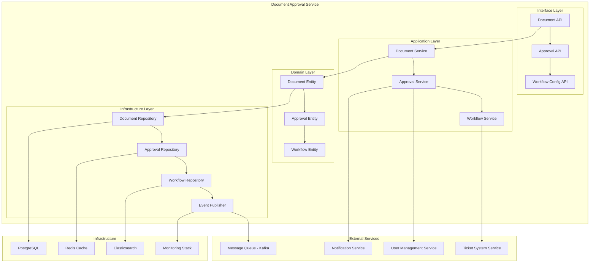
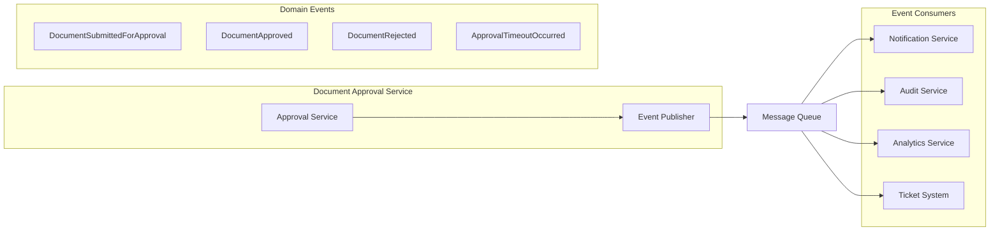
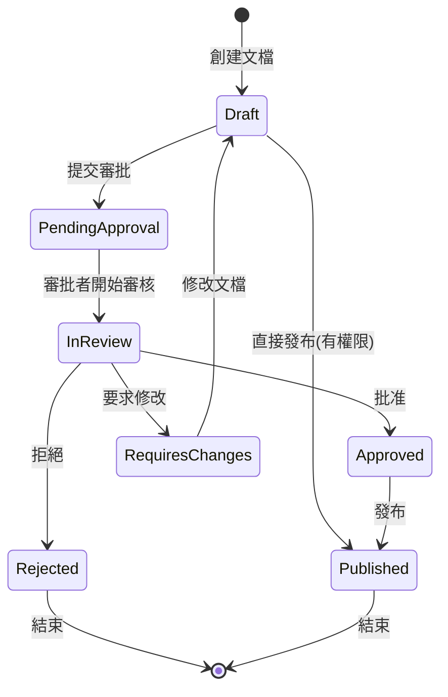
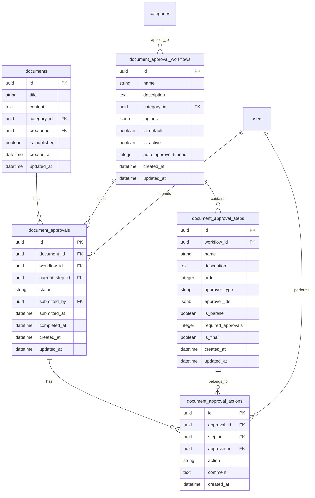

# Design Document

## Overview

文檔審批流程系統將為知識庫系統提供完整的多階段審批機制，確保文檔內容的品質和合規性。系統將重用現有的工單系統中成熟的工作流架構，包括 Workflow、WorkflowStep 和 WorkflowApproval 模型，並針對文檔審批場景進行適配和擴展。

設計遵循現有的 Clean Architecture 原則和事件驅動架構，與現有微服務生態系統無縫整合。系統將通過領域事件與其他服務通信，確保鬆耦合和高可擴展性，同時提供完整的監控和運維支援。

## Architecture

### 微服務架構圖



### 事件驅動架構圖



### 審批流程狀態圖



## Components and Interfaces

### 核心組件

#### 1. DocumentApprovalWorkflow (文檔審批工作流)

```python
class DocumentApprovalWorkflow(Base):
    """文檔審批工作流配置"""
    __tablename__ = "document_approval_workflows"

    id = Column(UUID, primary_key=True, default=uuid.uuid4)
    name = Column(String(100), nullable=False)
    description = Column(Text)
    category_id = Column(UUID, ForeignKey("categories.id"))  # 特定分類的審批流程
    tag_ids = Column(JSONB)  # 特定標籤的審批流程
    is_default = Column(Boolean, default=False)  # 是否為預設流程
    is_active = Column(Boolean, default=True)
    auto_approve_timeout = Column(Integer)  # 自動批准超時時間(小時)
    created_at = Column(DateTime, server_default=func.now())
    updated_at = Column(DateTime, server_default=func.now(), onupdate=func.now())
```

#### 2. DocumentApprovalStep (文檔審批步驟)

```python
class DocumentApprovalStep(Base):
    """文檔審批步驟"""
    __tablename__ = "document_approval_steps"

    id = Column(UUID, primary_key=True, default=uuid.uuid4)
    workflow_id = Column(UUID, ForeignKey("document_approval_workflows.id"))
    name = Column(String(100), nullable=False)
    description = Column(Text)
    order = Column(Integer, nullable=False)
    approver_type = Column(String(20), nullable=False)  # USER, ROLE, DEPARTMENT
    approver_ids = Column(JSONB)  # 審批者ID列表
    is_parallel = Column(Boolean, default=False)  # 是否並行審批
    required_approvals = Column(Integer, default=1)  # 需要的批准數量
    is_final = Column(Boolean, default=False)
    created_at = Column(DateTime, server_default=func.now())
    updated_at = Column(DateTime, server_default=func.now(), onupdate=func.now())
```

#### 3. DocumentApproval (文檔審批記錄)

```python
class DocumentApproval(Base):
    """文檔審批記錄"""
    __tablename__ = "document_approvals"

    id = Column(UUID, primary_key=True, default=uuid.uuid4)
    document_id = Column(UUID, ForeignKey("documents.id"), nullable=False)
    workflow_id = Column(UUID, ForeignKey("document_approval_workflows.id"))
    current_step_id = Column(UUID, ForeignKey("document_approval_steps.id"))
    status = Column(String(20), nullable=False)  # PENDING, IN_REVIEW, APPROVED, REJECTED, REQUIRES_CHANGES
    submitted_by = Column(UUID, ForeignKey("users.id"), nullable=False)
    submitted_at = Column(DateTime, server_default=func.now())
    completed_at = Column(DateTime)
    created_at = Column(DateTime, server_default=func.now())
    updated_at = Column(DateTime, server_default=func.now(), onupdate=func.now())
```

#### 4. DocumentApprovalAction (審批操作記錄)

```python
class DocumentApprovalAction(Base):
    """審批操作記錄"""
    __tablename__ = "document_approval_actions"

    id = Column(UUID, primary_key=True, default=uuid.uuid4)
    approval_id = Column(UUID, ForeignKey("document_approvals.id"), nullable=False)
    step_id = Column(UUID, ForeignKey("document_approval_steps.id"), nullable=False)
    approver_id = Column(UUID, ForeignKey("users.id"), nullable=False)
    action = Column(String(20), nullable=False)  # APPROVE, REJECT, REQUEST_CHANGES
    comment = Column(Text)
    created_at = Column(DateTime, server_default=func.now())
```

### 領域事件

#### 事件定義

```python
class DocumentApprovalEvent(BaseEvent):
    """文檔審批事件基類"""
    document_id: UUID
    approval_id: UUID
    user_id: UUID
    timestamp: datetime

class DocumentSubmittedForApproval(DocumentApprovalEvent):
    """文檔提交審批事件"""
    workflow_id: UUID
    approver_ids: List[UUID]

class DocumentApproved(DocumentApprovalEvent):
    """文檔批准事件"""
    approver_id: UUID
    step_id: UUID
    comment: Optional[str]

class DocumentRejected(DocumentApprovalEvent):
    """文檔拒絕事件"""
    approver_id: UUID
    step_id: UUID
    reason: str

class ApprovalStepCompleted(DocumentApprovalEvent):
    """審批步驟完成事件"""
    step_id: UUID
    next_step_id: Optional[UUID]

class ApprovalTimeoutOccurred(DocumentApprovalEvent):
    """審批超時事件"""
    step_id: UUID
    timeout_duration: int
    escalation_action: str
```

#### 事件發布器

```python
class DocumentApprovalEventPublisher:
    """文檔審批事件發布器"""

    def __init__(self, message_broker: MessageBroker):
        self.message_broker = message_broker

    async def publish_document_submitted(self, event: DocumentSubmittedForApproval):
        """發布文檔提交審批事件"""
        await self.message_broker.publish("document.approval.submitted", event)

    async def publish_document_approved(self, event: DocumentApproved):
        """發布文檔批准事件"""
        await self.message_broker.publish("document.approval.approved", event)

    async def publish_document_rejected(self, event: DocumentRejected):
        """發布文檔拒絕事件"""
        await self.message_broker.publish("document.approval.rejected", event)
```

### 外部服務整合

#### 用戶管理服務整合

```python
class UserManagementServiceClient:
    """用戶管理服務客戶端"""

    async def get_user_details(self, user_id: UUID) -> UserDetails:
        """獲取用戶詳情"""

    async def get_users_by_role(self, role: str) -> List[UserDetails]:
        """根據角色獲取用戶列表"""

    async def get_users_by_department(self, department_id: UUID) -> List[UserDetails]:
        """根據部門獲取用戶列表"""

    async def check_user_permissions(self, user_id: UUID, permission: str) -> bool:
        """檢查用戶權限"""
```

#### 通知服務整合

```python
class NotificationServiceClient:
    """通知服務客戶端"""

    async def send_approval_notification(self,
                                       recipient_ids: List[UUID],
                                       document_id: UUID,
                                       notification_type: str):
        """發送審批通知"""

    async def send_batch_notification(self, notifications: List[NotificationRequest]):
        """批量發送通知"""
```

#### 工單系統整合

```python
class TicketSystemServiceClient:
    """工單系統服務客戶端"""

    async def get_workflow_template(self, template_id: UUID) -> WorkflowTemplate:
        """獲取工作流模板"""

    async def reuse_approval_logic(self, workflow_config: WorkflowConfig) -> WorkflowEngine:
        """重用審批邏輯"""
```

### 服務接口

#### DocumentApprovalService

```python
class DocumentApprovalService:
    """文檔審批服務"""

    def submit_for_approval(self, document_id: UUID, user_id: UUID) -> DocumentApproval:
        """提交文檔進行審批"""

    def approve_document(self, approval_id: UUID, step_id: UUID, approver_id: UUID, comment: str = None) -> bool:
        """批准文檔"""

    def reject_document(self, approval_id: UUID, step_id: UUID, approver_id: UUID, comment: str) -> bool:
        """拒絕文檔"""

    def request_changes(self, approval_id: UUID, step_id: UUID, approver_id: UUID, comment: str) -> bool:
        """要求修改文檔"""

    def get_pending_approvals(self, user_id: UUID) -> List[DocumentApproval]:
        """獲取待審批文檔列表"""

    def get_approval_history(self, document_id: UUID) -> List[DocumentApprovalAction]:
        """獲取審批歷史"""

    def batch_approve(self, approval_ids: List[UUID], approver_id: UUID, comment: str = None) -> Dict[UUID, bool]:
        """批量批准"""
```

#### WorkflowConfigService

```python
class WorkflowConfigService:
    """工作流配置服務"""

    def create_workflow(self, workflow_data: DocumentApprovalWorkflowCreate) -> DocumentApprovalWorkflow:
        """創建審批工作流"""

    def add_approval_step(self, workflow_id: UUID, step_data: DocumentApprovalStepCreate) -> DocumentApprovalStep:
        """添加審批步驟"""

    def get_workflow_for_document(self, document: Document) -> Optional[DocumentApprovalWorkflow]:
        """根據文檔獲取適用的工作流"""

    def update_workflow(self, workflow_id: UUID, workflow_data: DocumentApprovalWorkflowUpdate) -> DocumentApprovalWorkflow:
        """更新工作流配置"""
```

## Data Models

### 數據庫關係圖



### 狀態枚舉

```python
class ApprovalStatus(str, Enum):
    PENDING = "PENDING"           # 待審批
    IN_REVIEW = "IN_REVIEW"       # 審核中
    APPROVED = "APPROVED"         # 已批准
    REJECTED = "REJECTED"         # 已拒絕
    REQUIRES_CHANGES = "REQUIRES_CHANGES"  # 要求修改

class ApprovalAction(str, Enum):
    APPROVE = "APPROVE"           # 批准
    REJECT = "REJECT"             # 拒絕
    REQUEST_CHANGES = "REQUEST_CHANGES"  # 要求修改

class ApproverType(str, Enum):
    USER = "USER"                 # 指定用戶
    ROLE = "ROLE"                 # 指定角色
    DEPARTMENT = "DEPARTMENT"     # 指定部門
```

## Error Handling

### 異常類型定義

```python
class DocumentApprovalException(Exception):
    """文檔審批異常基類"""
    pass

class WorkflowNotFoundException(DocumentApprovalException):
    """工作流未找到異常"""
    pass

class InvalidApprovalStateException(DocumentApprovalException):
    """無效審批狀態異常"""
    pass

class UnauthorizedApprovalException(DocumentApprovalException):
    """未授權審批異常"""
    pass

class ApprovalTimeoutException(DocumentApprovalException):
    """審批超時異常"""
    pass
```

### 錯誤處理策略

1. **業務邏輯錯誤**: 返回具體的錯誤信息和建議操作
2. **權限錯誤**: 記錄安全日誌並返回標準化錯誤信息
3. **系統錯誤**: 記錄詳細錯誤日誌，返回用戶友好的錯誤信息
4. **超時處理**: 自動觸發升級或自動批准機制

### HTTP 狀態碼映射

- `400 Bad Request`: 無效的審批操作或狀態
- `401 Unauthorized`: 未登入用戶
- `403 Forbidden`: 無審批權限
- `404 Not Found`: 文檔或審批記錄不存在
- `409 Conflict`: 審批狀態衝突
- `422 Unprocessable Entity`: 數據驗證失敗

## Testing Strategy

### 單元測試

1. **服務層測試**

   - 審批流程邏輯測試
   - 權限驗證測試
   - 狀態轉換測試
   - 超時處理測試

2. **模型層測試**
   - 數據模型驗證測試
   - 關聯關係測試
   - 約束條件測試

### 整合測試

1. **API 端點測試**

   - 審批提交流程測試
   - 批量操作測試
   - 權限控制測試

2. **數據庫整合測試**
   - 事務處理測試
   - 併發操作測試
   - 數據一致性測試

### 端到端測試

1. **完整審批流程測試**

   - 單階段審批流程
   - 多階段審批流程
   - 並行審批流程

2. **異常情況測試**
   - 審批超時處理
   - 審批者不可用情況
   - 工作流配置變更影響

### 性能測試

1. **負載測試**

   - 大量文檔同時提交審批
   - 批量審批操作性能
   - 審批歷史查詢性能

2. **壓力測試**
   - 高併發審批操作
   - 大量通知發送
   - 數據庫連接池壓力

### 測試數據準備

```python
@pytest.fixture
def sample_workflow():
    """創建測試用的審批工作流"""
    return DocumentApprovalWorkflow(
        name="標準文檔審批流程",
        description="適用於一般文檔的審批流程",
        is_default=True,
        auto_approve_timeout=72
    )

@pytest.fixture
def sample_approval_steps():
    """創建測試用的審批步驟"""
    return [
        DocumentApprovalStep(
            name="部門主管審批",
            order=1,
            approver_type=ApproverType.ROLE,
            approver_ids=["department_manager"],
            required_approvals=1
        ),
        DocumentApprovalStep(
            name="內容專家審批",
            order=2,
            approver_type=ApproverType.USER,
            approver_ids=["expert_user_id"],
            required_approvals=1,
            is_final=True
        )
    ]
```

### 測試覆蓋率目標

- **單元測試覆蓋率**: ≥ 90%
- **整合測試覆蓋率**: ≥ 80%
- **API 端點覆蓋率**: 100%
- **關鍵業務邏輯覆蓋率**: 100%
