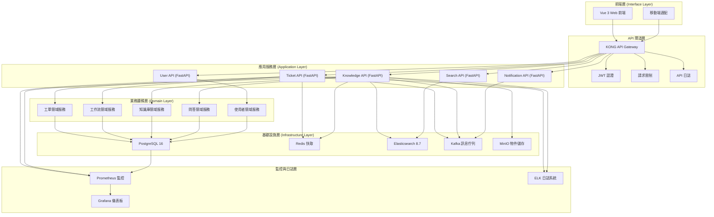

# Design Document

## Overview

本設計文件基於工單與知識庫系統的需求，提供完整的專案架構設計方案。系統採用 Clean Architecture 原則，結合事件驅動設計，實現高度模組化、可測試和可維護的企業級應用系統。

## Architecture

### 整體架構設計

系統採用分層架構，遵循依賴反轉原則，確保業務邏輯獨立於外部框架和技術細節。



### Clean Architecture 分層設計

#### Domain Layer (領域層)

- **Entities**: 核心業務實體 (Document, Ticket, User, Workflow)
- **Value Objects**: 值物件 (DocumentStatus, TicketPriority, WorkflowState)
- **Domain Events**: 領域事件 (DocumentCreated, TicketAssigned, WorkflowCompleted)
- **Repository Interfaces**: 儲存庫介面
- **Domain Services**: 領域服務

#### Application Layer (應用層)

- **Use Cases**: 業務用例 (CreateDocument, ProcessTicket, ExecuteWorkflow)
- **Application Services**: 應用服務
- **DTOs**: 資料傳輸物件
- **Event Handlers**: 事件處理器

#### Infrastructure Layer (基礎設施層)

- **Repository Implementations**: 儲存庫實作
- **External Service Adapters**: 外部服務適配器
- **Event Publishers**: 事件發布器
- **Database Models**: 資料庫模型

#### Interface Layer (介面層)

- **REST Controllers**: REST API 控制器
- **Request/Response Models**: 請求/回應模型
- **Middleware**: 中介軟體
- **Exception Handlers**: 例外處理器

## Components and Interfaces

### 前端元件架構

#### Vue 3 應用架構

```
src/
├── components/           # 可重用元件
│   ├── common/          # 通用元件
│   ├── ticket/          # 工單相關元件
│   ├── knowledge/       # 知識庫相關元件
│   └── workflow/        # 工作流相關元件
├── composables/         # 組合式函數
├── stores/              # Pinia 狀態管理
├── services/            # API 服務層
├── router/              # 路由配置
├── layouts/             # 頁面佈局
├── pages/               # 頁面元件
└── utils/               # 工具函數
```

#### 核心元件設計

- **TicketList**: 工單列表元件，支援篩選、排序、分頁
- **TicketForm**: 工單表單元件，支援動態欄位配置
- **WorkflowViewer**: 工作流視覺化元件
- **DocumentEditor**: 知識文檔編輯器，整合 Monaco Editor
- **SearchBox**: 統一搜尋元件，支援自動完成
- **NotificationCenter**: 通知中心元件

### 後端服務架構

#### API 服務設計

**Ticket API Service**

```python
# FastAPI 應用結構
app/
├── api/                 # API 路由
│   ├── v1/
│   │   ├── tickets.py
│   │   ├── workflows.py
│   │   └── approvals.py
├── core/                # 核心配置
├── models/              # SQLAlchemy 模型
├── schemas/             # Pydantic 模型
├── services/            # 業務邏輯服務
├── dependencies.py      # 依賴注入
└── main.py             # 應用入口
```

**Knowledge API Service**

```python
app/
├── api/
│   ├── v1/
│   │   ├── documents.py
│   │   ├── categories.py
│   │   ├── qa.py
│   │   └── search.py
├── core/
├── models/
├── schemas/
├── services/
├── dependencies.py
└── main.py
```

#### 核心介面定義

**Repository Interfaces**

```python
from abc import ABC, abstractmethod
from typing import List, Optional
import uuid

class TicketRepository(ABC):
    @abstractmethod
    async def create(self, ticket: Ticket) -> Ticket:
        pass

    @abstractmethod
    async def get_by_id(self, ticket_id: uuid.UUID) -> Optional[Ticket]:
        pass

    @abstractmethod
    async def list(self, filters: dict, skip: int, limit: int) -> List[Ticket]:
        pass

    @abstractmethod
    async def update(self, ticket: Ticket) -> Ticket:
        pass

    @abstractmethod
    async def delete(self, ticket_id: uuid.UUID) -> bool:
        pass
```

**Service Interfaces**

```python
class EventPublisher(ABC):
    @abstractmethod
    async def publish(self, event: DomainEvent) -> None:
        pass

class NotificationService(ABC):
    @abstractmethod
    async def send_notification(self, notification: Notification) -> None:
        pass
```

### 資料庫設計

#### PostgreSQL 資料庫架構

**核心資料表設計**

```sql
-- 使用者表
CREATE TABLE users (
    id UUID PRIMARY KEY DEFAULT gen_random_uuid(),
    username VARCHAR(50) UNIQUE NOT NULL,
    email VARCHAR(100) UNIQUE NOT NULL,
    full_name VARCHAR(100) NOT NULL,
    department_id UUID REFERENCES departments(id),
    role_id UUID REFERENCES roles(id),
    is_active BOOLEAN DEFAULT true,
    created_at TIMESTAMP WITH TIME ZONE DEFAULT NOW(),
    updated_at TIMESTAMP WITH TIME ZONE DEFAULT NOW()
);

-- 工單表
CREATE TABLE tickets (
    id UUID PRIMARY KEY DEFAULT gen_random_uuid(),
    title VARCHAR(200) NOT NULL,
    description TEXT,
    ticket_type_id UUID REFERENCES ticket_types(id),
    priority VARCHAR(20) DEFAULT 'medium',
    status VARCHAR(20) DEFAULT 'open',
    creator_id UUID REFERENCES users(id),
    assignee_id UUID REFERENCES users(id),
    workflow_id UUID REFERENCES workflows(id),
    created_at TIMESTAMP WITH TIME ZONE DEFAULT NOW(),
    updated_at TIMESTAMP WITH TIME ZONE DEFAULT NOW(),
    due_date TIMESTAMP WITH TIME ZONE
);

-- 知識文檔表
CREATE TABLE documents (
    id UUID PRIMARY KEY DEFAULT gen_random_uuid(),
    title VARCHAR(200) NOT NULL,
    content TEXT NOT NULL,
    summary TEXT,
    category_id UUID REFERENCES categories(id),
    creator_id UUID REFERENCES users(id),
    is_published BOOLEAN DEFAULT false,
    view_count INTEGER DEFAULT 0,
    created_at TIMESTAMP WITH TIME ZONE DEFAULT NOW(),
    updated_at TIMESTAMP WITH TIME ZONE DEFAULT NOW(),
    published_at TIMESTAMP WITH TIME ZONE
);

-- 工作流表
CREATE TABLE workflows (
    id UUID PRIMARY KEY DEFAULT gen_random_uuid(),
    name VARCHAR(100) NOT NULL,
    description TEXT,
    definition JSONB NOT NULL,
    is_active BOOLEAN DEFAULT true,
    created_at TIMESTAMP WITH TIME ZONE DEFAULT NOW(),
    updated_at TIMESTAMP WITH TIME ZONE DEFAULT NOW()
);
```

#### 索引策略

```sql
-- 效能優化索引
CREATE INDEX idx_tickets_status ON tickets(status);
CREATE INDEX idx_tickets_assignee ON tickets(assignee_id);
CREATE INDEX idx_tickets_created_at ON tickets(created_at);
CREATE INDEX idx_documents_category ON documents(category_id);
CREATE INDEX idx_documents_published ON documents(is_published, published_at);
CREATE INDEX idx_documents_search ON documents USING gin(to_tsvector('english', title || ' ' || content));
```

### 快取策略設計

#### Redis 快取架構

```python
# 快取鍵命名規範
CACHE_KEYS = {
    'user_profile': 'user:profile:{user_id}',
    'ticket_detail': 'ticket:detail:{ticket_id}',
    'document_content': 'document:content:{document_id}',
    'workflow_definition': 'workflow:definition:{workflow_id}',
    'search_results': 'search:results:{query_hash}',
    'user_permissions': 'user:permissions:{user_id}',
}

# 快取過期時間配置
CACHE_TTL = {
    'user_profile': 3600,      # 1小時
    'ticket_detail': 1800,     # 30分鐘
    'document_content': 7200,  # 2小時
    'workflow_definition': 86400,  # 24小時
    'search_results': 600,     # 10分鐘
    'user_permissions': 1800,  # 30分鐘
}
```

### 搜尋引擎設計

#### Elasticsearch 索引設計

```json
{
  "mappings": {
    "properties": {
      "title": {
        "type": "text",
        "analyzer": "standard",
        "fields": {
          "keyword": {
            "type": "keyword"
          }
        }
      },
      "content": {
        "type": "text",
        "analyzer": "standard"
      },
      "category": {
        "type": "keyword"
      },
      "tags": {
        "type": "keyword"
      },
      "created_at": {
        "type": "date"
      },
      "updated_at": {
        "type": "date"
      },
      "creator": {
        "type": "keyword"
      },
      "is_published": {
        "type": "boolean"
      }
    }
  }
}
```

## Data Models

### 領域實體模型

#### Ticket 實體

```python
@dataclass
class Ticket:
    id: UUID
    title: str
    description: str
    ticket_type: TicketType
    priority: TicketPriority
    status: TicketStatus
    creator: User
    assignee: Optional[User]
    workflow: Optional[Workflow]
    created_at: datetime
    updated_at: datetime
    due_date: Optional[datetime]

    def assign_to(self, user: User) -> None:
        self.assignee = user
        self.updated_at = datetime.now()
        self._add_event(TicketAssigned(self.id, user.id))

    def change_status(self, new_status: TicketStatus) -> None:
        old_status = self.status
        self.status = new_status
        self.updated_at = datetime.now()
        self._add_event(TicketStatusChanged(self.id, old_status, new_status))
```

#### Document 實體

```python
@dataclass
class Document:
    id: UUID
    title: str
    content: str
    summary: Optional[str]
    category: Category
    creator: User
    status: DocumentStatus
    view_count: int
    created_at: datetime
    updated_at: datetime
    published_at: Optional[datetime]
    tags: List[Tag]

    def publish(self) -> None:
        if self.status != DocumentStatus.PUBLISHED:
            self.status = DocumentStatus.PUBLISHED
            self.published_at = datetime.now()
            self.updated_at = datetime.now()
            self._add_event(DocumentPublished(self.id, self.creator.id))

    def add_view(self) -> None:
        self.view_count += 1
        self._add_event(DocumentViewed(self.id))
```

#### Workflow 實體

```python
@dataclass
class Workflow:
    id: UUID
    name: str
    description: str
    steps: List[WorkflowStep]
    is_active: bool
    created_at: datetime
    updated_at: datetime

    def execute_step(self, step_id: UUID, context: dict) -> WorkflowExecution:
        step = self._find_step(step_id)
        if not step:
            raise WorkflowStepNotFound(step_id)

        execution = step.execute(context)
        self._add_event(WorkflowStepExecuted(self.id, step_id, execution.result))
        return execution
```

### 資料傳輸物件 (DTOs)

#### API 請求/回應模型

```python
# Pydantic 模型
class TicketCreateRequest(BaseModel):
    title: str = Field(..., min_length=1, max_length=200)
    description: str = Field(..., min_length=1)
    ticket_type_id: UUID
    priority: TicketPriority = TicketPriority.MEDIUM
    assignee_id: Optional[UUID] = None
    due_date: Optional[datetime] = None

class TicketResponse(BaseModel):
    id: UUID
    title: str
    description: str
    ticket_type: TicketTypeResponse
    priority: TicketPriority
    status: TicketStatus
    creator: UserResponse
    assignee: Optional[UserResponse]
    created_at: datetime
    updated_at: datetime
    due_date: Optional[datetime]

    class Config:
        from_attributes = True

class DocumentCreateRequest(BaseModel):
    title: str = Field(..., min_length=1, max_length=200)
    content: str = Field(..., min_length=1)
    summary: Optional[str] = None
    category_id: UUID
    tag_ids: List[UUID] = []
    is_published: bool = False

class DocumentResponse(BaseModel):
    id: UUID
    title: str
    content: str
    summary: Optional[str]
    category: CategoryResponse
    creator: UserResponse
    status: DocumentStatus
    view_count: int
    created_at: datetime
    updated_at: datetime
    published_at: Optional[datetime]
    tags: List[TagResponse]

    class Config:
        from_attributes = True
```

## Error Handling

### 例外處理架構

#### 自定義例外類別

```python
class DomainException(Exception):
    """領域例外基類"""
    def __init__(self, message: str, error_code: str = None):
        self.message = message
        self.error_code = error_code
        super().__init__(message)

class TicketNotFoundException(DomainException):
    def __init__(self, ticket_id: UUID):
        super().__init__(f"Ticket {ticket_id} not found", "TICKET_NOT_FOUND")

class DocumentNotFoundException(DomainException):
    def __init__(self, document_id: UUID):
        super().__init__(f"Document {document_id} not found", "DOCUMENT_NOT_FOUND")

class WorkflowExecutionException(DomainException):
    def __init__(self, workflow_id: UUID, step_id: UUID, reason: str):
        super().__init__(
            f"Workflow {workflow_id} step {step_id} execution failed: {reason}",
            "WORKFLOW_EXECUTION_FAILED"
        )

class ValidationException(DomainException):
    def __init__(self, field: str, message: str):
        super().__init__(f"Validation failed for {field}: {message}", "VALIDATION_ERROR")
```

#### 全域例外處理器

```python
from fastapi import FastAPI, Request, HTTPException
from fastapi.responses import JSONResponse

app = FastAPI()

@app.exception_handler(DomainException)
async def domain_exception_handler(request: Request, exc: DomainException):
    return JSONResponse(
        status_code=400,
        content={
            "error": {
                "code": exc.error_code,
                "message": exc.message,
                "type": "domain_error"
            }
        }
    )

@app.exception_handler(ValidationException)
async def validation_exception_handler(request: Request, exc: ValidationException):
    return JSONResponse(
        status_code=422,
        content={
            "error": {
                "code": exc.error_code,
                "message": exc.message,
                "type": "validation_error"
            }
        }
    )

@app.exception_handler(Exception)
async def general_exception_handler(request: Request, exc: Exception):
    return JSONResponse(
        status_code=500,
        content={
            "error": {
                "code": "INTERNAL_SERVER_ERROR",
                "message": "An unexpected error occurred",
                "type": "system_error"
            }
        }
    )
```

### 錯誤回應格式標準化

```json
{
  "error": {
    "code": "TICKET_NOT_FOUND",
    "message": "Ticket 123e4567-e89b-12d3-a456-426614174000 not found",
    "type": "domain_error",
    "details": {
      "field": "ticket_id",
      "value": "123e4567-e89b-12d3-a456-426614174000"
    }
  }
}
```

## Testing Strategy

### 測試架構設計

#### 測試金字塔

```
    /\
   /  \     E2E Tests (少量)
  /____\
 /      \   Integration Tests (適量)
/________\  Unit Tests (大量)
```

#### 單元測試策略

```python
# 領域實體測試
class TestTicket:
    def test_create_ticket(self):
        ticket = Ticket.create(
            title="Test Ticket",
            description="Test Description",
            ticket_type=TicketType.BUG,
            creator=User(id=uuid4(), username="test_user")
        )

        assert ticket.title == "Test Ticket"
        assert ticket.status == TicketStatus.OPEN
        assert len(ticket.get_events()) == 1
        assert isinstance(ticket.get_events()[0], TicketCreated)

    def test_assign_ticket(self):
        ticket = Ticket.create(...)
        assignee = User(id=uuid4(), username="assignee")

        ticket.assign_to(assignee)

        assert ticket.assignee == assignee
        events = ticket.get_events()
        assert any(isinstance(e, TicketAssigned) for e in events)

# 用例測試
class TestCreateTicketUseCase:
    def test_execute_success(self):
        # Arrange
        repository = Mock(spec=TicketRepository)
        event_publisher = Mock(spec=EventPublisher)
        use_case = CreateTicketUseCase(repository, event_publisher)

        command = CreateTicketCommand(
            title="Test Ticket",
            description="Test Description",
            ticket_type_id=uuid4(),
            creator_id=uuid4()
        )

        # Act
        result = use_case.execute(command)

        # Assert
        repository.save.assert_called_once()
        event_publisher.publish.assert_called()
        assert result.title == command.title
```

#### 整合測試策略

```python
# API 整合測試
class TestTicketAPI:
    @pytest.fixture
    def client(self):
        return TestClient(app)

    @pytest.fixture
    def auth_headers(self):
        token = create_test_jwt_token()
        return {"Authorization": f"Bearer {token}"}

    def test_create_ticket(self, client, auth_headers):
        payload = {
            "title": "Test Ticket",
            "description": "Test Description",
            "ticket_type_id": str(uuid4()),
            "priority": "high"
        }

        response = client.post("/api/v1/tickets", json=payload, headers=auth_headers)

        assert response.status_code == 201
        data = response.json()
        assert data["title"] == payload["title"]
        assert data["priority"] == payload["priority"]

# 資料庫整合測試
class TestTicketRepository:
    @pytest.fixture
    def db_session(self):
        engine = create_engine("sqlite:///:memory:")
        Base.metadata.create_all(engine)
        session = sessionmaker(bind=engine)()
        yield session
        session.close()

    def test_save_and_retrieve_ticket(self, db_session):
        repository = SQLAlchemyTicketRepository(db_session)
        ticket = Ticket.create(...)

        saved_ticket = repository.save(ticket)
        retrieved_ticket = repository.get_by_id(saved_ticket.id)

        assert retrieved_ticket is not None
        assert retrieved_ticket.title == ticket.title
```

#### E2E 測試策略

```python
# 使用 Playwright 進行 E2E 測試
class TestTicketWorkflow:
    def test_complete_ticket_workflow(self, page):
        # 登入
        page.goto("/login")
        page.fill("#username", "test_user")
        page.fill("#password", "test_password")
        page.click("#login-button")

        # 創建工單
        page.goto("/tickets/create")
        page.fill("#title", "E2E Test Ticket")
        page.fill("#description", "This is an E2E test ticket")
        page.select_option("#ticket-type", "bug")
        page.click("#submit-button")

        # 驗證工單創建成功
        expect(page.locator(".success-message")).to_contain_text("Ticket created successfully")

        # 分配工單
        page.click("#assign-button")
        page.select_option("#assignee", "john_doe")
        page.click("#confirm-assign")

        # 驗證工單狀態更新
        expect(page.locator("#ticket-status")).to_contain_text("Assigned")
```

### 測試資料管理

```python
# 測試資料工廠
class TicketFactory:
    @staticmethod
    def create_ticket(**kwargs):
        defaults = {
            "id": uuid4(),
            "title": "Test Ticket",
            "description": "Test Description",
            "ticket_type": TicketType.TASK,
            "priority": TicketPriority.MEDIUM,
            "status": TicketStatus.OPEN,
            "creator": UserFactory.create_user(),
            "created_at": datetime.now(),
            "updated_at": datetime.now()
        }
        defaults.update(kwargs)
        return Ticket(**defaults)

class UserFactory:
    @staticmethod
    def create_user(**kwargs):
        defaults = {
            "id": uuid4(),
            "username": f"user_{random.randint(1000, 9999)}",
            "email": f"user{random.randint(1000, 9999)}@example.com",
            "full_name": "Test User",
            "is_active": True
        }
        defaults.update(kwargs)
        return User(**defaults)
```

### 效能測試策略

```python
# 使用 locust 進行負載測試
from locust import HttpUser, task, between

class TicketSystemUser(HttpUser):
    wait_time = between(1, 3)

    def on_start(self):
        # 登入獲取 token
        response = self.client.post("/auth/login", json={
            "username": "test_user",
            "password": "test_password"
        })
        self.token = response.json()["access_token"]
        self.headers = {"Authorization": f"Bearer {self.token}"}

    @task(3)
    def list_tickets(self):
        self.client.get("/api/v1/tickets", headers=self.headers)

    @task(2)
    def get_ticket_detail(self):
        ticket_id = "123e4567-e89b-12d3-a456-426614174000"
        self.client.get(f"/api/v1/tickets/{ticket_id}", headers=self.headers)

    @task(1)
    def create_ticket(self):
        payload = {
            "title": f"Load Test Ticket {random.randint(1, 1000)}",
            "description": "This is a load test ticket",
            "ticket_type_id": "456e7890-e89b-12d3-a456-426614174000",
            "priority": "medium"
        }
        self.client.post("/api/v1/tickets", json=payload, headers=self.headers)
```

### 測試環境配置

```yaml
# docker-compose.test.yml
version: "3.8"
services:
  test-db:
    image: postgres:16
    environment:
      POSTGRES_DB: test_db
      POSTGRES_USER: test_user
      POSTGRES_PASSWORD: test_password
    ports:
      - "5433:5432"

  test-redis:
    image: redis:7
    ports:
      - "6380:6379"

  test-elasticsearch:
    image: elasticsearch:8.7.0
    environment:
      - discovery.type=single-node
      - ES_JAVA_OPTS=-Xms256m -Xmx256m
    ports:
      - "9201:9200"
```

這個設計文件涵蓋了系統的整體架構、元件設計、資料模型、錯誤處理和測試策略，為後續的實作提供了詳細的技術指導。
