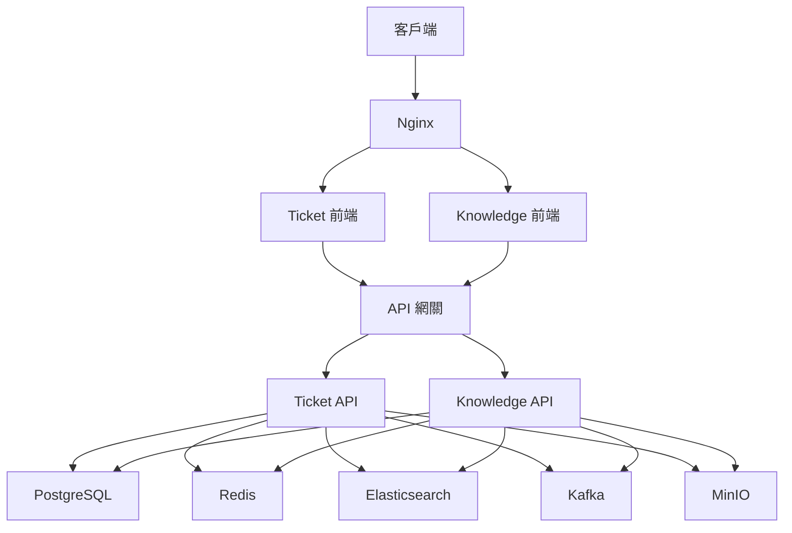
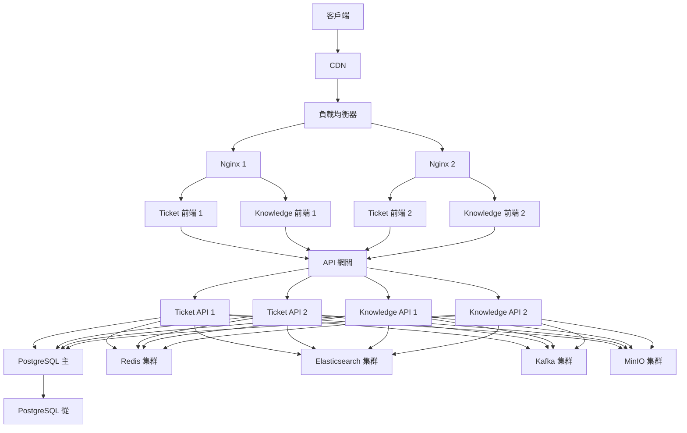

# Ticket 與 Knowledge 系統部署

## 概述

本目錄包含 Ticket 與 Knowledge 系統的部署配置和腳本。系統支持 Docker 和 Kubernetes 部署，並提供了相關的配置文件和部署腳本。

## 目錄結構

```
├── docker/              # Docker 配置
│   ├── frontend/        # 前端 Docker 配置
│   ├── backend/         # 後端 Docker 配置
│   ├── database/        # 數據庫 Docker 配置
│   ├── elasticsearch/   # Elasticsearch Docker 配置
│   ├── redis/           # Redis Docker 配置
│   ├── kafka/           # Kafka Docker 配置
│   ├── minio/           # MinIO Docker 配置
│   └── nginx/           # Nginx Docker 配置
├── kubernetes/          # Kubernetes 配置
│   ├── frontend/        # 前端 Kubernetes 配置
│   ├── backend/         # 後端 Kubernetes 配置
│   ├── database/        # 數據庫 Kubernetes 配置
│   ├── elasticsearch/   # Elasticsearch Kubernetes 配置
│   ├── redis/           # Redis Kubernetes 配置
│   ├── kafka/           # Kafka Kubernetes 配置
│   ├── minio/           # MinIO Kubernetes 配置
│   └── ingress/         # Ingress Kubernetes 配置
└── scripts/             # 部署腳本
    ├── setup/           # 環境設置腳本
    ├── deploy/          # 部署腳本
    ├── backup/          # 備份腳本
    └── monitoring/      # 監控腳本
```

## Docker 部署

系統使用 Docker Compose 進行本地開發和測試部署。Docker Compose 配置文件位於 `docker` 目錄下。

### 開發環境部署

```bash
# 構建並啟動所有服務
docker-compose -f docker/docker-compose.dev.yml up -d

# 查看服務狀態
docker-compose -f docker/docker-compose.dev.yml ps

# 查看服務日誌
docker-compose -f docker/docker-compose.dev.yml logs -f

# 停止所有服務
docker-compose -f docker/docker-compose.dev.yml down
```

### 生產環境部署

```bash
# 構建並啟動所有服務
docker-compose -f docker/docker-compose.prod.yml up -d

# 查看服務狀態
docker-compose -f docker/docker-compose.prod.yml ps

# 查看服務日誌
docker-compose -f docker/docker-compose.prod.yml logs -f

# 停止所有服務
docker-compose -f docker/docker-compose.prod.yml down
```

## Kubernetes 部署

系統支持 Kubernetes 部署，適用於生產環境。Kubernetes 配置文件位於 `kubernetes` 目錄下。

### 部署步驟

```bash
# 創建命名空間
kubectl create namespace ticket-knowledge

# 部署數據庫
kubectl apply -f kubernetes/database/

# 部署 Redis
kubectl apply -f kubernetes/redis/

# 部署 Elasticsearch
kubectl apply -f kubernetes/elasticsearch/

# 部署 Kafka
kubectl apply -f kubernetes/kafka/

# 部署 MinIO
kubectl apply -f kubernetes/minio/

# 部署後端服務
kubectl apply -f kubernetes/backend/

# 部署前端服務
kubectl apply -f kubernetes/frontend/

# 部署 Ingress
kubectl apply -f kubernetes/ingress/
```

### 查看部署狀態

```bash
# 查看所有資源
kubectl get all -n ticket-knowledge

# 查看 Pod 狀態
kubectl get pods -n ticket-knowledge

# 查看 Service 狀態
kubectl get svc -n ticket-knowledge

# 查看 Ingress 狀態
kubectl get ingress -n ticket-knowledge
```

## 部署架構

### 開發環境架構



### 生產環境架構



## 監控與日誌

系統使用 Prometheus 和 Grafana 進行監控，使用 ELK 堆棧進行日誌收集和分析。

### 監控配置

監控配置文件位於 `kubernetes/monitoring` 目錄下。

```bash
# 部署 Prometheus
kubectl apply -f kubernetes/monitoring/prometheus/

# 部署 Grafana
kubectl apply -f kubernetes/monitoring/grafana/
```

### 日誌配置

日誌配置文件位於 `kubernetes/logging` 目錄下。

```bash
# 部署 Elasticsearch
kubectl apply -f kubernetes/logging/elasticsearch/

# 部署 Logstash
kubectl apply -f kubernetes/logging/logstash/

# 部署 Kibana
kubectl apply -f kubernetes/logging/kibana/

# 部署 Filebeat
kubectl apply -f kubernetes/logging/filebeat/
```

## 備份與恢復

系統使用 Velero 進行 Kubernetes 資源備份，使用 PostgreSQL 的備份工具進行數據庫備份。

### 備份配置

備份配置文件位於 `kubernetes/backup` 目錄下。

```bash
# 部署 Velero
kubectl apply -f kubernetes/backup/velero/

# 創建備份
velero backup create ticket-knowledge-backup --include-namespaces ticket-knowledge

# 查看備份狀態
velero backup describe ticket-knowledge-backup

# 恢復備份
velero restore create --from-backup ticket-knowledge-backup
```

### 數據庫備份

數據庫備份腳本位於 `scripts/backup` 目錄下。

```bash
# 執行數據庫備份
bash scripts/backup/backup-database.sh

# 恢復數據庫備份
bash scripts/backup/restore-database.sh <備份文件>
```

## 擴展性考量

系統設計考慮了擴展性，可以通過以下方式進行擴展：

1. **水平擴展**：增加服務實例數量
2. **垂直擴展**：增加服務資源配置
3. **數據庫擴展**：使用讀寫分離、分片等技術
4. **緩存擴展**：使用 Redis 集群
5. **存儲擴展**：使用 MinIO 分佈式存儲

## 安全考量

系統設計考慮了安全性，採用了以下安全措施：

1. **網絡安全**：使用 TLS/SSL 加密通信
2. **認證與授權**：使用 JWT、OAuth2 進行認證和授權
3. **數據安全**：敏感數據加密存儲
4. **容器安全**：使用最小權限原則
5. **監控與審計**：記錄關鍵操作的審計日誌