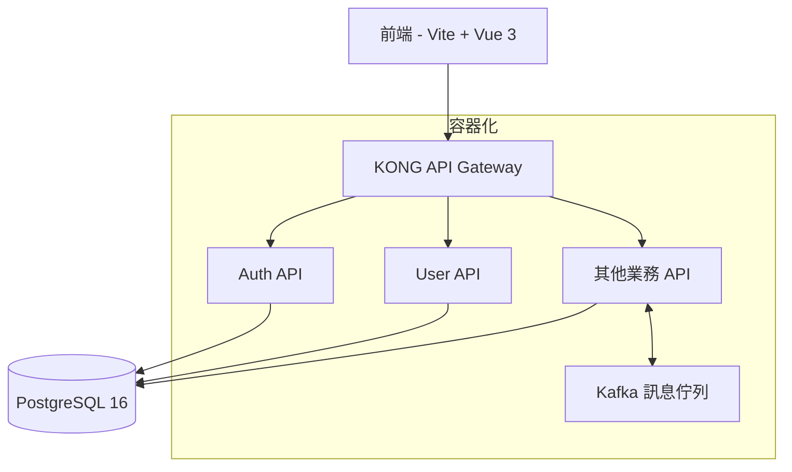

# 產品需求文檔 (PRD)

## 文檔信息

| 項目 | 內容 |
|------|------|
| 文檔版本 | v1.0 |
| 創建日期 | 2023-11-30 |
| 最後更新 | 2023-11-30 |
| 文檔目的 | 整理現有技術架構並為後續產品規劃提供基礎 |

## 產品技術架構概述

本文檔整理了現有技術架構，作為後續產品規劃的基礎。系統採用前後端分離架構，結合多種現代技術，提供高效能、可擴展的應用平台。

### 技術架構總覽

## 前端技術堆疊

### 核心框架與工具

| 技術 | 用途 | 優勢 |
|------|------|------|
| Vite | 建構工具 | 快速的開發伺服器啟動、即時模組熱替換 (HMR)、優化的生產構建 |
| Vue 3 | 前端框架 | 高效能響應式系統、Composition API、更好的 TypeScript 支援 |

## 後端技術堆疊

### 核心框架與工具

| 技術 | 用途 | 適用場景 |
|------|------|----------|
| Python Django | Web 應用框架 | 需要快速開發且功能完整的 Web 應用程式 |
| Python FastAPI | API 開發框架 | 高效能 API 開發，提供快速的請求處理能力 |
| C# Web API | API 開發框架 | 特定業務邏輯或既有系統整合需求 |

### 資料儲存

| 技術 | 用途 | 優勢 |
|------|------|------|
| PostgreSQL 16 | 關聯式資料庫 | 穩定性、擴展性和豐富的功能集，提供可靠的資料儲存 |

### API 管理

| 技術 | 用途 | 優勢 |
|------|------|------|
| KONG API Gateway | API 管理平台 | 集中管理、路由和保護 API 請求 |

### 訊息佇列

| 技術 | 用途 | 優勢 |
|------|------|------|
| Kafka | 訊息佇列系統 | 高吞吐量、低延遲的訊息傳遞，用於異步通訊、日誌收集和事件串流處理 |

### 容器化

| 技術 | 用途 | 優勢 |
|------|------|------|
| Docker | 容器平台 | 應用程式容器化，確保環境一致性 |
| Docker Compose | 容器編排 | 定義和運行多容器應用程式，確保開發、測試和生產環境的一致性 |

## 身份驗證與授權

### 認證機制

| 技術 | 用途 | 優勢 |
|------|------|------|
| 單點登入 (SSO) | 統一身份驗證 | 提供一致的使用者驗證體驗 |
| JWT (JSON Web Token) | 身份驗證令牌 | 安全且無狀態的驗證機制 |
| KONG API JWT 認證 | API 層級認證 | 在 API Gateway 層級進行 JWT 認證，確保只有經過驗證的請求才能存取後端服務 |

## 核心 API 服務

### 現有 API 服務

| 服務名稱 | 功能描述 | 技術選擇 |
|----------|----------|----------|
| Auth API | 處理所有登入、註冊、密碼重置等身份驗證相關的業務邏輯 | 待確認 |
| User API | 管理使用者資訊，如個人資料查詢、修改等 | 待確認 |

## 非功能需求

### 效能需求

- API 響應時間應在 300ms 以內（95% 請求）
- 系統應能支援同時 1000+ 使用者在線
- 資料庫查詢效能優化，確保複雜查詢在 1 秒內完成

### 安全需求

- 所有 API 通訊必須使用 HTTPS
- 敏感資料必須加密儲存
- 實施 API 請求頻率限制，防止 DDoS 攻擊
- 定期進行安全審計和漏洞掃描

### 可用性需求

- 系統可用性目標為 99.9%
- 實施自動故障轉移機制
- 建立完整的監控和警報系統

### 可擴展性需求

- 系統架構應支援水平擴展
- 資料庫設計應考慮未來資料量增長
- 微服務架構應允許獨立擴展各個服務

## 技術架構考量

### 系統整合

- 透過 KONG API Gateway 整合所有微服務
- 使用 Kafka 實現服務間的非同步通訊
- 建立統一的日誌收集和監控系統

### 資料模型

待後續產品需求確認後詳細設計

## 驗收標準彙總

待後續產品需求確認後詳細設計

## 成功指標與 KPI

待後續產品需求確認後詳細設計