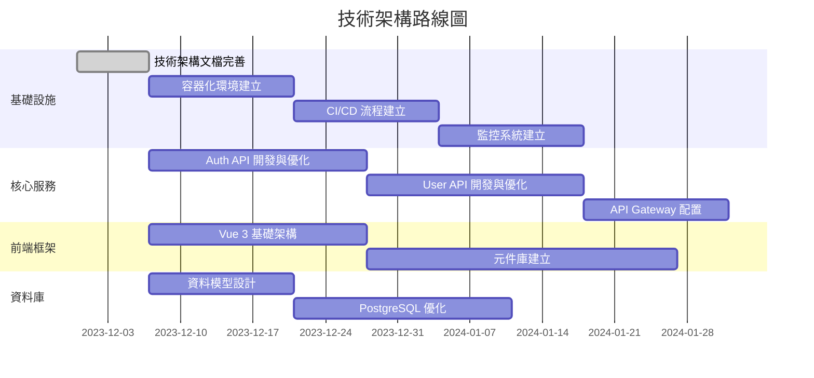

# 產品路線圖 (Roadmap)

## 路線圖總覽

本路線圖基於現有技術架構，提供後續產品開發的階段性規劃。由於尚未確定具體產品需求，此路線圖主要聚焦於技術架構的演進和基礎設施的建立。

## 版本策略與規劃

### 技術基礎版 (v0.1)

**目標**: 建立基本技術架構和開發環境

**主要內容**:
- 完善技術架構文檔
- 建立容器化開發環境
- 設置基本的 CI/CD 流程
- 實現基礎 Auth API 功能
- 實現基礎 User API 功能
- 建立前端基礎架構

**預計時間**: 1-2 個月

### 核心功能版 (v0.2)

**目標**: 實現核心業務功能和基礎設施優化

**主要內容**:
- 完善 Auth 和 User API
- 實現 KONG API Gateway 的完整配置
- 建立監控和日誌系統
- 優化資料庫設計和效能
- 開發前端元件庫
- 實現基本業務流程

**預計時間**: 2-3 個月

### MVP 版本 (v1.0)

**目標**: 發布最小可行產品

**主要內容**:
- 完整的使用者身份驗證和授權
- 核心業務功能實現
- 基本的使用者介面
- 完整的 API 文檔
- 基本的系統監控和警報

**預計時間**: 待產品需求確認後評估

### 功能擴展版 (v2.0)

**目標**: 擴展產品功能和優化使用者體驗

**主要內容**:
- 進階功能實現
- 使用者體驗優化
- 系統效能優化
- 資料分析和報表功能

**預計時間**: 待產品需求確認後評估

## 功能優先順序

### P0 (必要功能)

- 使用者身份驗證和授權系統
- 核心 API 服務 (Auth API, User API)
- 基本的前端框架和元件
- 資料庫基礎設計和優化
- API Gateway 基本配置

### P1 (重要功能)

- 完整的 API 文檔和開發指南
- 監控和日誌系統
- CI/CD 自動化流程
- 容器化部署流程
- 基本的錯誤處理和異常監控

### P2 (增強功能)

- 進階資料分析和報表
- 效能優化和擴展
- 自動化測試框架
- 使用者體驗優化
- 多語言支援

## 時程與資源規劃

### 階段一：技術基礎建設 (1-2 個月)

**資源需求**:
- 後端開發人員: 2-3 人
- 前端開發人員: 1-2 人
- DevOps 工程師: 1 人
- 產品經理: 1 人

**主要任務**:
- 技術架構文檔完善
- 開發環境建立
- 基礎 API 開發
- 前端框架搭建

### 階段二：核心功能開發 (2-3 個月)

**資源需求**:
- 後端開發人員: 3-4 人
- 前端開發人員: 2-3 人
- DevOps 工程師: 1 人
- QA 工程師: 1-2 人
- 產品經理: 1 人
- UI/UX 設計師: 1 人

**主要任務**:
- 核心業務功能開發
- API Gateway 配置優化
- 監控系統建立
- 前端元件開發
- 自動化測試建立

### 階段三：MVP 發布 (時間待定)

**資源需求**:
- 後端開發人員: 3-4 人
- 前端開發人員: 2-3 人
- DevOps 工程師: 1 人
- QA 工程師: 2 人
- 產品經理: 1 人
- UI/UX 設計師: 1 人

**主要任務**:
- 功能整合和測試
- 使用者體驗優化
- 效能測試和優化
- 文檔完善
- 上線準備

## 風險管理

### 技術風險

| 風險 | 影響 | 緩解策略 |
|------|------|----------|
| 技術堆疊整合複雜度高 | 可能導致開發延遲和系統不穩定 | 建立明確的技術整合規範，進行充分的技術驗證和原型測試 |
| 效能瓶頸 | 系統響應緩慢，影響使用者體驗 | 早期進行效能測試，識別潛在瓶頸，實施效能優化策略 |
| 安全漏洞 | 資料洩露或系統被入侵 | 實施嚴格的安全開發流程，定期進行安全審計和漏洞掃描 |

### 資源風險

| 風險 | 影響 | 緩解策略 |
|------|------|----------|
| 技術人才短缺 | 開發進度延遲 | 提前規劃人力需求，建立技術培訓計劃，考慮外部資源 |
| 需求變更頻繁 | 範圍蔓延，影響交付時間 | 建立明確的需求變更流程，實施敏捷開發方法，定期回顧和調整 |
| 預算限制 | 功能縮減或品質降低 | 優先實施核心功能，建立明確的預算控制機制，定期檢討資源分配 |

### 業務風險

| 風險 | 影響 | 緩解策略 |
|------|------|----------|
| 市場需求變化 | 產品功能與市場需求不符 | 定期進行市場調研，保持產品靈活性，快速回應市場變化 |
| 競爭對手 | 市場份額減少 | 持續監控競爭對手動向，保持產品創新，強化差異化優勢 |
| 使用者接受度低 | 產品採用率低 | 早期進行使用者測試，收集反饋，持續優化使用者體驗 |