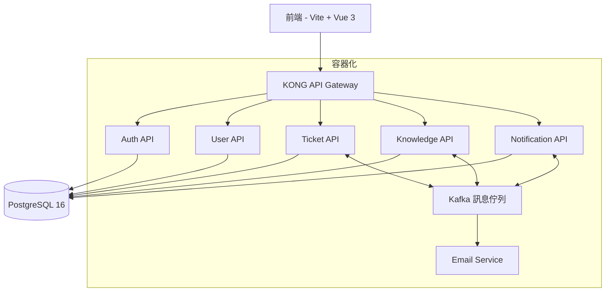
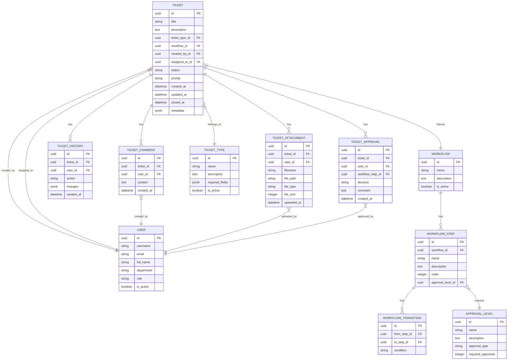
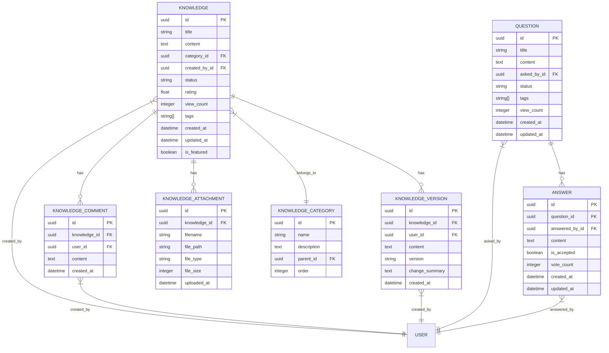

# Ticket 與 Knowledge 系統產品需求文檔 (PRD)

## 文檔信息

| 項目 | 內容 |
|------|------|
| 文檔版本 | v1.0 |
| 創建日期 | 2023-12-01 |
| 最後更新 | 2023-12-01 |
| 文檔目的 | 定義 Ticket 與 Knowledge 系統的需求與設計 |

## 產品概述

### 背景

公司需要一個完整的工單管理與知識庫系統，用於處理系統參數修改、系統上線、資料變更等需求的簽核流程，同時建立內部知識庫以維護系統操作指南、問答集與異常處理流程。

### 系統目標

1. **Ticket 系統**：提供完整的工單生命週期管理，支援多種工單類型、自定義工作流程與簽核機制。
2. **Knowledge 系統**：建立結構化的知識庫，方便員工查詢系統操作指南、常見問題解答與異常處理方法。

### 系統架構總覽

## Ticket 系統需求

### 功能需求

#### 1. 工單管理

| 功能 | 描述 | 優先級 |
|------|------|--------|
| 工單創建 | 允許用戶創建不同類型的工單，包括參數修改、系統上線、資料變更等 | P0 |
| 工單查詢 | 提供多條件查詢功能，支援按狀態、類型、創建者、處理者等篩選 | P0 |
| 工單詳情 | 顯示工單的詳細信息，包括基本信息、處理歷程、附件等 | P0 |
| 工單更新 | 允許相關人員更新工單狀態、添加評論、上傳附件等 | P0 |
| 工單關閉 | 完成處理後關閉工單，並記錄解決方案 | P0 |

#### 2. 工作流程與簽核

| 功能 | 描述 | 優先級 |
|------|------|--------|
| 自定義工作流程 | 支援為不同類型的工單定義不同的工作流程 | P0 |
| 多級簽核 | 支援多級簽核流程，可設定簽核順序與條件 | P0 |
| 簽核通知 | 當工單需要簽核時，自動通知相關簽核人 | P0 |
| 簽核歷程 | 記錄完整的簽核歷程，包括簽核人、時間、結果與意見 | P0 |
| 簽核委派 | 允許簽核人將簽核權限臨時委派給他人 | P1 |

#### 3. 通知與提醒

| 功能 | 描述 | 優先級 |
|------|------|--------|
| 郵件通知 | 工單狀態變更時發送郵件通知相關人員 | P0 |
| 系統通知 | 在系統內顯示通知，提醒用戶待處理的工單 | P0 |
| 定時提醒 | 對於長時間未處理的工單，定期發送提醒 | P1 |
| 通知設置 | 允許用戶自定義通知方式與頻率 | P2 |

#### 4. 報表與分析

| 功能 | 描述 | 優先級 |
|------|------|--------|
| 工單統計 | 提供工單數量、類型、狀態等統計信息 | P1 |
| 處理效率分析 | 分析工單處理時間、各階段耗時等 | P1 |
| 自定義報表 | 允許管理員自定義報表內容與格式 | P2 |
| 數據導出 | 支援將報表數據導出為 Excel、PDF 等格式 | P2 |

### 使用者角色與權限

| 角色 | 描述 | 權限 |
|------|------|------|
| 一般用戶 | 系統的基本使用者 | 創建工單、查看自己的工單、接收通知 |
| 處理人員 | 負責處理工單的人員 | 處理分配給自己的工單、更新工單狀態 |
| 簽核人員 | 負責簽核工單的人員 | 簽核工單、添加簽核意見 |
| 管理員 | 系統管理人員 | 管理工單類型、工作流程、用戶權限等 |
| 超級管理員 | 系統最高權限管理者 | 所有權限，包括系統配置、數據管理等 |

### 工單類型

| 類型 | 描述 | 所需信息 | 工作流程 |
|------|------|----------|----------|
| 參數修改 | 系統參數變更請求 | 參數名稱、當前值、目標值、修改原因、影響範圍 | 創建 → 審核 → 實施 → 驗證 → 關閉 |
| 系統上線 | 新系統或功能上線請求 | 系統名稱、版本、功能描述、測試報告、上線計劃 | 創建 → 技術審核 → 業務審核 → 實施計劃 → 上線 → 驗證 → 關閉 |
| 資料變更 | 資料庫資料變更請求 | 資料表、變更內容、變更原因、影響範圍、回滾計劃 | 創建 → 審核 → 備份 → 實施 → 驗證 → 關閉 |
| 問題報告 | 系統問題或錯誤報告 | 問題描述、重現步驟、影響範圍、優先級 | 創建 → 分派 → 調查 → 解決 → 驗證 → 關閉 |
| 功能請求 | 新功能或改進請求 | 功能描述、業務價值、優先級 | 創建 → 評估 → 審核 → 規劃 → 開發 → 測試 → 上線 → 關閉 |

## Knowledge 系統需求

### 功能需求

#### 1. 知識管理

| 功能 | 描述 | 優先級 |
|------|------|--------|
| 知識創建 | 允許用戶創建知識文檔，支援富文本編輯 | P0 |
| 知識分類 | 支援多層級分類，方便組織與查找知識 | P0 |
| 知識查詢 | 提供全文搜索功能，支援按標題、內容、標籤等搜索 | P0 |
| 知識更新 | 允許作者或管理員更新知識內容 | P0 |
| 版本控制 | 記錄知識文檔的修改歷史，支援版本比較與回滾 | P1 |

#### 2. 知識共享與協作

| 功能 | 描述 | 優先級 |
|------|------|--------|
| 評論與討論 | 允許用戶對知識文檔進行評論與討論 | P1 |
| 知識評分 | 允許用戶對知識文檔進行評分，反映其有用性 | P1 |
| 協作編輯 | 支援多人協作編輯知識文檔 | P2 |
| 知識推薦 | 基於用戶行為與偏好推薦相關知識 | P2 |

#### 3. 問答管理

| 功能 | 描述 | 優先級 |
|------|------|--------|
| 問題提交 | 允許用戶提交問題 | P0 |
| 回答管理 | 允許專家或管理員回答問題 | P0 |
| 最佳回答標記 | 允許提問者或管理員標記最佳回答 | P1 |
| 相關問題推薦 | 在提問時推薦相似的已解決問題 | P1 |

#### 4. 異常處理指南

| 功能 | 描述 | 優先級 |
|------|------|--------|
| 異常記錄 | 記錄系統異常情況與處理方法 | P0 |
| 處理流程定義 | 定義標準化的異常處理流程 | P0 |
| 案例分析 | 提供真實案例的分析與解決方案 | P1 |
| 預防措施 | 提供預防異常發生的建議與措施 | P1 |

### 使用者角色與權限

| 角色 | 描述 | 權限 |
|------|------|------|
| 一般用戶 | 知識的消費者 | 查看知識、提交問題、評論與評分 |
| 知識貢獻者 | 知識的創建者 | 創建與更新知識、回答問題 |
| 知識審核員 | 負責審核知識質量 | 審核知識內容、編輯分類、管理標籤 |
| 管理員 | 系統管理人員 | 管理知識分類、用戶權限、系統設置等 |

### 知識分類

| 分類 | 子分類 | 描述 |
|------|--------|------|
| 系統操作指南 | 用戶管理、權限設置、系統配置等 | 系統各功能模組的操作說明 |
| 常見問題解答 | 登入問題、功能使用、數據處理等 | 用戶常見問題與解答 |
| 異常處理流程 | 系統錯誤、數據異常、性能問題等 | 各類異常情況的處理流程與方法 |
| 最佳實踐 | 數據備份、安全防護、效能優化等 | 系統使用與管理的最佳實踐建議 |
| 新功能介紹 | 版本更新、功能發布等 | 系統新功能的介紹與使用說明 |

## 系統整合

### 與現有系統的整合

| 系統 | 整合點 | 整合方式 |
|------|--------|----------|
| 身份驗證系統 | 用戶認證與授權 | 通過 SSO 與 JWT 整合 |
| 郵件系統 | 通知發送 | 通過 API 調用或訊息佇列 |
| 日誌系統 | 操作日誌記錄 | 通過 Kafka 訊息佇列 |
| 報表系統 | 數據分析與報表 | 通過 API 或資料庫整合 |

### API 設計

#### Ticket API

| API 端點 | 方法 | 描述 |
|----------|------|------|
| /api/tickets | GET | 獲取工單列表，支援分頁與篩選 |
| /api/tickets | POST | 創建新工單 |
| /api/tickets/{id} | GET | 獲取指定工單的詳細信息 |
| /api/tickets/{id} | PUT | 更新指定工單 |
| /api/tickets/{id}/status | PUT | 更新工單狀態 |
| /api/tickets/{id}/comments | GET | 獲取工單評論 |
| /api/tickets/{id}/comments | POST | 添加工單評論 |
| /api/tickets/{id}/attachments | GET | 獲取工單附件 |
| /api/tickets/{id}/attachments | POST | 上傳工單附件 |
| /api/tickets/{id}/approvals | GET | 獲取工單簽核記錄 |
| /api/tickets/{id}/approvals | POST | 提交工單簽核 |
| /api/ticket-types | GET | 獲取工單類型列表 |
| /api/workflows | GET | 獲取工作流程列表 |

#### Knowledge API

| API 端點 | 方法 | 描述 |
|----------|------|------|
| /api/knowledge | GET | 獲取知識文檔列表，支援分頁與篩選 |
| /api/knowledge | POST | 創建新知識文檔 |
| /api/knowledge/{id} | GET | 獲取指定知識文檔 |
| /api/knowledge/{id} | PUT | 更新指定知識文檔 |
| /api/knowledge/{id}/versions | GET | 獲取知識文檔版本歷史 |
| /api/knowledge/{id}/comments | GET | 獲取知識文檔評論 |
| /api/knowledge/{id}/comments | POST | 添加知識文檔評論 |
| /api/knowledge/categories | GET | 獲取知識分類列表 |
| /api/questions | GET | 獲取問題列表 |
| /api/questions | POST | 提交新問題 |
| /api/questions/{id} | GET | 獲取指定問題詳情 |
| /api/questions/{id}/answers | GET | 獲取問題的回答 |
| /api/questions/{id}/answers | POST | 提交問題回答 |

## 資料模型

### Ticket 系統資料模型

### Knowledge 系統資料模型

## 使用者介面設計指導

### Ticket 系統介面

1. **工單列表頁面**
   - 提供多條件篩選與排序功能
   - 顯示工單基本信息，包括標題、類型、狀態、優先級、創建時間等
   - 支援快速操作，如查看詳情、更新狀態等

2. **工單詳情頁面**
   - 顯示工單的完整信息，包括描述、附件、評論等
   - 提供工單處理歷程時間軸
   - 根據用戶權限顯示可用操作，如更新、簽核、關閉等

3. **工單創建頁面**
   - 根據選擇的工單類型動態顯示所需填寫的字段
   - 提供附件上傳功能
   - 支援草稿保存

4. **簽核頁面**
   - 顯示待簽核的工單信息
   - 提供簽核意見輸入
   - 支援批量簽核

### Knowledge 系統介面

1. **知識庫首頁**
   - 顯示分類導航
   - 提供搜索功能
   - 展示熱門知識與最新更新

2. **知識文檔頁面**
   - 顯示知識內容，支援富文本格式
   - 提供版本歷史查看
   - 支援評論與評分

3. **知識創建/編輯頁面**
   - 提供富文本編輯器
   - 支援分類與標籤設置
   - 提供預覽功能

4. **問答頁面**
   - 顯示問題列表，支援篩選與排序
   - 提供問題詳情與回答
   - 支援最佳回答標記

## 非功能需求

### 效能需求

- API 響應時間應在 300ms 以內（95% 請求）
- 系統應能支援同時 500+ 使用者在線
- 資料庫查詢效能優化，確保複雜查詢在 1 秒內完成
- 文件上傳/下載速度應達到 5MB/s 以上

### 安全需求

- 所有 API 通訊必須使用 HTTPS
- 實施基於角色的訪問控制 (RBAC)
- 敏感操作需要二次認證
- 定期進行安全審計和漏洞掃描
- 實施 API 請求頻率限制，防止 DDoS 攻擊

### 可用性需求

- 系統可用性目標為 99.9%
- 實施自動故障轉移機制
- 建立完整的監控和警報系統
- 定期備份數據，確保數據可恢復性

### 可擴展性需求

- 系統架構應支援水平擴展
- 資料庫設計應考慮未來資料量增長
- 微服務架構應允許獨立擴展各個服務

## 實施計劃

### 階段一：基礎功能實現（1-2 個月）

- Ticket 系統基本功能實現，包括工單創建、查詢、更新等
- Knowledge 系統基本功能實現，包括知識創建、查詢等
- 用戶認證與授權整合

### 階段二：核心功能完善（2-3 個月）

- Ticket 系統工作流程與簽核功能實現
- Knowledge 系統版本控制與協作功能實現
- 通知系統整合
- 基本報表功能實現

### 階段三：進階功能開發（3-4 個月）

- 自定義工作流程與表單
- 知識推薦與智能搜索
- 高級報表與分析
- 系統優化與性能調優

## 驗收標準

### Ticket 系統驗收標準

1. 能夠成功創建、查詢、更新和關閉工單
2. 工作流程與簽核功能正常運作
3. 通知系統能夠及時發送相關通知
4. 報表功能能夠正確顯示統計數據
5. 系統效能符合非功能需求

### Knowledge 系統驗收標準

1. 能夠成功創建、查詢、更新知識文檔
2. 版本控制功能正常運作
3. 問答功能能夠正確記錄問題與回答
4. 搜索功能能夠準確找到相關知識
5. 系統效能符合非功能需求

## 成功指標與 KPI

### Ticket 系統 KPI

- 工單平均處理時間減少 30%
- 工單處理合規率達到 100%
- 用戶滿意度達到 4.5/5 以上
- 系統使用率達到 90% 以上

### Knowledge 系統 KPI

- 知識庫內容增長率每月 10% 以上
- 知識庫使用率達到 80% 以上
- 重複問題減少 50%
- 用戶自助解決問題比例提高 40%