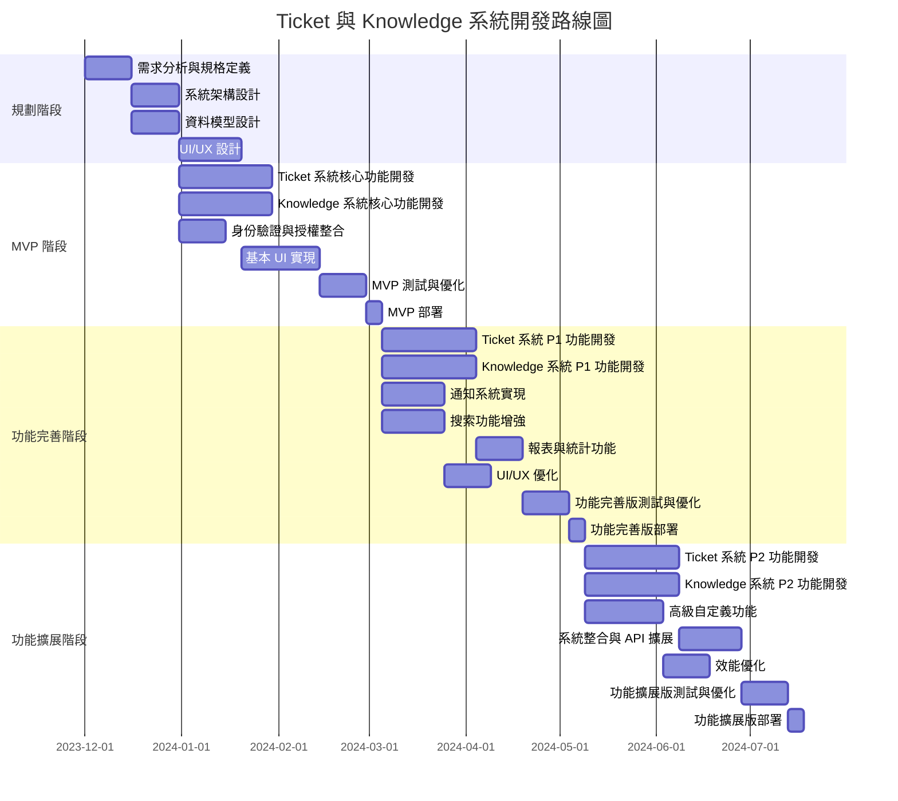

# Ticket 與 Knowledge 系統產品路線圖

## 文檔信息

| 項目 | 內容 |
|------|------|
| 文檔版本 | v1.0 |
| 創建日期 | 2023-12-01 |
| 最後更新 | 2023-12-01 |
| 文檔目的 | 定義 Ticket 與 Knowledge 系統的開發路線圖與版本規劃 |

## 路線圖總覽

本路線圖提供 Ticket 與 Knowledge 系統的開發計劃，包括版本規劃、功能優先順序、時程與資源規劃，以及風險管理策略。

## 版本策略與規劃

### 1. 規劃階段（1 個月）

**目標**：完成系統需求分析、架構設計和規格定義

**主要工作項目**：
- 需求分析與規格定義
- 系統架構設計
- 資料模型設計
- UI/UX 設計

**交付物**：
- 詳細的需求規格文檔
- 系統架構圖
- 資料模型圖
- UI/UX 設計原型

### 2. MVP 階段（2 個月）

**目標**：實現系統核心功能，提供基本的工單管理和知識庫功能

**主要功能**：

#### Ticket 系統 MVP 功能：
- 工單類型管理
- 工單創建與提交
- 基本工單處理流程
- 工單簽核基本功能
- 工單狀態查詢

#### Knowledge 系統 MVP 功能：
- 知識分類管理
- 知識文檔創建與編輯
- 基本知識搜索
- 問答功能基本實現
- 知識內容審核

**技術重點**：
- 身份驗證與授權整合
- 基本 UI 實現
- 核心 API 開發
- 資料庫設計與實現

**交付物**：
- 可運行的 MVP 版本
- 基本使用者文檔
- 系統部署文檔

### 3. 功能完善階段（3 個月）

**目標**：增強系統功能，提升使用者體驗，實現更完整的工作流程

**主要功能**：

#### Ticket 系統 P1 功能：
- 附件上傳與管理
- 處理意見與結果記錄
- 工單通知系統
- 工單歷程追蹤
- 工單統計與報表

#### Knowledge 系統 P1 功能：
- 高級搜索功能
- 附件管理
- 分類與標籤系統
- 編輯歷史與版本控制
- 回答評價與最佳回答

**技術重點**：
- 通知系統實現
- 搜索功能增強
- 報表與統計功能
- UI/UX 優化

**交付物**：
- 功能完善版本
- 更新的使用者文檔
- 系統管理員文檔

### 4. 功能擴展階段（3 個月）

**目標**：實現高級功能，優化系統效能，提供更豐富的自定義選項

**主要功能**：

#### Ticket 系統 P2 功能：
- 工單草稿保存
- 工單內溝通功能
- 工單轉交與委派
- 工單處理評價
- 自定義通知偏好
- 高級報表與分析

#### Knowledge 系統 P2 功能：
- 知識內容評價
- 版本比較功能
- 協作編輯
- 自動問題推薦
- 知識統計與分析
- 內容質量管理

**技術重點**：
- 高級自定義功能
- 系統整合與 API 擴展
- 效能優化

**交付物**：
- 功能擴展版本
- 完整的系統文檔
- API 文檔
- 效能測試報告

## 功能優先順序

### P0（必要功能 - MVP）

#### Ticket 系統 P0 功能：

| 功能 | 描述 | 優先級理由 |
|------|------|------------|
| 工單類型管理 | 創建和管理不同類型的工單 | 系統基礎功能，所有工單都需要類型 |
| 工單創建與提交 | 創建、填寫和提交工單 | 系統核心功能，使用者的主要入口 |
| 工單處理流程 | 查看和更新工單狀態 | 系統核心功能，實現工單處理的基本流程 |
| 工單簽核功能 | 審核和簽核工單 | 系統核心功能，實現工單審批的基本流程 |
| 工單狀態查詢 | 查看工單的當前狀態和進度 | 系統核心功能，使用者跟踪工單的主要方式 |

#### Knowledge 系統 P0 功能：

| 功能 | 描述 | 優先級理由 |
|------|------|------------|
| 知識分類管理 | 創建和管理知識分類 | 系統基礎功能，組織知識的基本方式 |
| 知識文檔管理 | 創建、編輯和查看知識文檔 | 系統核心功能，知識庫的主要內容 |
| 基本知識搜索 | 使用關鍵詞搜索知識庫 | 系統核心功能，使用者查找知識的主要方式 |
| 問答功能 | 提出問題和回答問題 | 系統核心功能，使用者互動的主要方式 |
| 知識內容審核 | 審核知識文檔的內容 | 系統核心功能，確保知識質量的基本機制 |

### P1（重要功能 - 第二階段）

#### Ticket 系統 P1 功能：

| 功能 | 描述 | 優先級理由 |
|------|------|------------|
| 附件管理 | 上傳和管理工單附件 | 提供更完整的工單信息，但不影響核心流程 |
| 處理意見記錄 | 記錄處理過程和意見 | 提供更詳細的工單處理信息，增強可追溯性 |
| 工單通知 | 工單狀態變更通知 | 提升使用者體驗，確保及時了解工單進展 |
| 工單歷程 | 查看工單的完整處理歷程 | 提供更詳細的工單處理信息，增強可追溯性 |
| 工單統計 | 基本工單統計和報表 | 提供管理視角，但不影響日常操作 |

#### Knowledge 系統 P1 功能：

| 功能 | 描述 | 優先級理由 |
|------|------|------------|
| 高級搜索 | 使用高級選項精確搜索 | 提升搜索效率，但基本搜索已能滿足主要需求 |
| 附件管理 | 上傳和管理知識文檔附件 | 提供更豐富的知識內容，但不影響核心功能 |
| 分類與標籤 | 使用標籤組織知識 | 提升知識組織和發現性，但分類已能滿足基本需求 |
| 編輯歷史 | 查看文檔的編輯歷史 | 提升內容管理能力，但不影響日常使用 |
| 回答評價 | 評價和選擇最佳回答 | 提升問答質量，但基本問答功能已能滿足需求 |

### P2（增強功能 - 第三階段）

#### Ticket 系統 P2 功能：

| 功能 | 描述 | 優先級理由 |
|------|------|------------|
| 工單草稿 | 保存工單草稿 | 提升使用者體驗，但不影響核心流程 |
| 工單內溝通 | 在工單中進行溝通 | 提升協作效率，但可通過其他渠道溝通 |
| 工單轉交 | 轉交和委派工單 | 提升處理靈活性，但基本流程已能滿足需求 |
| 處理評價 | 評價工單處理過程和結果 | 提供反饋機制，但不影響核心功能 |
| 自定義通知 | 自定義通知方式和頻率 | 提升使用者體驗，但標準通知已能滿足基本需求 |
| 高級報表 | 生成和導出各種報表 | 提供更深入的分析，但基本統計已能滿足管理需求 |

#### Knowledge 系統 P2 功能：

| 功能 | 描述 | 優先級理由 |
|------|------|------------|
| 內容評價 | 評價知識內容 | 提供反饋機制，但不影響核心功能 |
| 版本比較 | 比較文檔不同版本 | 提升內容管理能力，但不影響日常使用 |
| 協作編輯 | 多人協作編輯文檔 | 提升協作效率，但單人編輯已能滿足基本需求 |
| 自動推薦 | 自動推薦相關問題和知識 | 提升使用者體驗，但主動搜索已能滿足基本需求 |
| 知識統計 | 查看知識使用統計 | 提供管理視角，但不影響日常操作 |
| 質量管理 | 分析和管理內容質量 | 提升知識質量，但基本審核已能滿足質量控制需求 |

## 時程與資源規劃

### 時程規劃

| 階段 | 開始時間 | 結束時間 | 持續時間 |
|------|----------|----------|----------|
| 規劃階段 | 2023-12-01 | 2023-12-31 | 1 個月 |
| MVP 階段 | 2024-01-01 | 2024-02-29 | 2 個月 |
| 功能完善階段 | 2024-03-01 | 2024-05-31 | 3 個月 |
| 功能擴展階段 | 2024-06-01 | 2024-08-31 | 3 個月 |
| 系統優化與穩定 | 2024-09-01 | 2024-10-31 | 2 個月 |

### 資源規劃

#### 人力資源

| 角色 | 數量 | 主要職責 |
|------|------|----------|
| 產品經理 | 1 | 需求分析、產品規劃、使用者故事定義 |
| 系統架構師 | 1 | 系統架構設計、技術選型、性能優化 |
| 前端開發工程師 | 2 | UI 實現、前端功能開發、使用者體驗優化 |
| 後端開發工程師 | 3 | API 開發、業務邏輯實現、資料庫設計 |
| UI/UX 設計師 | 1 | 使用者介面設計、使用者體驗設計、原型製作 |
| QA 工程師 | 2 | 測試計劃、測試用例、功能測試、性能測試 |
| DevOps 工程師 | 1 | 部署自動化、監控系統、CI/CD 流程 |
| 技術文檔工程師 | 1 | 系統文檔、API 文檔、使用者手冊 |

#### 硬體資源

| 資源類型 | 數量 | 用途 |
|----------|------|------|
| 開發環境伺服器 | 2 | 開發和測試環境 |
| 生產環境伺服器 | 4 | 生產環境部署 |
| 資料庫伺服器 | 2 | 資料存儲和管理 |
| 快取伺服器 | 2 | 提升系統性能 |
| 負載均衡器 | 2 | 分配流量和提高可用性 |
| 儲存系統 | 1 | 附件和備份存儲 |

#### 軟體資源

| 資源類型 | 用途 |
|----------|------|
| 版本控制系統 | 代碼管理和協作 |
| CI/CD 工具 | 自動化構建和部署 |
| 專案管理工具 | 任務分配和進度追蹤 |
| 測試自動化工具 | 自動化測試和品質保證 |
| 監控和日誌工具 | 系統監控和問題診斷 |
| 文檔管理工具 | 技術文檔和知識管理 |

## 風險管理

### 風險識別與評估

| 風險 | 可能性 | 影響 | 風險等級 | 描述 |
|------|--------|------|----------|------|
| 需求變更 | 高 | 中 | 高 | 使用者需求可能在開發過程中發生變化，導致重新設計和開發 |
| 技術挑戰 | 中 | 高 | 高 | 某些功能可能面臨技術實現困難，如複雜的工作流程或搜索功能 |
| 整合問題 | 中 | 高 | 高 | 與現有系統（如 SSO、API Gateway）整合可能遇到兼容性問題 |
| 資源不足 | 中 | 高 | 高 | 人力或技術資源可能不足以按計劃完成開發 |
| 效能問題 | 中 | 中 | 中 | 系統在高負載下可能出現效能問題 |
| 安全漏洞 | 低 | 高 | 中 | 系統可能存在安全漏洞，導致資料洩露或未授權訪問 |
| 使用者接受度 | 中 | 中 | 中 | 使用者可能不願意採用新系統或適應新的工作流程 |
| 時程延遲 | 高 | 中 | 高 | 開發可能因各種原因延遲，影響系統上線時間 |

### 風險應對策略

#### 需求變更
- **預防措施**：
  - 在規劃階段進行充分的需求分析和使用者訪談
  - 使用敏捷開發方法，定期與使用者確認需求和優先級
  - 建立明確的需求變更流程和評估機制
- **應對措施**：
  - 設置需求變更緩衝期，評估變更影響
  - 根據變更影響調整開發計劃和資源分配
  - 使用模組化設計，降低變更的影響範圍

#### 技術挑戰
- **預防措施**：
  - 在規劃階段進行技術可行性評估
  - 識別關鍵技術風險點，提前進行原型驗證
  - 確保團隊具備必要的技術能力或提供培訓
- **應對措施**：
  - 尋求外部技術專家的支援
  - 考慮替代技術方案或功能簡化
  - 調整開發計劃，為複雜功能分配更多時間

#### 整合問題
- **預防措施**：
  - 詳細了解現有系統的 API 和整合要求
  - 在早期階段進行整合測試和驗證
  - 與現有系統的維護團隊建立良好的溝通渠道
- **應對措施**：
  - 開發適配層或中間件解決兼容性問題
  - 考慮分階段整合，降低風險
  - 必要時調整現有系統或開發自定義整合方案

#### 資源不足
- **預防措施**：
  - 進行詳細的資源規劃和分配
  - 識別關鍵資源需求和潛在瓶頸
  - 建立資源備份計劃和外部支援渠道
- **應對措施**：
  - 調整開發計劃和優先級
  - 尋求臨時資源或外部支援
  - 考慮功能範圍調整或分階段實現

#### 效能問題
- **預防措施**：
  - 在設計階段考慮效能因素
  - 建立效能測試計劃和基準
  - 使用適當的技術和架構模式提升效能
- **應對措施**：
  - 進行效能分析和優化
  - 增加硬體資源或調整系統配置
  - 考慮架構調整或功能優化

#### 安全漏洞
- **預防措施**：
  - 在設計階段進行安全評估
  - 遵循安全開發最佳實踐
  - 定期進行安全審計和漏洞掃描
- **應對措施**：
  - 建立安全事件響應流程
  - 及時修復發現的安全漏洞
  - 加強監控和日誌記錄

#### 使用者接受度
- **預防措施**：
  - 在設計階段充分考慮使用者體驗
  - 邀請使用者參與設計和測試過程
  - 提供清晰的使用者文檔和培訓材料
- **應對措施**：
  - 收集使用者反饋並及時調整
  - 提供使用者支援和幫助
  - 考慮分階段推出，降低使用者適應難度

#### 時程延遲
- **預防措施**：
  - 進行詳細的時程規劃和風險評估
  - 設置合理的緩衝期和里程碑
  - 定期檢查進度和風險
- **應對措施**：
  - 調整開發計劃和優先級
  - 增加資源或調整範圍
  - 考慮分階段上線，確保核心功能按時交付

## 成功指標

### 專案成功指標

| 指標 | 目標值 | 測量方法 |
|------|--------|----------|
| 按時交付 | 各階段不超過計劃時間的 10% | 專案管理工具追蹤 |
| 預算控制 | 不超過預算的 15% | 財務報告 |
| 功能完成度 | MVP 階段 100%，其他階段 90% 以上 | 需求追蹤系統 |
| 缺陷密度 | 每千行代碼不超過 5 個缺陷 | 缺陷追蹤系統 |
| 使用者滿意度 | 80% 以上的使用者滿意 | 使用者調查 |

### 系統成功指標

| 指標 | 目標值 | 測量方法 |
|------|--------|----------|
| 系統可用性 | 99.9% 以上 | 監控系統 |
| 響應時間 | 90% 的請求在 2 秒內完成 | 性能監控 |
| 並發使用者 | 支援 500 名同時在線使用者 | 負載測試 |
| 資料完整性 | 零資料丟失 | 資料審計 |
| 安全事件 | 零嚴重安全事件 | 安全監控 |

### 業務成功指標

| 指標 | 目標值 | 測量方法 |
|------|--------|----------|
| 工單處理效率 | 提升 30% | 系統報表 |
| 工單處理時間 | 減少 25% | 系統報表 |
| 知識庫使用率 | 80% 的員工每週至少使用一次 | 系統統計 |
| 知識重用率 | 50% 的問題通過知識庫解決 | 系統統計 |
| 使用者培訓時間 | 減少 20% | 培訓記錄 |
| 操作錯誤率 | 減少 40% | 系統報表 |

## 結論與建議

### 結論

Ticket 與 Knowledge 系統的開發是一個為期約 11 個月的專案，分為規劃、MVP、功能完善和功能擴展四個主要階段。通過分階段實現功能，可以確保核心功能優先交付，並根據使用者反饋和業務需求調整後續開發計劃。

### 建議

1. **採用敏捷開發方法**：使用敏捷開發方法，定期交付可用的系統版本，並根據使用者反饋調整開發計劃。

2. **優先實現核心功能**：確保 MVP 階段的核心功能完整實現，為後續功能擴展奠定基礎。

3. **重視使用者體驗**：在設計和開發過程中充分考慮使用者體驗，確保系統易於使用和學習。

4. **建立有效的溝通渠道**：與使用者和利益相關者建立有效的溝通渠道，及時收集反饋和需求變更。

5. **關注系統整合**：確保與現有系統（如 SSO、API Gateway）的順利整合，避免整合問題影響系統功能。

6. **重視安全和效能**：在設計和開發過程中充分考慮安全和效能因素，確保系統安全可靠且高效運行。

7. **建立完善的監控和支援機制**：建立完善的系統監控和使用者支援機制，確保系統穩定運行並及時解決使用者問題。

8. **定期評估和調整**：定期評估專案進度和風險，並根據評估結果調整開發計劃和資源分配。