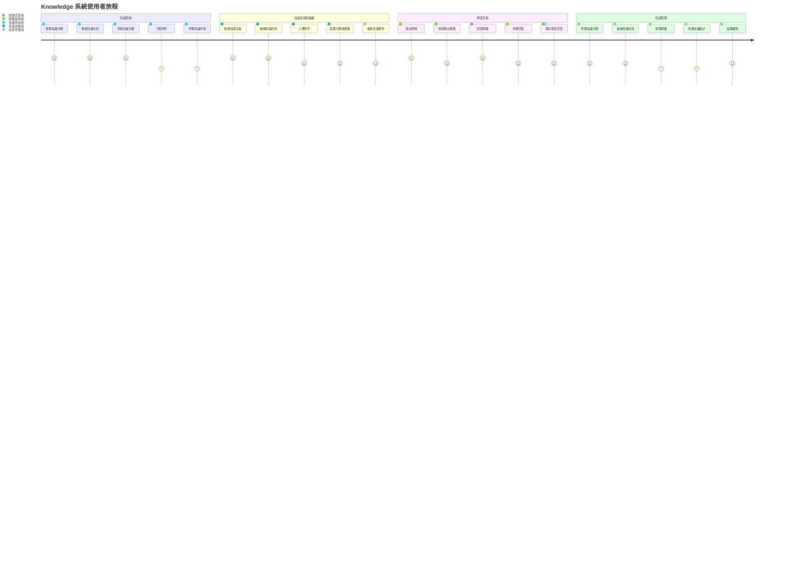

# Ticket 與 Knowledge 系統使用者故事地圖

## 文檔信息

| 項目 | 內容 |
|------|------|
| 文檔版本 | v1.0 |
| 創建日期 | 2023-12-01 |
| 最後更新 | 2023-12-01 |
| 文檔目的 | 定義 Ticket 與 Knowledge 系統的使用者故事與功能需求 |

## 概述

本文檔提供 Ticket 與 Knowledge 系統的使用者故事地圖，詳細描述不同使用者角色的旅程、任務與故事，作為系統功能開發的基礎。

## 使用者角色

### Ticket 系統角色

1. **申請者**：需要提出工單請求的一般使用者
2. **處理者**：負責處理工單的技術或業務人員
3. **簽核者**：負責審核與簽核工單的管理人員
4. **系統管理員**：負責管理系統設置與配置的管理人員

### Knowledge 系統角色

1. **知識查詢者**：需要查詢知識的一般使用者
2. **知識貢獻者**：創建與維護知識內容的專業人員
3. **問題提問者**：提出問題的一般使用者
4. **問題回答者**：回答問題的專業人員
5. **系統管理員**：負責管理系統設置與配置的管理人員

## Ticket 系統使用者故事地圖

## Knowledge 系統使用者故事地圖

## 詳細使用者故事

### Ticket 系統使用者故事

#### 1. 工單創建與提交

##### 1.1 瀏覽工單類型
- **使用者故事**:
  - 作為申請者，我希望能夠瀏覽所有可用的工單類型，以便選擇適合我需求的工單類型。
  - 作為申請者，我希望能夠看到每種工單類型的說明和用途，以便了解何時使用哪種工單類型。

##### 1.2 選擇工單類型
- **使用者故事**:
  - 作為申請者，我希望能夠選擇適合我需求的工單類型，以便創建正確的工單。
  - 作為申請者，我希望系統能夠根據我選擇的工單類型顯示相應的表單字段，以便我知道需要填寫哪些信息。

##### 1.3 填寫工單內容
- **使用者故事**:
  - 作為申請者，我希望能夠填寫工單的詳細內容，包括標題、描述、優先級等，以便清楚表達我的需求。
  - 作為申請者，我希望表單能夠提供輸入驗證和提示，以便確保我填寫的信息是完整和正確的。
  - 作為申請者，我希望能夠保存工單草稿，以便我可以稍後繼續完成。

##### 1.4 上傳附件
- **使用者故事**:
  - 作為申請者，我希望能夠上傳附件到工單，以便提供更多的背景信息和證明文件。
  - 作為申請者，我希望能夠預覽和刪除已上傳的附件，以便管理我的附件。

##### 1.5 提交工單
- **使用者故事**:
  - 作為申請者，我希望能夠提交工單，以便開始處理流程。
  - 作為申請者，我希望在提交工單後收到確認通知，以便知道我的工單已成功提交。
  - 作為申請者，我希望能夠查看我提交的工單的狀態和詳情，以便跟踪處理進度。

#### 2. 工單處理

##### 2.1 查看待處理工單
- **使用者故事**:
  - 作為處理者，我希望能夠查看分配給我的待處理工單列表，以便了解我需要處理的工作。
  - 作為處理者，我希望能夠按照不同條件（如優先級、提交時間、工單類型等）篩選和排序工單，以便更有效地管理我的工作。

##### 2.2 分析工單需求
- **使用者故事**:
  - 作為處理者，我希望能夠查看工單的詳細信息，包括描述、附件和歷史記錄，以便了解需求和背景。
  - 作為處理者，我希望能夠與申請者進行溝通，以便澄清需求和獲取更多信息。

##### 2.3 更新工單狀態
- **使用者故事**:
  - 作為處理者，我希望能夠更新工單的狀態（如「處理中」、「等待回覆」、「已解決」等），以便反映當前的處理進度。
  - 作為處理者，我希望能夠將工單轉交給其他處理者，以便在需要時獲取幫助或專業知識。

##### 2.4 添加處理意見
- **使用者故事**:
  - 作為處理者，我希望能夠添加處理意見和註釋，以便記錄處理過程和決策理由。
  - 作為處理者，我希望能夠查看其他處理者的意見和註釋，以便了解之前的處理情況。

##### 2.5 上傳處理結果
- **使用者故事**:
  - 作為處理者，我希望能夠上傳處理結果和相關文件，以便提供解決方案的證明和文檔。
  - 作為處理者，我希望能夠標記工單為「待簽核」，以便將工單提交給簽核者進行審核。

#### 3. 工單簽核

##### 3.1 查看待簽核工單
- **使用者故事**:
  - 作為簽核者，我希望能夠查看需要我簽核的工單列表，以便了解我需要審核的工作。
  - 作為簽核者，我希望能夠按照不同條件（如優先級、提交時間、工單類型等）篩選和排序待簽核工單，以便更有效地管理我的工作。

##### 3.2 審核工單內容
- **使用者故事**:
  - 作為簽核者，我希望能夠查看工單的詳細信息，包括描述、附件、處理過程和處理結果，以便進行全面的審核。
  - 作為簽核者，我希望能夠與處理者和申請者進行溝通，以便澄清問題和獲取更多信息。

##### 3.3 添加簽核意見
- **使用者故事**:
  - 作為簽核者，我希望能夠添加簽核意見和註釋，以便記錄審核過程和決策理由。
  - 作為簽核者，我希望能夠查看其他簽核者的意見和註釋，以便了解之前的審核情況。

##### 3.4 提交簽核結果
- **使用者故事**:
  - 作為簽核者，我希望能夠提交簽核結果（如「同意」、「拒絕」、「需要修改」等），以便完成審核流程。
  - 作為簽核者，我希望在提交簽核結果後，系統能夠自動更新工單狀態並通知相關人員，以便流程能夠繼續進行。

##### 3.5 委派簽核任務
- **使用者故事**:
  - 作為簽核者，我希望能夠將簽核任務委派給其他有權限的簽核者，以便在我無法處理時確保流程不會停滯。
  - 作為簽核者，我希望能夠查看委派歷史，以便了解工單的簽核流程。

#### 4. 工單追蹤

##### 4.1 查看工單狀態
- **使用者故事**:
  - 作為申請者/處理者/簽核者，我希望能夠查看工單的當前狀態，以便了解處理進度。
  - 作為申請者/處理者/簽核者，我希望能夠查看工單的預計完成時間，以便規劃相關工作。

##### 4.2 接收工單通知
- **使用者故事**:
  - 作為申請者/處理者/簽核者，我希望能夠接收工單狀態變更的通知，以便及時了解最新進展。
  - 作為申請者/處理者/簽核者，我希望能夠設置通知偏好（如郵件、系統內通知等），以便按照我喜歡的方式接收通知。

##### 4.3 查看工單歷程
- **使用者故事**:
  - 作為申請者/處理者/簽核者，我希望能夠查看工單的完整歷程，包括狀態變更、處理意見、簽核結果等，以便了解工單的處理過程。
  - 作為申請者/處理者/簽核者，我希望能夠查看工單的時間線，以便清楚地了解工單處理的時間節點。

##### 4.4 評價工單處理
- **使用者故事**:
  - 作為申請者，我希望能夠在工單完成後對處理過程和結果進行評價，以便提供反饋和改進建議。
  - 作為申請者，我希望能夠查看我之前的評價歷史，以便跟踪我的反饋。

#### 5. 工單管理

##### 5.1 查看工單統計
- **使用者故事**:
  - 作為系統管理員，我希望能夠查看工單統計數據，如工單數量、平均處理時間、按類型分布等，以便了解系統使用情況和識別改進機會。
  - 作為系統管理員，我希望能夠設置自定義報表和儀表板，以便根據特定需求分析數據。

##### 5.2 管理工單類型
- **使用者故事**:
  - 作為系統管理員，我希望能夠創建、編輯和停用工單類型，以便適應不斷變化的業務需求。
  - 作為系統管理員，我希望能夠為每種工單類型定義必填字段和表單結構，以便確保收集到必要的信息。

##### 5.3 配置工作流程
- **使用者故事**:
  - 作為系統管理員，我希望能夠為不同類型的工單配置工作流程，包括狀態、轉換條件和處理步驟，以便自動化和標準化處理流程。
  - 作為系統管理員，我希望能夠修改現有工作流程，以便適應流程變更和優化。

##### 5.4 設置簽核規則
- **使用者故事**:
  - 作為系統管理員，我希望能夠設置簽核規則，包括簽核層級、簽核人員和簽核條件，以便確保適當的審核和控制。
  - 作為系統管理員，我希望能夠為不同部門或團隊設置不同的簽核規則，以便適應不同的組織結構和需求。

##### 5.5 生成工單報表
- **使用者故事**:
  - 作為系統管理員，我希望能夠生成各種工單報表，如工單處理效率、簽核時間、滿意度等，以便評估系統效能和識別改進機會。
  - 作為系統管理員，我希望能夠將報表導出為不同格式（如 Excel、PDF 等），以便分享和進一步分析。

### Knowledge 系統使用者故事

#### 1. 知識查詢

##### 1.1 瀏覽知識分類
- **使用者故事**:
  - 作為知識查詢者，我希望能夠瀏覽知識庫的分類結構，以便找到我感興趣的主題。
  - 作為知識查詢者，我希望能夠查看每個分類下的知識文檔列表，以便找到我需要的信息。

##### 1.2 搜索知識內容
- **使用者故事**:
  - 作為知識查詢者，我希望能夠使用關鍵詞搜索知識庫，以便快速找到相關信息。
  - 作為知識查詢者，我希望搜索結果能夠按照相關性排序，並顯示摘要和匹配部分，以便評估結果的相關性。
  - 作為知識查詢者，我希望能夠使用高級搜索選項（如按分類、標籤、作者等篩選），以便更精確地找到我需要的信息。

##### 1.3 查看知識文檔
- **使用者故事**:
  - 作為知識查詢者，我希望能夠查看知識文檔的完整內容，包括文本、圖片、表格等，以便獲取我需要的信息。
  - 作為知識查詢者，我希望能夠查看知識文檔的元數據，如創建時間、作者、版本等，以便評估信息的可靠性和時效性。
  - 作為知識查詢者，我希望能夠查看相關知識文檔的推薦，以便探索更多相關信息。

##### 1.4 下載附件
- **使用者故事**:
  - 作為知識查詢者，我希望能夠下載知識文檔的附件，以便獲取更詳細的信息或資源。
  - 作為知識查詢者，我希望能夠在下載前預覽附件內容，以便確定是否需要下載。

##### 1.5 評價知識內容
- **使用者故事**:
  - 作為知識查詢者，我希望能夠對知識文檔進行評價（如點贊、評分等），以便表達我對內容的滿意度。
  - 作為知識查詢者，我希望能夠對知識文檔添加評論，以便提供反饋或提問。
  - 作為知識查詢者，我希望能夠報告過時或不正確的內容，以便幫助維護知識庫的質量。

#### 2. 知識創建與維護

##### 2.1 創建知識文檔
- **使用者故事**:
  - 作為知識貢獻者，我希望能夠創建新的知識文檔，以便分享我的專業知識和經驗。
  - 作為知識貢獻者，我希望能夠使用富文本編輯器，以便創建格式豐富、易於閱讀的內容。
  - 作為知識貢獻者，我希望能夠保存草稿，以便稍後繼續編輯。

##### 2.2 編輯知識內容
- **使用者故事**:
  - 作為知識貢獻者，我希望能夠編輯現有的知識文檔，以便更新信息或修正錯誤。
  - 作為知識貢獻者，我希望能夠查看文檔的編輯歷史，以便了解之前的變更。
  - 作為知識貢獻者，我希望能夠比較不同版本的文檔，以便查看具體變更。

##### 2.3 上傳附件
- **使用者故事**:
  - 作為知識貢獻者，我希望能夠上傳附件到知識文檔，以便提供更詳細的信息或資源。
  - 作為知識貢獻者，我希望能夠管理已上傳的附件，包括預覽、替換和刪除。

##### 2.4 設置分類與標籤
- **使用者故事**:
  - 作為知識貢獻者，我希望能夠為知識文檔選擇適當的分類，以便組織內容並幫助使用者找到它。
  - 作為知識貢獻者，我希望能夠為知識文檔添加標籤，以便提高可發現性和相關性。
  - 作為知識貢獻者，我希望能夠查看推薦的分類和標籤，以便更一致地組織內容。

##### 2.5 審核知識更新
- **使用者故事**:
  - 作為系統管理員，我希望能夠審核知識文檔的創建和更新，以便確保內容的質量和準確性。
  - 作為系統管理員，我希望能夠批准、拒絕或要求修改知識文檔，以便維護知識庫的標準。
  - 作為系統管理員，我希望能夠查看待審核的知識文檔列表，以便有效地管理審核工作。

#### 3. 問答互動

##### 3.1 提出問題
- **使用者故事**:
  - 作為問題提問者，我希望能夠提出新問題，以便獲取我需要的信息或解決方案。
  - 作為問題提問者，我希望能夠為問題添加詳細描述和標籤，以便更清楚地表達我的問題並幫助相關專家找到它。
  - 作為問題提問者，我希望能夠上傳附件（如截圖、日誌等），以便提供更多的背景信息。

##### 3.2 搜索相似問題
- **使用者故事**:
  - 作為問題提問者，我希望能夠在提問前搜索相似的問題，以便查看是否已有解答。
  - 作為問題提問者，我希望系統能夠在我輸入問題時自動推薦相似的問題，以便節省時間並避免重複提問。

##### 3.3 回答問題
- **使用者故事**:
  - 作為問題回答者，我希望能夠查看待回答的問題列表，以便找到我可以回答的問題。
  - 作為問題回答者，我希望能夠提供詳細的回答，包括文本、代碼、圖片等，以便清楚地解釋解決方案。
  - 作為問題回答者，我希望能夠編輯我的回答，以便修正錯誤或添加更多信息。

##### 3.4 評價回答
- **使用者故事**:
  - 作為問題提問者，我希望能夠對回答進行評價（如點贊、評分等），以便表達我對回答的滿意度。
  - 作為問題提問者，我希望能夠對回答添加評論，以便提供反饋或請求澄清。

##### 3.5 標記最佳回答
- **使用者故事**:
  - 作為問題提問者，我希望能夠將最有幫助的回答標記為「最佳回答」，以便幫助其他使用者找到最有價值的信息。
  - 作為系統管理員，我希望能夠在必要時將回答標記為「最佳回答」，以便確保問題有明確的解決方案。

#### 4. 知識管理

##### 4.1 管理知識分類
- **使用者故事**:
  - 作為系統管理員，我希望能夠創建、編輯和刪除知識分類，以便組織知識庫的結構。
  - 作為系統管理員，我希望能夠調整分類的層級和順序，以便優化使用者體驗。

##### 4.2 審核知識內容
- **使用者故事**:
  - 作為系統管理員，我希望能夠審核知識文檔的內容，以便確保質量和準確性。
  - 作為系統管理員，我希望能夠標記需要更新的過時內容，以便維護知識庫的時效性。
  - 作為系統管理員，我希望能夠刪除不適當或不相關的內容，以便維護知識庫的品質。

##### 4.3 管理標籤
- **使用者故事**:
  - 作為系統管理員，我希望能夠創建、編輯和刪除標籤，以便標準化知識組織。
  - 作為系統管理員，我希望能夠合併相似的標籤，以便減少冗餘和混淆。
  - 作為系統管理員，我希望能夠查看標籤使用統計，以便了解熱門主題和趨勢。

##### 4.4 查看知識統計
- **使用者故事**:
  - 作為系統管理員，我希望能夠查看知識庫的使用統計，如訪問量、搜索關鍵詞、熱門文檔等，以便了解使用者需求和行為。
  - 作為系統管理員，我希望能夠查看知識貢獻統計，如創建和編輯活動，以便識別活躍貢獻者和內容增長趨勢。

##### 4.5 設置權限
- **使用者故事**:
  - 作為系統管理員，我希望能夠設置知識庫的訪問權限，以便控制誰可以查看、創建和編輯內容。
  - 作為系統管理員，我希望能夠為不同的使用者組設置不同的權限，以便適應不同的角色和責任。
  - 作為系統管理員，我希望能夠設置特定文檔或分類的訪問限制，以便保護敏感或機密信息。

## 功能優先級與版本規劃

### Ticket 系統功能優先級

#### P0（必要功能 - MVP）

| 使用者活動 | 使用者任務 | 使用者故事 |
|------------|------------|------------|
| 工單創建與提交 | 選擇工單類型 | 選擇適合需求的工單類型 |
| 工單創建與提交 | 填寫工單內容 | 填寫工單的詳細內容 |
| 工單創建與提交 | 提交工單 | 提交工單並接收確認通知 |
| 工單處理 | 查看待處理工單 | 查看分配的待處理工單列表 |
| 工單處理 | 更新工單狀態 | 更新工單的處理狀態 |
| 工單簽核 | 查看待簽核工單 | 查看需要簽核的工單列表 |
| 工單簽核 | 提交簽核結果 | 提交簽核結果並更新工單狀態 |
| 工單追蹤 | 查看工單狀態 | 查看工單的當前狀態和進度 |
| 工單管理 | 管理工單類型 | 創建和編輯工單類型 |
| 工單管理 | 配置工作流程 | 為工單類型配置基本工作流程 |

#### P1（重要功能 - 第二階段）

| 使用者活動 | 使用者任務 | 使用者故事 |
|------------|------------|------------|
| 工單創建與提交 | 上傳附件 | 上傳附件到工單 |
| 工單處理 | 添加處理意見 | 添加處理意見和註釋 |
| 工單處理 | 上傳處理結果 | 上傳處理結果和相關文件 |
| 工單簽核 | 審核工單內容 | 查看工單的詳細信息進行審核 |
| 工單簽核 | 添加簽核意見 | 添加簽核意見和註釋 |
| 工單追蹤 | 接收工單通知 | 接收工單狀態變更的通知 |
| 工單追蹤 | 查看工單歷程 | 查看工單的完整處理歷程 |
| 工單管理 | 查看工單統計 | 查看基本工單統計數據 |
| 工單管理 | 設置簽核規則 | 設置基本簽核規則和層級 |

#### P2（增強功能 - 第三階段）

| 使用者活動 | 使用者任務 | 使用者故事 |
|------------|------------|------------|
| 工單創建與提交 | 保存工單草稿 | 保存工單草稿以便稍後完成 |
| 工單處理 | 與申請者溝通 | 在工單中與申請者進行溝通 |
| 工單處理 | 轉交工單 | 將工單轉交給其他處理者 |
| 工單簽核 | 委派簽核任務 | 將簽核任務委派給其他簽核者 |
| 工單追蹤 | 評價工單處理 | 對工單處理過程和結果進行評價 |
| 工單追蹤 | 設置通知偏好 | 自定義通知方式和頻率 |
| 工單管理 | 生成工單報表 | 生成和導出各種工單報表 |
| 工單管理 | 設置自定義字段 | 為工單類型設置自定義字段 |

### Knowledge 系統功能優先級

#### P0（必要功能 - MVP）

| 使用者活動 | 使用者任務 | 使用者故事 |
|------------|------------|------------|
| 知識查詢 | 瀏覽知識分類 | 瀏覽知識庫的分類結構 |
| 知識查詢 | 搜索知識內容 | 使用關鍵詞搜索知識庫 |
| 知識查詢 | 查看知識文檔 | 查看知識文檔的完整內容 |
| 知識創建與維護 | 創建知識文檔 | 創建新的知識文檔 |
| 知識創建與維護 | 編輯知識內容 | 編輯現有的知識文檔 |
| 問答互動 | 提出問題 | 提出新問題並添加描述 |
| 問答互動 | 回答問題 | 提供問題的詳細回答 |
| 知識管理 | 管理知識分類 | 創建和編輯知識分類 |
| 知識管理 | 審核知識內容 | 審核知識文檔的內容 |

#### P1（重要功能 - 第二階段）

| 使用者活動 | 使用者任務 | 使用者故事 |
|------------|------------|------------|
| 知識查詢 | 使用高級搜索 | 使用高級搜索選項精確查找信息 |
| 知識查詢 | 查看相關推薦 | 查看相關知識文檔的推薦 |
| 知識創建與維護 | 上傳附件 | 上傳附件到知識文檔 |
| 知識創建與維護 | 設置分類與標籤 | 為知識文檔選擇分類和添加標籤 |
| 知識創建與維護 | 查看編輯歷史 | 查看文檔的編輯歷史和變更 |
| 問答互動 | 搜索相似問題 | 在提問前搜索相似的問題 |
| 問答互動 | 評價回答 | 對回答進行評價和評論 |
| 問答互動 | 標記最佳回答 | 將最有幫助的回答標記為最佳回答 |
| 知識管理 | 管理標籤 | 創建、編輯和合併標籤 |
| 知識管理 | 設置權限 | 設置知識庫的訪問權限 |

#### P2（增強功能 - 第三階段）

| 使用者活動 | 使用者任務 | 使用者故事 |
|------------|------------|------------|
| 知識查詢 | 下載附件 | 下載和預覽知識文檔的附件 |
| 知識查詢 | 評價知識內容 | 對知識文檔進行評價和評論 |
| 知識創建與維護 | 比較版本差異 | 比較不同版本的文檔內容 |
| 知識創建與維護 | 協作編輯 | 與其他貢獻者協作編輯文檔 |
| 問答互動 | 自動問題推薦 | 輸入問題時獲取自動推薦 |
| 問答互動 | 問題關聯知識 | 將問題關聯到相關知識文檔 |
| 知識管理 | 查看知識統計 | 查看知識庫的使用和貢獻統計 |
| 知識管理 | 內容質量分析 | 分析知識內容的質量和時效性 |

## 版本規劃

### 第一階段：MVP（1-2 個月）

- 實現所有 P0 功能
- 建立基本的使用者介面和工作流程
- 整合身份驗證和授權系統
- 完成基本的資料模型和 API

### 第二階段：功能完善（2-3 個月）

- 實現所有 P1 功能
- 優化使用者介面和體驗
- 增強搜索和通知功能
- 實現報表和統計功能

### 第三階段：功能擴展（3-4 個月）

- 實現所有 P2 功能
- 添加高級功能和自定義選項
- 優化系統效能和可擴展性
- 實現與其他系統的整合