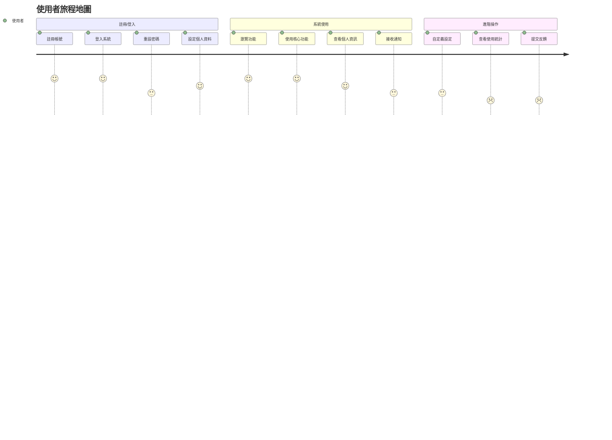

# 使用者故事地圖 (User Story Map)

## 概述

本文檔基於現有技術架構，提供初步的使用者故事地圖框架。由於尚未確定具體產品需求，此地圖主要聚焦於通用的系統功能和使用者旅程，作為後續產品規劃的基礎。

## 使用者活動流

使用者故事地圖從上到下分為三個層級：
1. **使用者活動**：代表使用者與系統互動的主要階段
2. **使用者任務**：每個活動中使用者需要完成的具體任務
3. **使用者故事**：實現任務所需的具體功能點

## 詳細使用者故事地圖

### 1. 註冊/登入

#### 1.1 註冊帳號
- **使用者故事**:
  - 作為新使用者，我希望能夠註冊新帳號，以便開始使用系統
  - 作為新使用者，我希望能夠使用電子郵件註冊，以便使用我熟悉的方式建立帳號
  - 作為新使用者，我希望能夠驗證我的電子郵件，以確保帳號安全

#### 1.2 登入系統
- **使用者故事**:
  - 作為註冊使用者，我希望能夠使用電子郵件和密碼登入，以便存取我的帳號
  - 作為註冊使用者，我希望能夠使用單點登入 (SSO)，以便快速存取系統
  - 作為註冊使用者，我希望能夠在多個裝置上保持登入狀態，以便隨時存取系統

#### 1.3 重設密碼
- **使用者故事**:
  - 作為註冊使用者，我希望能夠在忘記密碼時重設密碼，以便重新存取我的帳號
  - 作為註冊使用者，我希望能夠透過電子郵件接收密碼重設連結，以便安全地重設密碼

#### 1.4 設定個人資料
- **使用者故事**:
  - 作為註冊使用者，我希望能夠設定和更新我的個人資料，以便系統能夠識別我
  - 作為註冊使用者，我希望能夠上傳頭像，以便個人化我的帳號

### 2. 系統使用

#### 2.1 瀏覽功能
- **使用者故事**:
  - 作為登入使用者，我希望能夠瀏覽系統的主要功能，以便了解系統能夠做什麼
  - 作為登入使用者，我希望能夠看到功能分類，以便快速找到我需要的功能

#### 2.2 使用核心功能
- **使用者故事**:
  - 作為登入使用者，我希望能夠使用系統的核心功能，以便完成我的工作
  - 作為登入使用者，我希望核心功能有清晰的使用指引，以便我能夠正確使用

#### 2.3 查看個人資訊
- **使用者故事**:
  - 作為登入使用者，我希望能夠查看我的個人資訊，以便了解我的帳號狀態
  - 作為登入使用者，我希望能夠查看我的使用歷史，以便追蹤我的活動

#### 2.4 接收通知
- **使用者故事**:
  - 作為登入使用者，我希望能夠接收系統通知，以便了解重要事件
  - 作為登入使用者，我希望能夠設定通知偏好，以便控制我接收的通知類型

### 3. 進階操作

#### 3.1 自定義設定
- **使用者故事**:
  - 作為登入使用者，我希望能夠自定義系統設定，以便根據我的偏好使用系統
  - 作為登入使用者，我希望能夠設定預設值，以便簡化我的操作流程

#### 3.2 查看使用統計
- **使用者故事**:
  - 作為登入使用者，我希望能夠查看我的使用統計，以便了解我的使用模式
  - 作為登入使用者，我希望能夠匯出統計資料，以便進行進一步分析

#### 3.3 提交反饋
- **使用者故事**:
  - 作為登入使用者，我希望能夠提交系統反饋，以便幫助改進系統
  - 作為登入使用者，我希望能夠追蹤我提交的反饋狀態，以便了解處理進度

## 任務分解與優先級

### 優先級 P0（必要功能）

| 使用者活動 | 使用者任務 | 使用者故事 |
|------------|------------|------------|
| 註冊/登入 | 註冊帳號 | 使用電子郵件註冊新帳號 |
| 註冊/登入 | 登入系統 | 使用電子郵件和密碼登入 |
| 註冊/登入 | 登入系統 | 使用單點登入 (SSO) |
| 註冊/登入 | 重設密碼 | 透過電子郵件重設密碼 |
| 系統使用 | 瀏覽功能 | 瀏覽系統的主要功能 |
| 系統使用 | 使用核心功能 | 使用系統的核心功能 |

### 優先級 P1（重要功能）

| 使用者活動 | 使用者任務 | 使用者故事 |
|------------|------------|------------|
| 註冊/登入 | 設定個人資料 | 設定和更新個人資料 |
| 系統使用 | 查看個人資訊 | 查看個人資訊和使用歷史 |
| 系統使用 | 接收通知 | 接收系統通知 |
| 進階操作 | 自定義設定 | 自定義系統設定 |

### 優先級 P2（增強功能）

| 使用者活動 | 使用者任務 | 使用者故事 |
|------------|------------|------------|
| 註冊/登入 | 設定個人資料 | 上傳頭像 |
| 系統使用 | 接收通知 | 設定通知偏好 |
| 進階操作 | 查看使用統計 | 查看使用統計和匯出資料 |
| 進階操作 | 提交反饋 | 提交系統反饋和追蹤狀態 |

## 與版本映射關係

### 技術基礎版 (v0.1)

- 註冊帳號（基本功能）
- 登入系統（包含 SSO）
- 重設密碼
- 基本個人資料設定

### 核心功能版 (v0.2)

- 完整的註冊和登入流程
- 完整的個人資料管理
- 基本功能瀏覽和使用
- 基本個人資訊查看
- 基本通知功能

### MVP 版本 (v1.0)

- 所有 P0 和 P1 功能
- 部分 P2 功能（根據產品需求優先順序）

### 功能擴展版 (v2.0)

- 所有 P0、P1 和 P2 功能
- 進階功能和優化（根據使用者反饋）