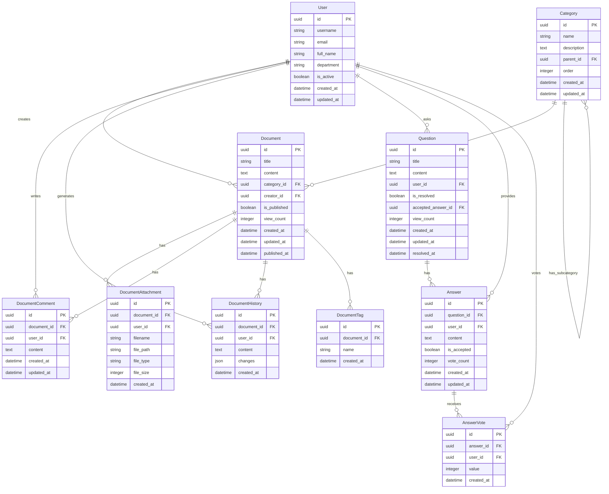

# 數據模型設計

## 概述

本文檔定義了 Ticket 和 Knowledge 系統的數據模型設計，包括實體關係圖和表結構定義。系統使用 PostgreSQL 16 作為數據庫，並通過 SQLAlchemy ORM 進行數據訪問。

## 實體關係圖 (ER Diagram)

### Ticket 系統 ER 圖


### Knowledge 系統 ER 圖



## 表結構定義

### Ticket 系統表結構

#### users 表

| 欄位名稱 | 數據類型 | 約束 | 描述 |
|---------|---------|------|------|
| id | UUID | PRIMARY KEY | 用戶唯一標識符 |
| username | VARCHAR(50) | UNIQUE, NOT NULL | 用戶名 |
| email | VARCHAR(100) | UNIQUE, NOT NULL | 電子郵件 |
| full_name | VARCHAR(100) | NOT NULL | 全名 |
| password_hash | VARCHAR(255) | NOT NULL | 密碼哈希 |
| department_id | UUID | FOREIGN KEY | 部門 ID |
| role | VARCHAR(20) | NOT NULL | 角色 (admin, manager, user) |
| is_active | BOOLEAN | NOT NULL, DEFAULT TRUE | 是否激活 |
| created_at | TIMESTAMP | NOT NULL, DEFAULT NOW() | 創建時間 |
| updated_at | TIMESTAMP | NOT NULL, DEFAULT NOW() | 更新時間 |

#### departments 表

| 欄位名稱 | 數據類型 | 約束 | 描述 |
|---------|---------|------|------|
| id | UUID | PRIMARY KEY | 部門唯一標識符 |
| name | VARCHAR(100) | NOT NULL | 部門名稱 |
| description | TEXT | | 部門描述 |
| parent_id | UUID | FOREIGN KEY | 父部門 ID |
| created_at | TIMESTAMP | NOT NULL, DEFAULT NOW() | 創建時間 |
| updated_at | TIMESTAMP | NOT NULL, DEFAULT NOW() | 更新時間 |

#### tickets 表

| 欄位名稱 | 數據類型 | 約束 | 描述 |
|---------|---------|------|------|
| id | UUID | PRIMARY KEY | 工單唯一標識符 |
| title | VARCHAR(200) | NOT NULL | 工單標題 |
| description | TEXT | NOT NULL | 工單描述 |
| creator_id | UUID | FOREIGN KEY, NOT NULL | 創建者 ID |
| assignee_id | UUID | FOREIGN KEY | 處理者 ID |
| ticket_type_id | UUID | FOREIGN KEY, NOT NULL | 工單類型 ID |
| ticket_status_id | UUID | FOREIGN KEY, NOT NULL | 工單狀態 ID |
| ticket_priority_id | UUID | FOREIGN KEY, NOT NULL | 工單優先級 ID |
| current_workflow_step_id | UUID | FOREIGN KEY | 當前工作流步驟 ID |
| due_date | TIMESTAMP | | 截止日期 |
| created_at | TIMESTAMP | NOT NULL, DEFAULT NOW() | 創建時間 |
| updated_at | TIMESTAMP | NOT NULL, DEFAULT NOW() | 更新時間 |
| closed_at | TIMESTAMP | | 關閉時間 |

#### ticket_types 表

| 欄位名稱 | 數據類型 | 約束 | 描述 |
|---------|---------|------|------|
| id | UUID | PRIMARY KEY | 工單類型唯一標識符 |
| name | VARCHAR(100) | NOT NULL | 類型名稱 |
| description | TEXT | | 類型描述 |
| workflow_id | UUID | FOREIGN KEY, NOT NULL | 工作流 ID |
| is_active | BOOLEAN | NOT NULL, DEFAULT TRUE | 是否激活 |
| created_at | TIMESTAMP | NOT NULL, DEFAULT NOW() | 創建時間 |
| updated_at | TIMESTAMP | NOT NULL, DEFAULT NOW() | 更新時間 |

#### ticket_statuses 表

| 欄位名稱 | 數據類型 | 約束 | 描述 |
|---------|---------|------|------|
| id | UUID | PRIMARY KEY | 工單狀態唯一標識符 |
| name | VARCHAR(100) | NOT NULL | 狀態名稱 |
| description | TEXT | | 狀態描述 |
| color | VARCHAR(20) | NOT NULL | 狀態顏色 |
| order | INTEGER | NOT NULL | 排序順序 |
| is_active | BOOLEAN | NOT NULL, DEFAULT TRUE | 是否激活 |
| created_at | TIMESTAMP | NOT NULL, DEFAULT NOW() | 創建時間 |
| updated_at | TIMESTAMP | NOT NULL, DEFAULT NOW() | 更新時間 |

#### ticket_priorities 表

| 欄位名稱 | 數據類型 | 約束 | 描述 |
|---------|---------|------|------|
| id | UUID | PRIMARY KEY | 工單優先級唯一標識符 |
| name | VARCHAR(100) | NOT NULL | 優先級名稱 |
| description | TEXT | | 優先級描述 |
| color | VARCHAR(20) | NOT NULL | 優先級顏色 |
| order | INTEGER | NOT NULL | 排序順序 |
| is_active | BOOLEAN | NOT NULL, DEFAULT TRUE | 是否激活 |
| created_at | TIMESTAMP | NOT NULL, DEFAULT NOW() | 創建時間 |
| updated_at | TIMESTAMP | NOT NULL, DEFAULT NOW() | 更新時間 |

#### ticket_attachments 表

| 欄位名稱 | 數據類型 | 約束 | 描述 |
|---------|---------|------|------|
| id | UUID | PRIMARY KEY | 附件唯一標識符 |
| ticket_id | UUID | FOREIGN KEY, NOT NULL | 工單 ID |
| user_id | UUID | FOREIGN KEY, NOT NULL | 上傳用戶 ID |
| filename | VARCHAR(255) | NOT NULL | 文件名 |
| file_path | VARCHAR(255) | NOT NULL | 文件路徑 |
| file_type | VARCHAR(100) | NOT NULL | 文件類型 |
| file_size | INTEGER | NOT NULL | 文件大小 (bytes) |
| created_at | TIMESTAMP | NOT NULL, DEFAULT NOW() | 創建時間 |

#### ticket_comments 表

| 欄位名稱 | 數據類型 | 約束 | 描述 |
|---------|---------|------|------|
| id | UUID | PRIMARY KEY | 評論唯一標識符 |
| ticket_id | UUID | FOREIGN KEY, NOT NULL | 工單 ID |
| user_id | UUID | FOREIGN KEY, NOT NULL | 用戶 ID |
| content | TEXT | NOT NULL | 評論內容 |
| created_at | TIMESTAMP | NOT NULL, DEFAULT NOW() | 創建時間 |
| updated_at | TIMESTAMP | NOT NULL, DEFAULT NOW() | 更新時間 |

#### ticket_history 表

| 欄位名稱 | 數據類型 | 約束 | 描述 |
|---------|---------|------|------|
| id | UUID | PRIMARY KEY | 歷史記錄唯一標識符 |
| ticket_id | UUID | FOREIGN KEY, NOT NULL | 工單 ID |
| user_id | UUID | FOREIGN KEY, NOT NULL | 用戶 ID |
| action | VARCHAR(100) | NOT NULL | 操作類型 |
| changes | JSONB | | 變更內容 |
| created_at | TIMESTAMP | NOT NULL, DEFAULT NOW() | 創建時間 |

#### workflows 表

| 欄位名稱 | 數據類型 | 約束 | 描述 |
|---------|---------|------|------|
| id | UUID | PRIMARY KEY | 工作流唯一標識符 |
| name | VARCHAR(100) | NOT NULL | 工作流名稱 |
| description | TEXT | | 工作流描述 |
| is_active | BOOLEAN | NOT NULL, DEFAULT TRUE | 是否激活 |
| created_at | TIMESTAMP | NOT NULL, DEFAULT NOW() | 創建時間 |
| updated_at | TIMESTAMP | NOT NULL, DEFAULT NOW() | 更新時間 |

#### workflow_steps 表

| 欄位名稱 | 數據類型 | 約束 | 描述 |
|---------|---------|------|------|
| id | UUID | PRIMARY KEY | 工作流步驟唯一標識符 |
| workflow_id | UUID | FOREIGN KEY, NOT NULL | 工作流 ID |
| name | VARCHAR(100) | NOT NULL | 步驟名稱 |
| description | TEXT | | 步驟描述 |
| department_id | UUID | FOREIGN KEY | 負責部門 ID |
| order | INTEGER | NOT NULL | 排序順序 |
| requires_approval | BOOLEAN | NOT NULL, DEFAULT FALSE | 是否需要審批 |
| is_final | BOOLEAN | NOT NULL, DEFAULT FALSE | 是否為最終步驟 |
| created_at | TIMESTAMP | NOT NULL, DEFAULT NOW() | 創建時間 |
| updated_at | TIMESTAMP | NOT NULL, DEFAULT NOW() | 更新時間 |

#### workflow_approvals 表

| 欄位名稱 | 數據類型 | 約束 | 描述 |
|---------|---------|------|------|
| id | UUID | PRIMARY KEY | 審批唯一標識符 |
| ticket_id | UUID | FOREIGN KEY, NOT NULL | 工單 ID |
| workflow_step_id | UUID | FOREIGN KEY, NOT NULL | 工作流步驟 ID |
| approver_id | UUID | FOREIGN KEY, NOT NULL | 審批人 ID |
| is_approved | BOOLEAN | | 是否批准 |
| comment | TEXT | | 審批意見 |
| created_at | TIMESTAMP | NOT NULL, DEFAULT NOW() | 創建時間 |
| updated_at | TIMESTAMP | NOT NULL, DEFAULT NOW() | 更新時間 |

#### notifications 表

| 欄位名稱 | 數據類型 | 約束 | 描述 |
|---------|---------|------|------|
| id | UUID | PRIMARY KEY | 通知唯一標識符 |
| user_id | UUID | FOREIGN KEY, NOT NULL | 用戶 ID |
| ticket_id | UUID | FOREIGN KEY, NOT NULL | 工單 ID |
| type | VARCHAR(50) | NOT NULL | 通知類型 |
| message | TEXT | NOT NULL | 通知消息 |
| is_read | BOOLEAN | NOT NULL, DEFAULT FALSE | 是否已讀 |
| created_at | TIMESTAMP | NOT NULL, DEFAULT NOW() | 創建時間 |
| read_at | TIMESTAMP | | 閱讀時間 |

### Knowledge 系統表結構

#### documents 表

| 欄位名稱 | 數據類型 | 約束 | 描述 |
|---------|---------|------|------|
| id | UUID | PRIMARY KEY | 文檔唯一標識符 |
| title | VARCHAR(200) | NOT NULL | 文檔標題 |
| content | TEXT | NOT NULL | 文檔內容 |
| category_id | UUID | FOREIGN KEY, NOT NULL | 分類 ID |
| creator_id | UUID | FOREIGN KEY, NOT NULL | 創建者 ID |
| is_published | BOOLEAN | NOT NULL, DEFAULT TRUE | 是否發布 |
| view_count | INTEGER | NOT NULL, DEFAULT 0 | 查看次數 |
| created_at | TIMESTAMP | NOT NULL, DEFAULT NOW() | 創建時間 |
| updated_at | TIMESTAMP | NOT NULL, DEFAULT NOW() | 更新時間 |
| published_at | TIMESTAMP | | 發布時間 |

#### document_attachments 表

| 欄位名稱 | 數據類型 | 約束 | 描述 |
|---------|---------|------|------|
| id | UUID | PRIMARY KEY | 附件唯一標識符 |
| document_id | UUID | FOREIGN KEY, NOT NULL | 文檔 ID |
| user_id | UUID | FOREIGN KEY, NOT NULL | 上傳用戶 ID |
| filename | VARCHAR(255) | NOT NULL | 文件名 |
| file_path | VARCHAR(255) | NOT NULL | 文件路徑 |
| file_type | VARCHAR(100) | NOT NULL | 文件類型 |
| file_size | INTEGER | NOT NULL | 文件大小 (bytes) |
| created_at | TIMESTAMP | NOT NULL, DEFAULT NOW() | 創建時間 |

#### document_comments 表

| 欄位名稱 | 數據類型 | 約束 | 描述 |
|---------|---------|------|------|
| id | UUID | PRIMARY KEY | 評論唯一標識符 |
| document_id | UUID | FOREIGN KEY, NOT NULL | 文檔 ID |
| user_id | UUID | FOREIGN KEY, NOT NULL | 用戶 ID |
| content | TEXT | NOT NULL | 評論內容 |
| created_at | TIMESTAMP | NOT NULL, DEFAULT NOW() | 創建時間 |
| updated_at | TIMESTAMP | NOT NULL, DEFAULT NOW() | 更新時間 |

#### document_history 表

| 欄位名稱 | 數據類型 | 約束 | 描述 |
|---------|---------|------|------|
| id | UUID | PRIMARY KEY | 歷史記錄唯一標識符 |
| document_id | UUID | FOREIGN KEY, NOT NULL | 文檔 ID |
| user_id | UUID | FOREIGN KEY, NOT NULL | 用戶 ID |
| content | TEXT | NOT NULL | 文檔內容 |
| changes | JSONB | NOT NULL | 變更內容 |
| created_at | TIMESTAMP | NOT NULL, DEFAULT NOW() | 創建時間 |

#### document_tags 表

| 欄位名稱 | 數據類型 | 約束 | 描述 |
|---------|---------|------|------|
| id | UUID | PRIMARY KEY | 標籤唯一標識符 |
| document_id | UUID | FOREIGN KEY, NOT NULL | 文檔 ID |
| name | VARCHAR(100) | NOT NULL | 標籤名稱 |
| created_at | TIMESTAMP | NOT NULL, DEFAULT NOW() | 創建時間 |

#### categories 表

| 欄位名稱 | 數據類型 | 約束 | 描述 |
|---------|---------|------|------|
| id | UUID | PRIMARY KEY | 分類唯一標識符 |
| name | VARCHAR(100) | NOT NULL | 分類名稱 |
| description | TEXT | | 分類描述 |
| parent_id | UUID | FOREIGN KEY | 父分類 ID |
| order | INTEGER | NOT NULL, DEFAULT 0 | 排序順序 |
| created_at | TIMESTAMP | NOT NULL, DEFAULT NOW() | 創建時間 |
| updated_at | TIMESTAMP | NOT NULL, DEFAULT NOW() | 更新時間 |

#### questions 表

| 欄位名稱 | 數據類型 | 約束 | 描述 |
|---------|---------|------|------|
| id | UUID | PRIMARY KEY | 問題唯一標識符 |
| title | VARCHAR(200) | NOT NULL | 問題標題 |
| content | TEXT | NOT NULL | 問題內容 |
| user_id | UUID | FOREIGN KEY, NOT NULL | 提問者 ID |
| is_resolved | BOOLEAN | NOT NULL, DEFAULT FALSE | 是否已解決 |
| accepted_answer_id | UUID | | 已接受的回答 ID |
| view_count | INTEGER | NOT NULL, DEFAULT 0 | 查看次數 |
| created_at | TIMESTAMP | NOT NULL, DEFAULT NOW() | 創建時間 |
| updated_at | TIMESTAMP | NOT NULL, DEFAULT NOW() | 更新時間 |
| resolved_at | TIMESTAMP | | 解決時間 |

#### answers 表

| 欄位名稱 | 數據類型 | 約束 | 描述 |
|---------|---------|------|------|
| id | UUID | PRIMARY KEY | 回答唯一標識符 |
| question_id | UUID | FOREIGN KEY, NOT NULL | 問題 ID |
| user_id | UUID | FOREIGN KEY, NOT NULL | 回答者 ID |
| content | TEXT | NOT NULL | 回答內容 |
| is_accepted | BOOLEAN | NOT NULL, DEFAULT FALSE | 是否被接受 |
| vote_count | INTEGER | NOT NULL, DEFAULT 0 | 投票數 |
| created_at | TIMESTAMP | NOT NULL, DEFAULT NOW() | 創建時間 |
| updated_at | TIMESTAMP | NOT NULL, DEFAULT NOW() | 更新時間 |

#### answer_votes 表

| 欄位名稱 | 數據類型 | 約束 | 描述 |
|---------|---------|------|------|
| id | UUID | PRIMARY KEY | 投票唯一標識符 |
| answer_id | UUID | FOREIGN KEY, NOT NULL | 回答 ID |
| user_id | UUID | FOREIGN KEY, NOT NULL | 用戶 ID |
| value | INTEGER | NOT NULL | 投票值 (1 或 -1) |
| created_at | TIMESTAMP | NOT NULL, DEFAULT NOW() | 創建時間 |

## 索引設計

### Ticket 系統索引

| 表名 | 索引名 | 欄位 | 索引類型 | 描述 |
|------|-------|------|---------|------|
| users | users_username_idx | username | BTREE | 加速用戶名查詢 |
| users | users_email_idx | email | BTREE | 加速電子郵件查詢 |
| users | users_department_id_idx | department_id | BTREE | 加速部門查詢 |
| departments | departments_parent_id_idx | parent_id | BTREE | 加速父部門查詢 |
| tickets | tickets_creator_id_idx | creator_id | BTREE | 加速創建者查詢 |
| tickets | tickets_assignee_id_idx | assignee_id | BTREE | 加速處理者查詢 |
| tickets | tickets_ticket_type_id_idx | ticket_type_id | BTREE | 加速工單類型查詢 |
| tickets | tickets_ticket_status_id_idx | ticket_status_id | BTREE | 加速工單狀態查詢 |
| tickets | tickets_ticket_priority_id_idx | ticket_priority_id | BTREE | 加速工單優先級查詢 |
| tickets | tickets_current_workflow_step_id_idx | current_workflow_step_id | BTREE | 加速工作流步驟查詢 |
| tickets | tickets_created_at_idx | created_at | BTREE | 加速創建時間查詢 |
| tickets | tickets_updated_at_idx | updated_at | BTREE | 加速更新時間查詢 |
| tickets | tickets_title_idx | title | GIN | 全文搜索工單標題 |
| tickets | tickets_description_idx | description | GIN | 全文搜索工單描述 |
| ticket_attachments | ticket_attachments_ticket_id_idx | ticket_id | BTREE | 加速工單附件查詢 |
| ticket_comments | ticket_comments_ticket_id_idx | ticket_id | BTREE | 加速工單評論查詢 |
| ticket_comments | ticket_comments_user_id_idx | user_id | BTREE | 加速用戶評論查詢 |
| ticket_history | ticket_history_ticket_id_idx | ticket_id | BTREE | 加速工單歷史查詢 |
| ticket_history | ticket_history_user_id_idx | user_id | BTREE | 加速用戶歷史查詢 |
| workflow_steps | workflow_steps_workflow_id_idx | workflow_id | BTREE | 加速工作流步驟查詢 |
| workflow_approvals | workflow_approvals_ticket_id_idx | ticket_id | BTREE | 加速工單審批查詢 |
| workflow_approvals | workflow_approvals_workflow_step_id_idx | workflow_step_id | BTREE | 加速工作流步驟審批查詢 |
| workflow_approvals | workflow_approvals_approver_id_idx | approver_id | BTREE | 加速審批人查詢 |
| notifications | notifications_user_id_idx | user_id | BTREE | 加速用戶通知查詢 |
| notifications | notifications_ticket_id_idx | ticket_id | BTREE | 加速工單通知查詢 |

### Knowledge 系統索引

| 表名 | 索引名 | 欄位 | 索引類型 | 描述 |
|------|-------|------|---------|------|
| documents | documents_category_id_idx | category_id | BTREE | 加速分類查詢 |
| documents | documents_creator_id_idx | creator_id | BTREE | 加速創建者查詢 |
| documents | documents_created_at_idx | created_at | BTREE | 加速創建時間查詢 |
| documents | documents_updated_at_idx | updated_at | BTREE | 加速更新時間查詢 |
| documents | documents_title_idx | title | GIN | 全文搜索文檔標題 |
| documents | documents_content_idx | content | GIN | 全文搜索文檔內容 |
| document_attachments | document_attachments_document_id_idx | document_id | BTREE | 加速文檔附件查詢 |
| document_comments | document_comments_document_id_idx | document_id | BTREE | 加速文檔評論查詢 |
| document_comments | document_comments_user_id_idx | user_id | BTREE | 加速用戶評論查詢 |
| document_history | document_history_document_id_idx | document_id | BTREE | 加速文檔歷史查詢 |
| document_history | document_history_user_id_idx | user_id | BTREE | 加速用戶歷史查詢 |
| document_tags | document_tags_document_id_idx | document_id | BTREE | 加速文檔標籤查詢 |
| document_tags | document_tags_name_idx | name | BTREE | 加速標籤名稱查詢 |
| categories | categories_parent_id_idx | parent_id | BTREE | 加速父分類查詢 |
| questions | questions_user_id_idx | user_id | BTREE | 加速提問者查詢 |
| questions | questions_created_at_idx | created_at | BTREE | 加速創建時間查詢 |
| questions | questions_is_resolved_idx | is_resolved | BTREE | 加速解決狀態查詢 |
| questions | questions_title_idx | title | GIN | 全文搜索問題標題 |
| questions | questions_content_idx | content | GIN | 全文搜索問題內容 |
| answers | answers_question_id_idx | question_id | BTREE | 加速問題回答查詢 |
| answers | answers_user_id_idx | user_id | BTREE | 加速回答者查詢 |
| answers | answers_is_accepted_idx | is_accepted | BTREE | 加速接受狀態查詢 |
| answer_votes | answer_votes_answer_id_idx | answer_id | BTREE | 加速回答投票查詢 |
| answer_votes | answer_votes_user_id_idx | user_id | BTREE | 加速用戶投票查詢 |

## 數據庫遷移

系統使用 Alembic 進行數據庫遷移管理，遷移腳本位於 `src/database/migrations` 目錄。

### 初始化遷移

```python
# src/database/migrations/versions/001_initial_schema.py
"""Initial schema

Revision ID: 001
Revises: 
Create Date: 2023-05-01 00:00:00.000000

"""
from alembic import op
import sqlalchemy as sa
from sqlalchemy.dialects.postgresql import UUID, JSONB


# revision identifiers, used by Alembic.
revision = '001'
down_revision = None
branch_labels = None
depends_on = None


def upgrade():
    # Create tables for Ticket system
    op.create_table(
        'departments',
        sa.Column('id', UUID, primary_key=True),
        sa.Column('name', sa.String(100), nullable=False),
        sa.Column('description', sa.Text),
        sa.Column('parent_id', UUID, sa.ForeignKey('departments.id')),
        sa.Column('created_at', sa.TIMESTAMP, nullable=False, server_default=sa.func.now()),
        sa.Column('updated_at', sa.TIMESTAMP, nullable=False, server_default=sa.func.now()),
    )
    
    op.create_table(
        'users',
        sa.Column('id', UUID, primary_key=True),
        sa.Column('username', sa.String(50), nullable=False, unique=True),
        sa.Column('email', sa.String(100), nullable=False, unique=True),
        sa.Column('full_name', sa.String(100), nullable=False),
        sa.Column('password_hash', sa.String(255), nullable=False),
        sa.Column('department_id', UUID, sa.ForeignKey('departments.id')),
        sa.Column('role', sa.String(20), nullable=False),
        sa.Column('is_active', sa.Boolean, nullable=False, default=True),
        sa.Column('created_at', sa.TIMESTAMP, nullable=False, server_default=sa.func.now()),
        sa.Column('updated_at', sa.TIMESTAMP, nullable=False, server_default=sa.func.now()),
    )
    
    op.create_table(
        'workflows',
        sa.Column('id', UUID, primary_key=True),
        sa.Column('name', sa.String(100), nullable=False),
        sa.Column('description', sa.Text),
        sa.Column('is_active', sa.Boolean, nullable=False, default=True),
        sa.Column('created_at', sa.TIMESTAMP, nullable=False, server_default=sa.func.now()),
        sa.Column('updated_at', sa.TIMESTAMP, nullable=False, server_default=sa.func.now()),
    )
    
    op.create_table(
        'workflow_steps',
        sa.Column('id', UUID, primary_key=True),
        sa.Column('workflow_id', UUID, sa.ForeignKey('workflows.id'), nullable=False),
        sa.Column('name', sa.String(100), nullable=False),
        sa.Column('description', sa.Text),
        sa.Column('department_id', UUID, sa.ForeignKey('departments.id')),
        sa.Column('order', sa.Integer, nullable=False),
        sa.Column('requires_approval', sa.Boolean, nullable=False, default=False),
        sa.Column('is_final', sa.Boolean, nullable=False, default=False),
        sa.Column('created_at', sa.TIMESTAMP, nullable=False, server_default=sa.func.now()),
        sa.Column('updated_at', sa.TIMESTAMP, nullable=False, server_default=sa.func.now()),
    )
    
    op.create_table(
        'ticket_types',
        sa.Column('id', UUID, primary_key=True),
        sa.Column('name', sa.String(100), nullable=False),
        sa.Column('description', sa.Text),
        sa.Column('workflow_id', UUID, sa.ForeignKey('workflows.id'), nullable=False),
        sa.Column('is_active', sa.Boolean, nullable=False, default=True),
        sa.Column('created_at', sa.TIMESTAMP, nullable=False, server_default=sa.func.now()),
        sa.Column('updated_at', sa.TIMESTAMP, nullable=False, server_default=sa.func.now()),
    )
    
    op.create_table(
        'ticket_statuses',
        sa.Column('id', UUID, primary_key=True),
        sa.Column('name', sa.String(100), nullable=False),
        sa.Column('description', sa.Text),
        sa.Column('color', sa.String(20), nullable=False),
        sa.Column('order', sa.Integer, nullable=False),
        sa.Column('is_active', sa.Boolean, nullable=False, default=True),
        sa.Column('created_at', sa.TIMESTAMP, nullable=False, server_default=sa.func.now()),
        sa.Column('updated_at', sa.TIMESTAMP, nullable=False, server_default=sa.func.now()),
    )
    
    op.create_table(
        'ticket_priorities',
        sa.Column('id', UUID, primary_key=True),
        sa.Column('name', sa.String(100), nullable=False),
        sa.Column('description', sa.Text),
        sa.Column('color', sa.String(20), nullable=False),
        sa.Column('order', sa.Integer, nullable=False),
        sa.Column('is_active', sa.Boolean, nullable=False, default=True),
        sa.Column('created_at', sa.TIMESTAMP, nullable=False, server_default=sa.func.now()),
        sa.Column('updated_at', sa.TIMESTAMP, nullable=False, server_default=sa.func.now()),
    )
    
    op.create_table(
        'tickets',
        sa.Column('id', UUID, primary_key=True),
        sa.Column('title', sa.String(200), nullable=False),
        sa.Column('description', sa.Text, nullable=False),
        sa.Column('creator_id', UUID, sa.ForeignKey('users.id'), nullable=False),
        sa.Column('assignee_id', UUID, sa.ForeignKey('users.id')),
        sa.Column('ticket_type_id', UUID, sa.ForeignKey('ticket_types.id'), nullable=False),
        sa.Column('ticket_status_id', UUID, sa.ForeignKey('ticket_statuses.id'), nullable=False),
        sa.Column('ticket_priority_id', UUID, sa.ForeignKey('ticket_priorities.id'), nullable=False),
        sa.Column('current_workflow_step_id', UUID, sa.ForeignKey('workflow_steps.id')),
        sa.Column('due_date', sa.TIMESTAMP),
        sa.Column('created_at', sa.TIMESTAMP, nullable=False, server_default=sa.func.now()),
        sa.Column('updated_at', sa.TIMESTAMP, nullable=False, server_default=sa.func.now()),
        sa.Column('closed_at', sa.TIMESTAMP),
    )
    
    op.create_table(
        'ticket_attachments',
        sa.Column('id', UUID, primary_key=True),
        sa.Column('ticket_id', UUID, sa.ForeignKey('tickets.id'), nullable=False),
        sa.Column('user_id', UUID, sa.ForeignKey('users.id'), nullable=False),
        sa.Column('filename', sa.String(255), nullable=False),
        sa.Column('file_path', sa.String(255), nullable=False),
        sa.Column('file_type', sa.String(100), nullable=False),
        sa.Column('file_size', sa.Integer, nullable=False),
        sa.Column('created_at', sa.TIMESTAMP, nullable=False, server_default=sa.func.now()),
    )
    
    op.create_table(
        'ticket_comments',
        sa.Column('id', UUID, primary_key=True),
        sa.Column('ticket_id', UUID, sa.ForeignKey('tickets.id'), nullable=False),
        sa.Column('user_id', UUID, sa.ForeignKey('users.id'), nullable=False),
        sa.Column('content', sa.Text, nullable=False),
        sa.Column('created_at', sa.TIMESTAMP, nullable=False, server_default=sa.func.now()),
        sa.Column('updated_at', sa.TIMESTAMP, nullable=False, server_default=sa.func.now()),
    )
    
    op.create_table(
        'ticket_history',
        sa.Column('id', UUID, primary_key=True),
        sa.Column('ticket_id', UUID, sa.ForeignKey('tickets.id'), nullable=False),
        sa.Column('user_id', UUID, sa.ForeignKey('users.id'), nullable=False),
        sa.Column('action', sa.String(100), nullable=False),
        sa.Column('changes', JSONB),
        sa.Column('created_at', sa.TIMESTAMP, nullable=False, server_default=sa.func.now()),
    )
    
    op.create_table(
        'workflow_approvals',
        sa.Column('id', UUID, primary_key=True),
        sa.Column('ticket_id', UUID, sa.ForeignKey('tickets.id'), nullable=False),
        sa.Column('workflow_step_id', UUID, sa.ForeignKey('workflow_steps.id'), nullable=False),
        sa.Column('approver_id', UUID, sa.ForeignKey('users.id'), nullable=False),
        sa.Column('is_approved', sa.Boolean),
        sa.Column('comment', sa.Text),
        sa.Column('created_at', sa.TIMESTAMP, nullable=False, server_default=sa.func.now()),
        sa.Column('updated_at', sa.TIMESTAMP, nullable=False, server_default=sa.func.now()),
    )
    
    op.create_table(
        'notifications',
        sa.Column('id', UUID, primary_key=True),
        sa.Column('user_id', UUID, sa.ForeignKey('users.id'), nullable=False),
        sa.Column('ticket_id', UUID, sa.ForeignKey('tickets.id'), nullable=False),
        sa.Column('type', sa.String(50), nullable=False),
        sa.Column('message', sa.Text, nullable=False),
        sa.Column('is_read', sa.Boolean, nullable=False, default=False),
        sa.Column('created_at', sa.TIMESTAMP, nullable=False, server_default=sa.func.now()),
        sa.Column('read_at', sa.TIMESTAMP),
    )
    
    # Create tables for Knowledge system
    op.create_table(
        'categories',
        sa.Column('id', UUID, primary_key=True),
        sa.Column('name', sa.String(100), nullable=False),
        sa.Column('description', sa.Text),
        sa.Column('parent_id', UUID, sa.ForeignKey('categories.id')),
        sa.Column('order', sa.Integer, nullable=False, default=0),
        sa.Column('created_at', sa.TIMESTAMP, nullable=False, server_default=sa.func.now()),
        sa.Column('updated_at', sa.TIMESTAMP, nullable=False, server_default=sa.func.now()),
    )
    
    op.create_table(
        'documents',
        sa.Column('id', UUID, primary_key=True),
        sa.Column('title', sa.String(200), nullable=False),
        sa.Column('content', sa.Text, nullable=False),
        sa.Column('category_id', UUID, sa.ForeignKey('categories.id'), nullable=False),
        sa.Column('creator_id', UUID, sa.ForeignKey('users.id'), nullable=False),
        sa.Column('is_published', sa.Boolean, nullable=False, default=True),
        sa.Column('view_count', sa.Integer, nullable=False, default=0),
        sa.Column('created_at', sa.TIMESTAMP, nullable=False, server_default=sa.func.now()),
        sa.Column('updated_at', sa.TIMESTAMP, nullable=False, server_default=sa.func.now()),
        sa.Column('published_at', sa.TIMESTAMP),
    )
    
    op.create_table(
        'document_attachments',
        sa.Column('id', UUID, primary_key=True),
        sa.Column('document_id', UUID, sa.ForeignKey('documents.id'), nullable=False),
        sa.Column('user_id', UUID, sa.ForeignKey('users.id'), nullable=False),
        sa.Column('filename', sa.String(255), nullable=False),
        sa.Column('file_path', sa.String(255), nullable=False),
        sa.Column('file_type', sa.String(100), nullable=False),
        sa.Column('file_size', sa.Integer, nullable=False),
        sa.Column('created_at', sa.TIMESTAMP, nullable=False, server_default=sa.func.now()),
    )
    
    op.create_table(
        'document_comments',
        sa.Column('id', UUID, primary_key=True),
        sa.Column('document_id', UUID, sa.ForeignKey('documents.id'), nullable=False),
        sa.Column('user_id', UUID, sa.ForeignKey('users.id'), nullable=False),
        sa.Column('content', sa.Text, nullable=False),
        sa.Column('created_at', sa.TIMESTAMP, nullable=False, server_default=sa.func.now()),
        sa.Column('updated_at', sa.TIMESTAMP, nullable=False, server_default=sa.func.now()),
    )
    
    op.create_table(
        'document_history',
        sa.Column('id', UUID, primary_key=True),
        sa.Column('document_id', UUID, sa.ForeignKey('documents.id'), nullable=False),
        sa.Column('user_id', UUID, sa.ForeignKey('users.id'), nullable=False),
        sa.Column('content', sa.Text, nullable=False),
        sa.Column('changes', JSONB, nullable=False),
        sa.Column('created_at', sa.TIMESTAMP, nullable=False, server_default=sa.func.now()),
    )
    
    op.create_table(
        'document_tags',
        sa.Column('id', UUID, primary_key=True),
        sa.Column('document_id', UUID, sa.ForeignKey('documents.id'), nullable=False),
        sa.Column('name', sa.String(100), nullable=False),
        sa.Column('created_at', sa.TIMESTAMP, nullable=False, server_default=sa.func.now()),
    )
    
    op.create_table(
        'questions',
        sa.Column('id', UUID, primary_key=True),
        sa.Column('title', sa.String(200), nullable=False),
        sa.Column('content', sa.Text, nullable=False),
        sa.Column('user_id', UUID, sa.ForeignKey('users.id'), nullable=False),
        sa.Column('is_resolved', sa.Boolean, nullable=False, default=False),
        sa.Column('accepted_answer_id', UUID),
        sa.Column('view_count', sa.Integer, nullable=False, default=0),
        sa.Column('created_at', sa.TIMESTAMP, nullable=False, server_default=sa.func.now()),
        sa.Column('updated_at', sa.TIMESTAMP, nullable=False, server_default=sa.func.now()),
        sa.Column('resolved_at', sa.TIMESTAMP),
    )
    
    op.create_table(
        'answers',
        sa.Column('id', UUID, primary_key=True),
        sa.Column('question_id', UUID, sa.ForeignKey('questions.id'), nullable=False),
        sa.Column('user_id', UUID, sa.ForeignKey('users.id'), nullable=False),
        sa.Column('content', sa.Text, nullable=False),
        sa.Column('is_accepted', sa.Boolean, nullable=False, default=False),
        sa.Column('vote_count', sa.Integer, nullable=False, default=0),
        sa.Column('created_at', sa.TIMESTAMP, nullable=False, server_default=sa.func.now()),
        sa.Column('updated_at', sa.TIMESTAMP, nullable=False, server_default=sa.func.now()),
    )
    
    op.create_table(
        'answer_votes',
        sa.Column('id', UUID, primary_key=True),
        sa.Column('answer_id', UUID, sa.ForeignKey('answers.id'), nullable=False),
        sa.Column('user_id', UUID, sa.ForeignKey('users.id'), nullable=False),
        sa.Column('value', sa.Integer, nullable=False),
        sa.Column('created_at', sa.TIMESTAMP, nullable=False, server_default=sa.func.now()),
    )
    
    # Create foreign key constraint for questions.accepted_answer_id
    op.create_foreign_key(
        'fk_questions_accepted_answer_id',
        'questions',
        'answers',
        ['accepted_answer_id'],
        ['id'],
    )
    
    # Create indexes for Ticket system
    op.create_index('users_username_idx', 'users', ['username'])
    op.create_index('users_email_idx', 'users', ['email'])
    op.create_index('users_department_id_idx', 'users', ['department_id'])
    op.create_index('departments_parent_id_idx', 'departments', ['parent_id'])
    op.create_index('tickets_creator_id_idx', 'tickets', ['creator_id'])
    op.create_index('tickets_assignee_id_idx', 'tickets', ['assignee_id'])
    op.create_index('tickets_ticket_type_id_idx', 'tickets', ['ticket_type_id'])
    op.create_index('tickets_ticket_status_id_idx', 'tickets', ['ticket_status_id'])
    op.create_index('tickets_ticket_priority_id_idx', 'tickets', ['ticket_priority_id'])
    op.create_index('tickets_current_workflow_step_id_idx', 'tickets', ['current_workflow_step_id'])
    op.create_index('tickets_created_at_idx', 'tickets', ['created_at'])
    op.create_index('tickets_updated_at_idx', 'tickets', ['updated_at'])
    op.create_index('ticket_attachments_ticket_id_idx', 'ticket_attachments', ['ticket_id'])
    op.create_index('ticket_comments_ticket_id_idx', 'ticket_comments', ['ticket_id'])
    op.create_index('ticket_comments_user_id_idx', 'ticket_comments', ['user_id'])
    op.create_index('ticket_history_ticket_id_idx', 'ticket_history', ['ticket_id'])
    op.create_index('ticket_history_user_id_idx', 'ticket_history', ['user_id'])
    op.create_index('workflow_steps_workflow_id_idx', 'workflow_steps', ['workflow_id'])
    op.create_index('workflow_approvals_ticket_id_idx', 'workflow_approvals', ['ticket_id'])
    op.create_index('workflow_approvals_workflow_step_id_idx', 'workflow_approvals', ['workflow_step_id'])
    op.create_index('workflow_approvals_approver_id_idx', 'workflow_approvals', ['approver_id'])
    op.create_index('notifications_user_id_idx', 'notifications', ['user_id'])
    op.create_index('notifications_ticket_id_idx', 'notifications', ['ticket_id'])
    
    # Create indexes for Knowledge system
    op.create_index('documents_category_id_idx', 'documents', ['category_id'])
    op.create_index('documents_creator_id_idx', 'documents', ['creator_id'])
    op.create_index('documents_created_at_idx', 'documents', ['created_at'])
    op.create_index('documents_updated_at_idx', 'documents', ['updated_at'])
    op.create_index('document_attachments_document_id_idx', 'document_attachments', ['document_id'])
    op.create_index('document_comments_document_id_idx', 'document_comments', ['document_id'])
    op.create_index('document_comments_user_id_idx', 'document_comments', ['user_id'])
    op.create_index('document_history_document_id_idx', 'document_history', ['document_id'])
    op.create_index('document_history_user_id_idx', 'document_history', ['user_id'])
    op.create_index('document_tags_document_id_idx', 'document_tags', ['document_id'])
    op.create_index('document_tags_name_idx', 'document_tags', ['name'])
    op.create_index('categories_parent_id_idx', 'categories', ['parent_id'])
    op.create_index('questions_user_id_idx', 'questions', ['user_id'])
    op.create_index('questions_created_at_idx', 'questions', ['created_at'])
    op.create_index('questions_is_resolved_idx', 'questions', ['is_resolved'])
    op.create_index('answers_question_id_idx', 'answers', ['question_id'])
    op.create_index('answers_user_id_idx', 'answers', ['user_id'])
    op.create_index('answers_is_accepted_idx', 'answers', ['is_accepted'])
    op.create_index('answer_votes_answer_id_idx', 'answer_votes', ['answer_id'])
    op.create_index('answer_votes_user_id_idx', 'answer_votes', ['user_id'])
    
    # Create full-text search indexes
    op.execute(
        "CREATE INDEX tickets_title_idx ON tickets USING GIN (to_tsvector('english', title))"
    )
    op.execute(
        "CREATE INDEX tickets_description_idx ON tickets USING GIN (to_tsvector('english', description))"
    )
    op.execute(
        "CREATE INDEX documents_title_idx ON documents USING GIN (to_tsvector('english', title))"
    )
    op.execute(
        "CREATE INDEX documents_content_idx ON documents USING GIN (to_tsvector('english', content))"
    )
    op.execute(
        "CREATE INDEX questions_title_idx ON questions USING GIN (to_tsvector('english', title))"
    )
    op.execute(
        "CREATE INDEX questions_content_idx ON questions USING GIN (to_tsvector('english', content))"
    )


def downgrade():
    # Drop full-text search indexes
    op.execute("DROP INDEX IF EXISTS questions_content_idx")
    op.execute("DROP INDEX IF EXISTS questions_title_idx")
    op.execute("DROP INDEX IF EXISTS documents_content_idx")
    op.execute("DROP INDEX IF EXISTS documents_title_idx")
    op.execute("DROP INDEX IF EXISTS tickets_description_idx")
    op.execute("DROP INDEX IF EXISTS tickets_title_idx")
    
    # Drop foreign key constraint for questions.accepted_answer_id
    op.drop_constraint('fk_questions_accepted_answer_id', 'questions')
    
    # Drop tables for Knowledge system
    op.drop_table('answer_votes')
    op.drop_table('answers')
    op.drop_table('questions')
    op.drop_table('document_tags')
    op.drop_table('document_history')
    op.drop_table('document_comments')
    op.drop_table('document_attachments')
    op.drop_table('documents')
    op.drop_table('categories')
    
    # Drop tables for Ticket system
    op.drop_table('notifications')
    op.drop_table('workflow_approvals')
    op.drop_table('ticket_history')
    op.drop_table('ticket_comments')
    op.drop_table('ticket_attachments')
    op.drop_table('tickets')
    op.drop_table('ticket_priorities')
    op.drop_table('ticket_statuses')
    op.drop_table('ticket_types')
    op.drop_table('workflow_steps')
    op.drop_table('workflows')
    op.drop_table('users')
    op.drop_table('departments')
```

## 數據庫連接

系統使用 SQLAlchemy 進行數據庫連接和操作，連接配置位於 `src/database/session.py` 文件。

```python
# src/database/session.py
from sqlalchemy import create_engine
from sqlalchemy.ext.declarative import declarative_base
from sqlalchemy.orm import sessionmaker

from core.config import settings

engine = create_engine(
    settings.DATABASE_URI,
    pool_pre_ping=True,
    pool_size=settings.DATABASE_POOL_SIZE,
    max_overflow=settings.DATABASE_MAX_OVERFLOW,
    pool_recycle=settings.DATABASE_POOL_RECYCLE,
)
SessionLocal = sessionmaker(autocommit=False, autoflush=False, bind=engine)

Base = declarative_base()


def get_db():
    db = SessionLocal()
    try:
        yield db
    finally:
        db.close()
```

## 數據庫優化

為了確保系統的高性能和可擴展性，我們採用了以下數據庫優化策略：

1. **適當的索引設計**：為常用查詢欄位創建索引，包括外鍵、創建時間、更新時間等。
2. **全文搜索優化**：使用 PostgreSQL 的 GIN 索引和 tsvector 類型實現高效的全文搜索功能。
3. **查詢優化**：使用查詢計劃分析和優化複雜查詢，避免全表掃描和不必要的聯接。
4. **分頁查詢**：所有列表查詢都實現分頁功能，避免一次性返回大量數據。
5. **延遲加載**：使用 SQLAlchemy 的延遲加載功能，只在需要時加載關聯數據。
6. **連接池管理**：配置適當的連接池大小和超時設置，避免連接資源耗盡。
7. **定期維護**：設置定期的 VACUUM 和 ANALYZE 操作，保持數據庫性能。

## 數據安全策略

為了保護系統數據的安全性和完整性，我們實施了以下數據安全策略：

1. **數據加密**：敏感數據（如密碼）使用強加密算法存儲。
2. **訪問控制**：實施基於角色的訪問控制，限制用戶對數據的訪問權限。
3. **審計日誌**：記錄所有數據修改操作，包括修改者、修改時間和修改內容。
4. **數據備份**：定期備份數據庫，並測試恢復流程。
5. **輸入驗證**：所有用戶輸入都經過嚴格驗證，防止 SQL 注入和其他攻擊。
6. **參數化查詢**：使用 SQLAlchemy 的參數化查詢功能，避免 SQL 注入風險。
7. **數據隔離**：使用模式（Schema）隔離不同模塊的數據，減少安全風險。

## SQLAlchemy 模型定義

### Ticket 系統模型

```python
# src/database/models/ticket.py
from sqlalchemy import Boolean, Column, DateTime, ForeignKey, Integer, String, Text, func
from sqlalchemy.dialects.postgresql import UUID, JSONB
from sqlalchemy.orm import relationship
import uuid

from database.session import Base


class Department(Base):
    __tablename__ = "departments"
    
    id = Column(UUID, primary_key=True, default=uuid.uuid4)
    name = Column(String(100), nullable=False)
    description = Column(Text)
    parent_id = Column(UUID, ForeignKey("departments.id"))
    created_at = Column(DateTime, nullable=False, server_default=func.now())
    updated_at = Column(DateTime, nullable=False, server_default=func.now(), onupdate=func.now())
    
    # Relationships
    parent = relationship("Department", remote_side=[id], backref="children")
    users = relationship("User", back_populates="department")
    workflow_steps = relationship("WorkflowStep", back_populates="department")


class User(Base):
    __tablename__ = "users"
    
    id = Column(UUID, primary_key=True, default=uuid.uuid4)
    username = Column(String(50), nullable=False, unique=True)
    email = Column(String(100), nullable=False, unique=True)
    full_name = Column(String(100), nullable=False)
    password_hash = Column(String(255), nullable=False)
    department_id = Column(UUID, ForeignKey("departments.id"))
    role = Column(String(20), nullable=False)
    is_active = Column(Boolean, nullable=False, default=True)
    created_at = Column(DateTime, nullable=False, server_default=func.now())
    updated_at = Column(DateTime, nullable=False, server_default=func.now(), onupdate=func.now())
    
    # Relationships
    department = relationship("Department", back_populates="users")
    created_tickets = relationship("Ticket", foreign_keys="[Ticket.creator_id]", back_populates="creator")
    assigned_tickets = relationship("Ticket", foreign_keys="[Ticket.assignee_id]", back_populates="assignee")
    ticket_comments = relationship("TicketComment", back_populates="user")
    ticket_history = relationship("TicketHistory", back_populates="user")
    workflow_approvals = relationship("WorkflowApproval", back_populates="approver")
    notifications = relationship("Notification", back_populates="user")


class Workflow(Base):
    __tablename__ = "workflows"
    
    id = Column(UUID, primary_key=True, default=uuid.uuid4)
    name = Column(String(100), nullable=False)
    description = Column(Text)
    is_active = Column(Boolean, nullable=False, default=True)
    created_at = Column(DateTime, nullable=False, server_default=func.now())
    updated_at = Column(DateTime, nullable=False, server_default=func.now(), onupdate=func.now())
    
    # Relationships
    steps = relationship("WorkflowStep", back_populates="workflow", order_by="WorkflowStep.order")
    ticket_types = relationship("TicketType", back_populates="workflow")


class WorkflowStep(Base):
    __tablename__ = "workflow_steps"
    
    id = Column(UUID, primary_key=True, default=uuid.uuid4)
    workflow_id = Column(UUID, ForeignKey("workflows.id"), nullable=False)
    name = Column(String(100), nullable=False)
    description = Column(Text)
    department_id = Column(UUID, ForeignKey("departments.id"))
    order = Column(Integer, nullable=False)
    requires_approval = Column(Boolean, nullable=False, default=False)
    is_final = Column(Boolean, nullable=False, default=False)
    created_at = Column(DateTime, nullable=False, server_default=func.now())
    updated_at = Column(DateTime, nullable=False, server_default=func.now(), onupdate=func.now())
    
    # Relationships
    workflow = relationship("Workflow", back_populates="steps")
    department = relationship("Department", back_populates="workflow_steps")
    approvals = relationship("WorkflowApproval", back_populates="workflow_step")
    tickets = relationship("Ticket", foreign_keys="[Ticket.current_workflow_step_id]", back_populates="current_workflow_step")


class TicketType(Base):
    __tablename__ = "ticket_types"
    
    id = Column(UUID, primary_key=True, default=uuid.uuid4)
    name = Column(String(100), nullable=False)
    description = Column(Text)
    workflow_id = Column(UUID, ForeignKey("workflows.id"), nullable=False)
    is_active = Column(Boolean, nullable=False, default=True)
    created_at = Column(DateTime, nullable=False, server_default=func.now())
    updated_at = Column(DateTime, nullable=False, server_default=func.now(), onupdate=func.now())
    
    # Relationships
    workflow = relationship("Workflow", back_populates="ticket_types")
    tickets = relationship("Ticket", back_populates="ticket_type")


class TicketStatus(Base):
    __tablename__ = "ticket_statuses"
    
    id = Column(UUID, primary_key=True, default=uuid.uuid4)
    name = Column(String(100), nullable=False)
    description = Column(Text)
    color = Column(String(20), nullable=False)
    order = Column(Integer, nullable=False)
    is_active = Column(Boolean, nullable=False, default=True)
    created_at = Column(DateTime, nullable=False, server_default=func.now())
    updated_at = Column(DateTime, nullable=False, server_default=func.now(), onupdate=func.now())
    
    # Relationships
    tickets = relationship("Ticket", back_populates="ticket_status")


class TicketPriority(Base):
    __tablename__ = "ticket_priorities"
    
    id = Column(UUID, primary_key=True, default=uuid.uuid4)
    name = Column(String(100), nullable=False)
    description = Column(Text)
    color = Column(String(20), nullable=False)
    order = Column(Integer, nullable=False)
    is_active = Column(Boolean, nullable=False, default=True)
    created_at = Column(DateTime, nullable=False, server_default=func.now())
    updated_at = Column(DateTime, nullable=False, server_default=func.now(), onupdate=func.now())
    
    # Relationships
    tickets = relationship("Ticket", back_populates="ticket_priority")


class Ticket(Base):
    __tablename__ = "tickets"
    
    id = Column(UUID, primary_key=True, default=uuid.uuid4)
    title = Column(String(200), nullable=False)
    description = Column(Text, nullable=False)
    creator_id = Column(UUID, ForeignKey("users.id"), nullable=False)
    assignee_id = Column(UUID, ForeignKey("users.id"))
    ticket_type_id = Column(UUID, ForeignKey("ticket_types.id"), nullable=False)
    ticket_status_id = Column(UUID, ForeignKey("ticket_statuses.id"), nullable=False)
    ticket_priority_id = Column(UUID, ForeignKey("ticket_priorities.id"), nullable=False)
    current_workflow_step_id = Column(UUID, ForeignKey("workflow_steps.id"))
    due_date = Column(DateTime)
    created_at = Column(DateTime, nullable=False, server_default=func.now())
    updated_at = Column(DateTime, nullable=False, server_default=func.now(), onupdate=func.now())
    closed_at = Column(DateTime)
    
    # Relationships
    creator = relationship("User", foreign_keys=[creator_id], back_populates="created_tickets")
    assignee = relationship("User", foreign_keys=[assignee_id], back_populates="assigned_tickets")
    ticket_type = relationship("TicketType", back_populates="tickets")
    ticket_status = relationship("TicketStatus", back_populates="tickets")
    ticket_priority = relationship("TicketPriority", back_populates="tickets")
    current_workflow_step = relationship("WorkflowStep", foreign_keys=[current_workflow_step_id], back_populates="tickets")
    attachments = relationship("TicketAttachment", back_populates="ticket")
    comments = relationship("TicketComment", back_populates="ticket")
    history = relationship("TicketHistory", back_populates="ticket")
    workflow_approvals = relationship("WorkflowApproval", back_populates="ticket")
    notifications = relationship("Notification", back_populates="ticket")


class TicketAttachment(Base):
    __tablename__ = "ticket_attachments"
    
    id = Column(UUID, primary_key=True, default=uuid.uuid4)
    ticket_id = Column(UUID, ForeignKey("tickets.id"), nullable=False)
    user_id = Column(UUID, ForeignKey("users.id"), nullable=False)
    filename = Column(String(255), nullable=False)
    file_path = Column(String(255), nullable=False)
    file_type = Column(String(100), nullable=False)
    file_size = Column(Integer, nullable=False)
    created_at = Column(DateTime, nullable=False, server_default=func.now())
    
    # Relationships
    ticket = relationship("Ticket", back_populates="attachments")
    user = relationship("User")


class TicketComment(Base):
    __tablename__ = "ticket_comments"
    
    id = Column(UUID, primary_key=True, default=uuid.uuid4)
    ticket_id = Column(UUID, ForeignKey("tickets.id"), nullable=False)
    user_id = Column(UUID, ForeignKey("users.id"), nullable=False)
    content = Column(Text, nullable=False)
    created_at = Column(DateTime, nullable=False, server_default=func.now())
    updated_at = Column(DateTime, nullable=False, server_default=func.now(), onupdate=func.now())
    
    # Relationships
    ticket = relationship("Ticket", back_populates="comments")
    user = relationship("User", back_populates="ticket_comments")


class TicketHistory(Base):
    __tablename__ = "ticket_history"
    
    id = Column(UUID, primary_key=True, default=uuid.uuid4)
    ticket_id = Column(UUID, ForeignKey("tickets.id"), nullable=False)
    user_id = Column(UUID, ForeignKey("users.id"), nullable=False)
    action = Column(String(100), nullable=False)
    changes = Column(JSONB)
    created_at = Column(DateTime, nullable=False, server_default=func.now())
    
    # Relationships
    ticket = relationship("Ticket", back_populates="history")
    user = relationship("User", back_populates="ticket_history")


class WorkflowApproval(Base):
    __tablename__ = "workflow_approvals"
    
    id = Column(UUID, primary_key=True, default=uuid.uuid4)
    ticket_id = Column(UUID, ForeignKey("tickets.id"), nullable=False)
    workflow_step_id = Column(UUID, ForeignKey("workflow_steps.id"), nullable=False)
    approver_id = Column(UUID, ForeignKey("users.id"), nullable=False)
    is_approved = Column(Boolean)
    comment = Column(Text)
    created_at = Column(DateTime, nullable=False, server_default=func.now())
    updated_at = Column(DateTime, nullable=False, server_default=func.now(), onupdate=func.now())
    
    # Relationships
    ticket = relationship("Ticket", back_populates="workflow_approvals")
    workflow_step = relationship("WorkflowStep", back_populates="approvals")
    approver = relationship("User", back_populates="workflow_approvals")


class Notification(Base):
    __tablename__ = "notifications"
    
    id = Column(UUID, primary_key=True, default=uuid.uuid4)
    user_id = Column(UUID, ForeignKey("users.id"), nullable=False)
    ticket_id = Column(UUID, ForeignKey("tickets.id"), nullable=False)
    type = Column(String(50), nullable=False)
    message = Column(Text, nullable=False)
    is_read = Column(Boolean, nullable=False, default=False)
    created_at = Column(DateTime, nullable=False, server_default=func.now())
    read_at = Column(DateTime)
    
    # Relationships
    user = relationship("User", back_populates="notifications")
    ticket = relationship("Ticket", back_populates="notifications")
```

### Knowledge 系統模型

```python
# src/database/models/knowledge.py
from sqlalchemy import Boolean, Column, DateTime, ForeignKey, Integer, String, Text, func
from sqlalchemy.dialects.postgresql import UUID, JSONB
from sqlalchemy.orm import relationship
import uuid

from database.session import Base


class Category(Base):
    __tablename__ = "categories"
    
    id = Column(UUID, primary_key=True, default=uuid.uuid4)
    name = Column(String(100), nullable=False)
    description = Column(Text)
    parent_id = Column(UUID, ForeignKey("categories.id"))
    order = Column(Integer, nullable=False, default=0)
    created_at = Column(DateTime, nullable=False, server_default=func.now())
    updated_at = Column(DateTime, nullable=False, server_default=func.now(), onupdate=func.now())
    
    # Relationships
    parent = relationship("Category", remote_side=[id], backref="children")
    documents = relationship("Document", back_populates="category")


class Document(Base):
    __tablename__ = "documents"
    
    id = Column(UUID, primary_key=True, default=uuid.uuid4)
    title = Column(String(200), nullable=False)
    content = Column(Text, nullable=False)
    category_id = Column(UUID, ForeignKey("categories.id"), nullable=False)
    creator_id = Column(UUID, ForeignKey("users.id"), nullable=False)
    is_published = Column(Boolean, nullable=False, default=True)
    view_count = Column(Integer, nullable=False, default=0)
    created_at = Column(DateTime, nullable=False, server_default=func.now())
    updated_at = Column(DateTime, nullable=False, server_default=func.now(), onupdate=func.now())
    published_at = Column(DateTime)
    
    # Relationships
    category = relationship("Category", back_populates="documents")
    creator = relationship("User")
    attachments = relationship("DocumentAttachment", back_populates="document")
    comments = relationship("DocumentComment", back_populates="document")
    history = relationship("DocumentHistory", back_populates="document")
    tags = relationship("DocumentTag", back_populates="document")


class DocumentAttachment(Base):
    __tablename__ = "document_attachments"
    
    id = Column(UUID, primary_key=True, default=uuid.uuid4)
    document_id = Column(UUID, ForeignKey("documents.id"), nullable=False)
    user_id = Column(UUID, ForeignKey("users.id"), nullable=False)
    filename = Column(String(255), nullable=False)
    file_path = Column(String(255), nullable=False)
    file_type = Column(String(100), nullable=False)
    file_size = Column(Integer, nullable=False)
    created_at = Column(DateTime, nullable=False, server_default=func.now())
    
    # Relationships
    document = relationship("Document", back_populates="attachments")
    user = relationship("User")


class DocumentComment(Base):
    __tablename__ = "document_comments"
    
    id = Column(UUID, primary_key=True, default=uuid.uuid4)
    document_id = Column(UUID, ForeignKey("documents.id"), nullable=False)
    user_id = Column(UUID, ForeignKey("users.id"), nullable=False)
    content = Column(Text, nullable=False)
    created_at = Column(DateTime, nullable=False, server_default=func.now())
    updated_at = Column(DateTime, nullable=False, server_default=func.now(), onupdate=func.now())
    
    # Relationships
    document = relationship("Document", back_populates="comments")
    user = relationship("User")


class DocumentHistory(Base):
    __tablename__ = "document_history"
    
    id = Column(UUID, primary_key=True, default=uuid.uuid4)
    document_id = Column(UUID, ForeignKey("documents.id"), nullable=False)
    user_id = Column(UUID, ForeignKey("users.id"), nullable=False)
    content = Column(Text, nullable=False)
    changes = Column(JSONB, nullable=False)
    created_at = Column(DateTime, nullable=False, server_default=func.now())
    
    # Relationships
    document = relationship("Document", back_populates="history")
    user = relationship("User")


class DocumentTag(Base):
    __tablename__ = "document_tags"
    
    id = Column(UUID, primary_key=True, default=uuid.uuid4)
    document_id = Column(UUID, ForeignKey("documents.id"), nullable=False)
    name = Column(String(100), nullable=False)
    created_at = Column(DateTime, nullable=False, server_default=func.now())
    
    # Relationships
    document = relationship("Document", back_populates="tags")


class Question(Base):
    __tablename__ = "questions"
    
    id = Column(UUID, primary_key=True, default=uuid.uuid4)
    title = Column(String(200), nullable=False)
    content = Column(Text, nullable=False)
    user_id = Column(UUID, ForeignKey("users.id"), nullable=False)
    is_resolved = Column(Boolean, nullable=False, default=False)
    accepted_answer_id = Column(UUID, ForeignKey("answers.id"))
    view_count = Column(Integer, nullable=False, default=0)
    created_at = Column(DateTime, nullable=False, server_default=func.now())
    updated_at = Column(DateTime, nullable=False, server_default=func.now(), onupdate=func.now())
    resolved_at = Column(DateTime)
    
    # Relationships
    user = relationship("User")
    answers = relationship("Answer", back_populates="question", foreign_keys="[Answer.question_id]")
    accepted_answer = relationship("Answer", foreign_keys=[accepted_answer_id])


class Answer(Base):
    __tablename__ = "answers"
    
    id = Column(UUID, primary_key=True, default=uuid.uuid4)
    question_id = Column(UUID, ForeignKey("questions.id"), nullable=False)
    user_id = Column(UUID, ForeignKey("users.id"), nullable=False)
    content = Column(Text, nullable=False)
    is_accepted = Column(Boolean, nullable=False, default=False)
    vote_count = Column(Integer, nullable=False, default=0)
    created_at = Column(DateTime, nullable=False, server_default=func.now())
    updated_at = Column(DateTime, nullable=False, server_default=func.now(), onupdate=func.now())
    
    # Relationships
    question = relationship("Question", back_populates="answers", foreign_keys=[question_id])
    user = relationship("User")
    votes = relationship("AnswerVote", back_populates="answer")


class AnswerVote(Base):
    __tablename__ = "answer_votes"
    
    id = Column(UUID, primary_key=True, default=uuid.uuid4)
    answer_id = Column(UUID, ForeignKey("answers.id"), nullable=False)
    user_id = Column(UUID, ForeignKey("users.id"), nullable=False)
    value = Column(Integer, nullable=False)  # 1 for upvote, -1 for downvote
    created_at = Column(DateTime, nullable=False, server_default=func.now())
    
    # Relationships
    answer = relationship("Answer", back_populates="votes")
    user = relationship("User")
```

## 結論

本文檔詳細定義了 Ticket 和 Knowledge 系統的數據模型設計，包括實體關係圖、表結構定義、索引設計、數據庫遷移、數據庫連接、數據庫優化和數據安全策略。這些設計將作為系統開發的基礎，確保數據的一致性、完整性和安全性。